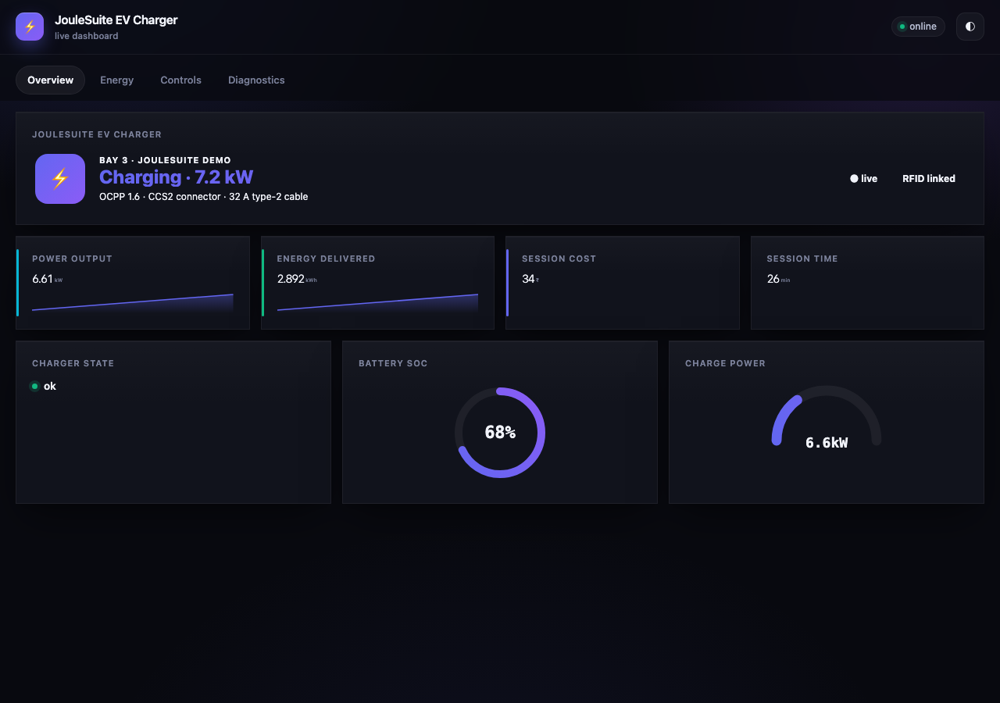
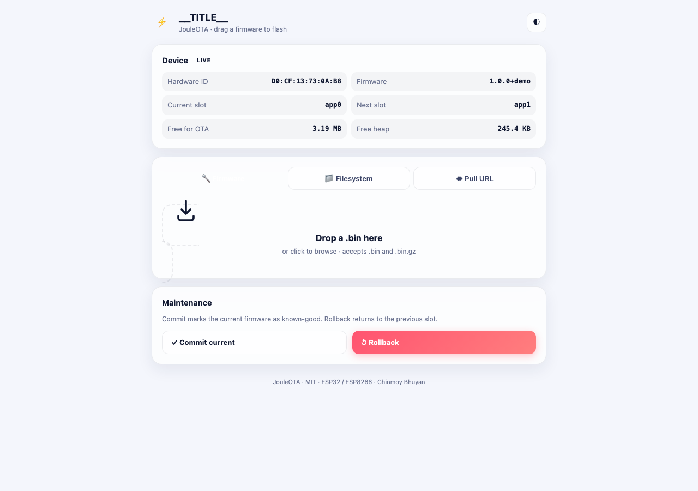
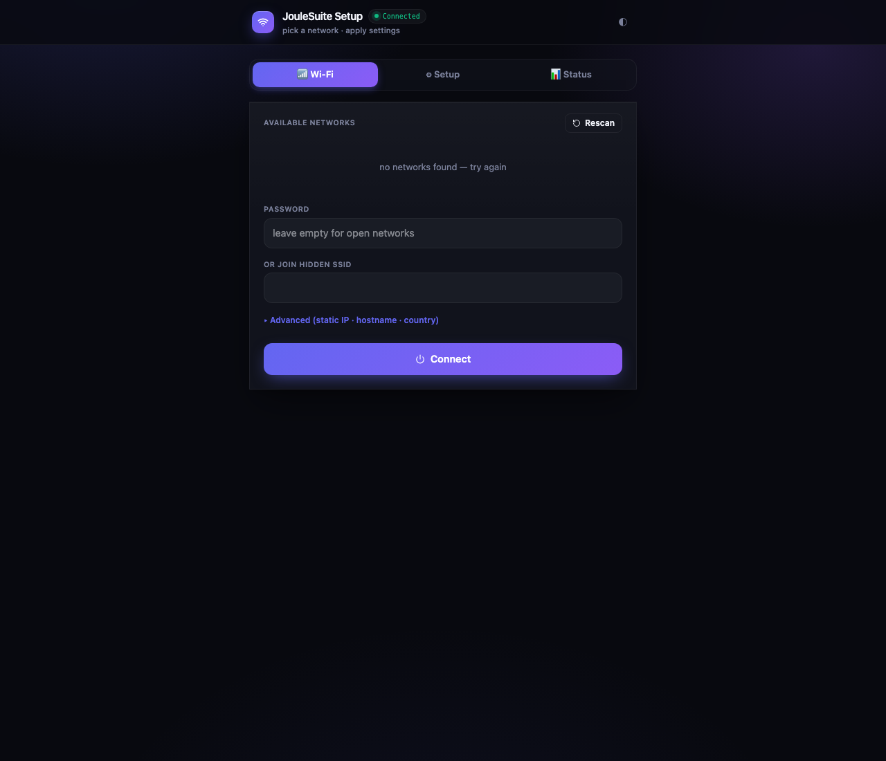

# JouleSuite

> Four MIT-licensed Arduino libraries for ESP32 and ESP8266 that give
> embedded products a polished, production-grade web stack:
> **wireless firmware updates · wireless serial console · Wi-Fi
> provisioning portal · real-time dashboard.** All four ship the same
> design language, theme themselves to system preference, and run on a
> single `AsyncWebServer` instance.

| Library | What it does | Routes | Wire size |
|---|---|---|---:|
| [**JouleOTA**](libraries/JouleOTA/) | Async drop-in firmware + filesystem updater with push-from-browser **and** pull-from-URL modes, HMAC-signed images, A/B rollback, live SSE progress | `/ota` `/ota/info` `/ota/upload` `/ota/pull` `/ota/events` `/ota/commit` `/ota/rollback` | **5.0 KB gz** |
| [**JouleSerial**](libraries/JouleSerial/) | Bi-directional WebSocket console — 4 log levels with ANSI colour, regex search, hex view, history replay, exports (TXT/JSON/CSV) | `/serial` `/serial/ws` | **4.6 KB gz** |
| [**JouleNet**](libraries/JouleNet/) | Multi-SSID Wi-Fi manager with captive portal, 9 custom-parameter types, static IP, mDNS, NVS-backed persistence, auto-failover | `/wifi` `/wifi/scan` `/wifi/connect` `/wifi/status` `/wifi/params` `/wifi/reset` `/wifi/restart` | **5.3 KB gz** |
| [**JouleDash**](libraries/JouleDash/) | Real-time IoT dashboard over a single WebSocket — **15 widget types** (number, gauge, donut, slider, switch, button, chart, joystick, colour, image, custom-HTML, …) with multi-tab and dark/light/auto theme | `/` `/dash` `/dash/ws` | **7.0 KB gz** |

**Author:** [Chinmoy Bhuyan](mailto:dikibhuyan@gmail.com) ·
**License:** MIT ·
**Targets:** ESP32 (S2 / S3 / C3 / classic) · ESP8266

---

## Screenshot tour

|  |  |
|---|---|
|  <br>**JouleDash** — 17 cards, 3 tabs, live WebSocket |  <br>**JouleOTA** — drag-drop with SVG progress ring |
|  <br>**JouleNet** — multi-SSID picker + custom-param form |  <br>**JouleSerial** — colour-tinted WebSocket log + cmd input |

Mobile mockups: [dash · overview](docs/screenshots/dash-mobile-overview.png) ·
[dash · drawer](docs/screenshots/dash-mobile-menu.png) ·
[ota](docs/screenshots/ota-mobile.png) ·
[wifi](docs/screenshots/wifi-mobile.png) ·
[serial](docs/screenshots/serial-mobile.png) — every UI is responsive
down to a 320 px viewport. JouleDash automatically collapses its
horizontal tab strip into a slide-in hamburger drawer on phones so
no tab ever scrolls off-screen.

---

## Highlights

* **Premium UI, tiny on the wire.** Every page is a single self-contained
  document — no external CDN, no web-fonts, no fingerprintable assets —
  and is served **pre-gzipped from flash** so the largest page is under
  7 KB on the wire. Loads in one TCP round-trip on real-world Wi-Fi.
* **Mobile-first and theme-aware.** Glass-morphism panels, smooth
  micro-interactions, 44 px touch targets, fluid grid breakpoints. The
  user's `prefers-color-scheme` is honoured automatically; the dark /
  light / auto switch persists in `localStorage`.
* **One async server, four mountpoints.** The libraries share an existing
  `AsyncWebServer` instance and never collide on routes. Bring your own
  app endpoints alongside.
* **Battle-tested defaults.** `WiFi.setSleep(false)` + max TX power so
  TCP ACKs don't get dropped on weak links. `AsyncURIMatcher::exact()`
  on umbrella routes so `/ota` doesn't accidentally swallow `/ota/info`.
  Atomic NVS writes for credentials and custom parameters. Per-IP rate
  limiting on OTA uploads.
* **All Pro-grade features included, free.** Donut chart, joystick,
  colour picker, image card, multi-tab layout, push notifications,
  custom-HTML escape hatch, textarea params, exports, regex search —
  everything is in the box.

---

## Install

### Option A — drop into your sketch

Copy `libraries/Joule*` into your sketch's `lib/` (PlatformIO) or
Arduino IDE's `~/Documents/Arduino/libraries/`, then `#include`.

### Option B — PlatformIO `lib_extra_dirs`

```ini
; platformio.ini
[env:esp32]
platform  = espressif32
framework = arduino
board     = esp32-s3-devkitc-1
lib_extra_dirs = ../mcu_libraries/libraries
lib_deps =
  ESP32Async/ESPAsyncWebServer @ ^3.7.0
  ESP32Async/AsyncTCP          @ ^3.4.0
  bblanchon/ArduinoJson        @ ^7.4.0
```

### Option C — install individually from GitHub

```ini
lib_deps =
  https://github.com/hyndex/JouleOTA.git
  https://github.com/hyndex/JouleSerial.git
  https://github.com/hyndex/JouleNet.git
  https://github.com/hyndex/JouleDash.git
```

---

## Hello-world — all four libraries on one server

```cpp
#include <WiFi.h>
#include <ESPAsyncWebServer.h>
#include <JouleOTA.h>
#include <JouleSerial.h>
#include <JouleNet.h>
#include <JouleDash.h>

AsyncWebServer server(80);
joule::DashCard cTemp(joule::DashType::Number, "t", "Temp", "°C");

void setup() {
  JouleNet.setApCredentials("Joule-Setup");
  JouleNet.setHostname("joule");
  JouleNet.begin(&server);                      //  /wifi/* portal
  JouleNet.autoConnect();

  JouleSerial.begin(&server);                   //  /serial + /serial/ws
  JouleOTA.begin(&server);                      //  /ota + sub-routes
  JouleDash.add(&cTemp);
  JouleDash.begin(&server);                     //  / and /dash + /dash/ws

  server.begin();
}

void loop() {
  JouleNet.loop();
  JouleOTA.loop();
  cTemp.setValue(analogRead(34) * 0.1f);
  JouleDash.tick();
}
```

Then open `http://joule.local` on any device on the same network.

---

## Endpoint map (all four libraries on one server)

| Path | Method | Library | Purpose |
|---|---|---|---|
| `/`            | GET  | JouleDash   | Dashboard (302 → `/dash` to sidestep an AsyncTCP-on-`/` quirk) |
| `/dash`        | GET  | JouleDash   | Dashboard SPA |
| `/dash/ws`     | WS   | JouleDash   | Bi-directional layout + value stream |
| `/ota`         | GET  | JouleOTA    | Updater UI |
| `/ota/info`    | GET  | JouleOTA    | JSON: hwId, fwVersion, partitions, heap |
| `/ota/upload`  | POST | JouleOTA    | Multipart firmware / filesystem upload |
| `/ota/pull`    | POST | JouleOTA    | `{"url":"...","mode":"firmware"}` — device fetches |
| `/ota/events`  | SSE  | JouleOTA    | Live progress stream |
| `/ota/commit`  | POST | JouleOTA    | Mark current slot valid (cancel rollback) |
| `/ota/rollback`| POST | JouleOTA    | Revert to previous slot + reboot |
| `/serial`      | GET  | JouleSerial | Console UI |
| `/serial/ws`   | WS   | JouleSerial | Bi-directional log + command stream |
| `/wifi`        | GET  | JouleNet    | Provisioning portal |
| `/wifi/scan`   | GET  | JouleNet    | JSON: available networks |
| `/wifi/connect`| POST | JouleNet    | `{"ssid":"...","password":"...",…}` |
| `/wifi/status` | GET  | JouleNet    | JSON diagnostics |
| `/wifi/params` | GET/POST | JouleNet | Custom-parameter form |
| `/wifi/reset`  | POST | JouleNet    | Erase NVS + reboot |
| `/wifi/restart`| POST | JouleNet    | Reboot only |
| `/generate_204`, `/gen_204`, `/hotspot-detect.html`, `/ncsi.txt` | GET | JouleNet | OS captive-portal probes |

---

## Hardware compatibility

| Platform              | Status | Notes |
|---|:-:|---|
| ESP32 (classic)       | ✅ | Default target |
| ESP32-S3 (N4R2 / N8R2 / N16R8) | ✅ | Reference device: ESP32-S3 N8R2 |
| ESP32-S2              | ✅ | No BLE — irrelevant here |
| ESP32-C3              | ✅ | Single-core, smaller heap |
| ESP8266 (NodeMCU)     | ⚠ | Compiles. OTA works. Dash works for small layouts. PSRAM-free constraints limit history sizes. |
| arduino-esp32 3.x     | ✅ | Required for `AsyncURIMatcher::exact()` |
| arduino-esp32 2.x     | ⚠ | Routes match via legacy `on()` matcher; not recommended |

---

## Repository layout

```
mcu_libraries/
├── README.md                            ← you are here
├── demo/                                ← PlatformIO sketch wiring all 4 libs
│   ├── platformio.ini
│   └── src/main.cpp
├── docs/screenshots/                    ← PNGs used in this README + per-lib docs
├── libraries/
│   ├── JouleOTA/    ← drag-drop OTA       (README inside)
│   ├── JouleSerial/ ← WebSocket console   (README inside)
│   ├── JouleNet/    ← Wi-Fi provisioning  (README inside)
│   └── JouleDash/   ← Real-time dashboard (README inside)
└── tools/
    ├── gzip_ui.py          ← pre-compress UI HTML into PROGMEM blobs
    ├── minify_ui.py        ← strip whitespace from UI source
    ├── stamp_authors.py    ← add author header to every file
    └── preview_proxy.js    ← localhost proxy used to screenshot the live device
```

---

## Production checklist

- [ ] Enable HTTP Basic auth in `JouleOTA::begin(&server, "admin", "<strong-pass>")`
- [ ] Set an HMAC-SHA256 signing key with `JouleOTA::setSigningKey("<hex>")`
- [ ] Call `JouleOTA::setRollbackTimeoutMs(30000)` and `commit()` from `setup()` after self-test
- [ ] Disable filesystem updates if not needed: `JouleOTA::allowFilesystemUpdates(false)`
- [ ] Set `JouleSerial::setMirrorToHardwareSerial(false)` for headless devices
- [ ] Set a portal AP password: `JouleNet::setApCredentials("MyProduct-Setup", "<strong>")`
- [ ] Set static IP / country code / hostname in `JouleNet`
- [ ] Set `JouleDash::begin(..., allowAnonymousRead=false)` — require auth even to read
- [ ] If the device sees weak signal (< -80 dBm), keep `WiFi.setSleep(false)` (the library does this by default)
- [ ] Bake a unique HWID into `JouleOTA::setID()` (MAC works, serial number is better)

---

## Building & flashing the bundled demo

```bash
cd mcu_libraries/demo

# Build the firmware
pio run

# Flash to a connected ESP32-S3 (auto-detects the port)
pio run -t upload

# Watch live serial output
pio device monitor -b 115200
```

The demo seeds a Wi-Fi SSID for the bench on first boot; change
[`demo/src/main.cpp`](demo/src/main.cpp) lines 35–37 for your network.

---

## Verified on hardware

Reference test environment used to validate every release:

* **Board:** ESP32-S3 N8R2 (8 MB flash, 2 MB PSRAM, USB-Serial/JTAG, MAC `D0:CF:13:73:0A:B8`)
* **Wi-Fi:** RSSI ≈ -86 dBm — deliberately weak so the libraries get
  exercised against TCP retransmits, packet loss, and AsyncTCP back-
  pressure. If JouleSuite renders here, it renders anywhere.
* **Verified end-to-end** (Python `websockets` + `urllib` from the host Mac):
  * All 5 HTML routes (`/`, `/dash`, `/ota`, `/wifi`, `/serial`) stream
    to completion
  * `/dash/ws` layout push delivers all 17 cards / 15 widget types
    (including the donut)
  * `cmd led=1` round-trips on `/dash/ws` and the value is rebroadcast
    to every connected tab
  * `cmd heap` round-trips on `/serial/ws` and the host sketch's
    handler responds with the live free-heap byte count
  * `POST /wifi/params` with new values persists to NVS (verified by
    re-GET); textarea preserves multi-line content
  * All 9 custom-parameter types (`header`, `text`, `password`, `number`,
    `dropdown`, `color`, `toggle`, `divider`, `textarea`) render and
    persist

---

## Contributing

PRs welcome. Style guidelines:

* C++17 minimum; C++20-only features avoided for ESP8266 compatibility
* One blank line between sections, no trailing whitespace
* Comments explain **why**, not what — the code already says what
* New widgets / param types need: an enum entry, a JSON serializer in
  `*::describe()` (or `_typeName()`), a render branch in `*_ui.h`, and
  a test path in `demo/src/main.cpp`

After editing any `*_ui.h`, re-run `python3 tools/gzip_ui.py` to
refresh the matching `*_ui_gz.h` PROGMEM blob.

---

## License

MIT — see [LICENSE](LICENSE). Free to use in commercial products
without attribution; a star on the repo or a thank-you note to the
author is always appreciated.

---

<sub>**Author:** Chinmoy Bhuyan · **Email:** dikibhuyan@gmail.com · **(c)** 2026 — MIT</sub>
