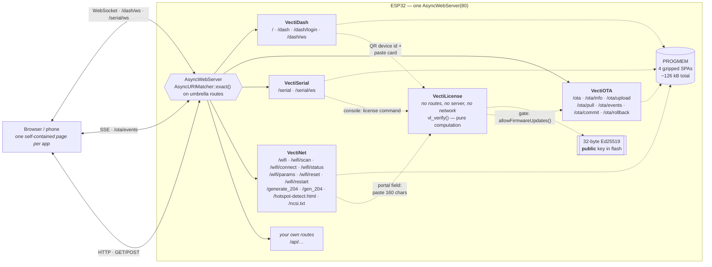
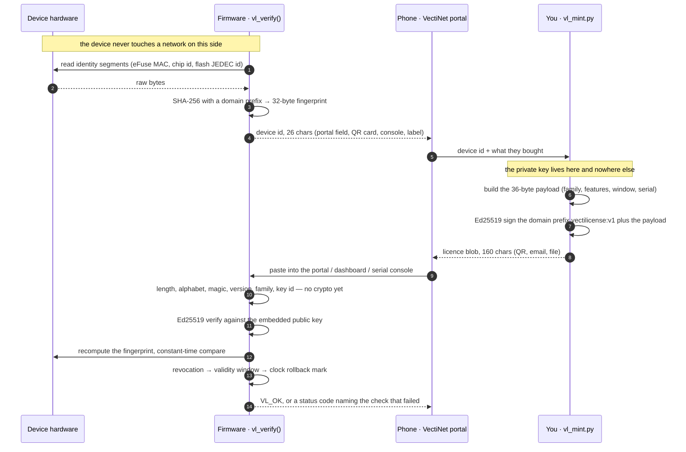

<div align="center">


# VectiSuite

**Five Apache-2.0 libraries. Four give an ESP32 a real web stack — OTA updates, a wireless
console, Wi-Fi provisioning and a live dashboard, all served from the chip's own flash.
The fifth licenses the product: offline, asymmetric, verify-only on the device.**

[](LICENSE)
[](#-install)
[](#-what-it-costs-you)
[](#-the-widget-catalogue)
[](#-vectilicense--offline-device-licensing)
[](#-versus-the-paid-incumbents)

</div>

---

## 💸 Versus the paid incumbents

The four popular commercial libraries in this space are all sold by a single vendor as
separate products. Buying the Pro tier of all four costs **$946**. VectiSuite ships the
same feature set, plus things none of them have, under Apache-2.0.

The comparison covers four products — an OTA updater, a console, a provisioning portal
and a dashboard. **Device licensing is not something they charge extra for; it is not a
thing they do at all**, which is why the licensing rows below read `—` rather than 💰.

They are referred to below as **Paid Alternative 1–4** rather than by name: the point of
this table is what the *features and licences* cost you, not who publishes them.

Every claim below was checked against primary sources (source code, open issues, store
pages) on **2026-08-17**. Evidence is in the last column.

| | VectiSuite<br>**$0 · Apache-2.0** | Paid Alternative 1<br>**$199 · AGPL-3.0** | Paid Alternative 2<br>**$249 · AGPL-3.0** | Paid Alternative 3<br>**$199 · AGPL-3.0** | Paid Alternative 4<br>**$299 · GPL-3.0** | Evidence |
|---|:--:|:--:|:--:|:--:|:--:|---|
| **OTA — push firmware from browser** | ✅ | ✅ | — | — | — | |
| **OTA — pull firmware from a URL** | ✅ | ❌ | — | — | — | zero grep hits in Paid Alternative 1 source |
| **OTA — signed images** | ✅ HMAC-SHA256 | ❌ | — | — | — | zero grep hits |
| **OTA — A/B rollback** | ✅ | ❌ | — | — | — | zero grep hits |
| **OTA — integrity check that works** | ✅ | ❌ | — | — | — | `Update.setMD5()` is called *before* `Update.begin()`, which reinitialises the hash. Maintainer the upstream maintainer, issue #286: "The MD5 check never worked. Pro version also has the same issue." Still open. |
| **Console — log levels** | ✅ 4 (DEBUG/INFO/WARN/ERROR) | — | ❌ both tiers | — | — | no level support in free or Pro |
| **Console — search / filter** | ✅ | — | ❌ both tiers | — | — | |
| **Console — timestamps** | ✅ free | — | 💰 $249 | — | — | Pro upsell |
| **Console — export TXT/JSON/CSV** | ✅ free | — | 💰 $249 | — | — | Pro upsell |
| **Wi-Fi — multiple SSIDs + failover** | ✅ 8 slots | — | — | ❌ | — | single SSID only |
| **Wi-Fi — static IP** | ✅ | — | — | ❌ | — | issue #19, open since 2024-10-22 |
| **Wi-Fi — OS captive-portal probes** | ✅ `/generate_204` `/gen_204` `/hotspot-detect.html` `/ncsi.txt` | — | — | ⚠️ | — | store page advertises OS auto-popup; source implements only a DNS wildcard + 302 catch-all, none of the four probe paths |
| **Wi-Fi — password / toggle param types** | ✅ free | — | — | 💰 $199 | — | paywalled |
| **Dashboard — widget count** | ✅ 49 + custom HTML | — | — | — | 9 free / ~30 Pro | free tier = 8 cards + 1 Bar chart |
| **Dashboard — tabs** | ✅ free | — | — | — | 💰 $299 | paywalled |
| **Dashboard — joystick** | ✅ free | — | — | — | 💰 $299 | paywalled |
| **Dashboard — input cards** | ✅ free | — | — | — | 💰 $299 | paywalled |
| **Dashboard — custom-HTML escape hatch** | ✅ | — | — | — | ❌ both tiers | absent in free *and* Pro |
| **Dashboard — branding / brand colour** | ✅ free | — | — | — | 💰 $299 | paywalled |
| **Licensing — lock features to one device** | ✅ Ed25519, offline | — | — | — | — | **no equivalent in the compared products.** All four are OTA / console / provisioning / dashboard products; none of them ships a device-licensing feature at any tier. This is a capability gap, not a paywall. |
| **Licensing — no keygen recoverable from a flash dump** | ✅ device holds a *public* key only | — | — | — | — | see [the honest security statement](#the-honest-security-statement) — this removes the keygen, not firmware patching |
| **Licensing — activation with no internet and no app** | ✅ paste into the VectiNet portal | — | — | — | — | |
| **Licensing — runs off the ESP32** | ✅ pure C99 core, no OS, no libc headers | — | — | — | — | the other four VectiSuite libraries are ESP32-bound; VectiLicense is not |
| **Licence terms readable before you pay** | Apache-2.0, full text in repo | ✅ | ✅ | ✅ | ✅ | Commercial licence v1.3 is published on the vendor's site (verified 2026-08-17) |
| **You keep ownership of your own modifications** | ✅ Apache-2.0 §2–3 | ❌ | ❌ | ❌ | ❌ | *"All intellectual property rights in the Licensed Material, including any modifications or enhancements created by Licensee based on the Licensed Material, shall remain the exclusive property of Licensor."* |
| **You may build a competing product** | ✅ no restriction | ❌ | ❌ | ❌ | ❌ | *"Licensee shall not use the Licensed Material to build, develop, or offer any product or service that directly or indirectly competes with the products or services offered by Licensor."* |
| **You may ship firmware unobfuscated** | ✅ | ❌ | ❌ | ❌ | ❌ | commercial licence requires pre-compiling and static linking so the library cannot be extracted; firmware may not be distributed in clear text |
| **You may sublicense or redistribute** | ✅ Apache-2.0 | ❌ | ❌ | ❌ | ❌ | *"Licensee shall not sublicense the Licensed Material to any third party."* |
| **Seats** | unlimited | — | — | — | 1 developer | Paid Alternative 4 Pro is a single-developer seat |
| **Maturity — be honest** | ⚠️ new: no users, no CI, not in Arduino Library Manager. The four web libraries have no test suite; VectiLicense has one (9 `ctest` cases) but most of its HALs have never been compiled | ✅ mature, widely used, heavily tutorialised | ✅ 647 ★ | ✅ | ✅ mature, widely used | Paid Alternative 2: 647 stars, 0 open issues, last commit 2025-12-04 |
| **Dashboard flash cost** | 46,811 B gzipped | — | — | — | lighter | that is the price of 49 widgets vs 9; no measured figure for Paid Alternative 4's blob |

> A "—" means the product does not cover that domain. `⚠️` means partially / with a caveat.

---

## 📸 What it looks like

Every page is a single self-contained document — no CDN, no web fonts, no external
requests — served pre-gzipped straight from PROGMEM. All four SPAs honour
`prefers-color-scheme` and persist an explicit dark/light choice in `localStorage`.

VectiLicense has no page of its own. It borrows one: its bridges add a device-ID field
and a paste box to VectiNet's portal, or three cards to VectiDash. See
[VectiLicense](#-vectilicense--offline-device-licensing).

### VectiDash — real-time dashboard

| Dark | Light |
|---|---|
|  |  |
|  |  |

 

On a phone the horizontal tab strip collapses into a slide-in drawer, so no tab ever
scrolls off-screen:

 

### VectiOTA · VectiSerial · VectiNet

| | Dark | Light | Phone |
|---|---|---|---|
| **VectiOTA** |  |  |  |
| **VectiSerial** |  |  |  |
| **VectiNet** |  |  |  |

---

## 🚀 Quick start

Each library mounts onto an `AsyncWebServer` you already have. Line counts below are
what you *add* to a sketch that is already on Wi-Fi with a server object — counted
honestly, no hiding a setup block behind an ellipsis.

### VectiOTA — 3 lines

```cpp
#include <VectiOTA.h>                        // 1

void setup() {
  VectiOTA.begin(&server, "admin", "vecti"); // 2  →  /ota
  server.begin();
}

void loop() { VectiOTA.loop(); }             // 3  (rollback timer + pull mode)
```

### VectiSerial — 3 lines

```cpp
#include <VectiSerial.h>                     // 1

void setup() {
  VectiSerial.begin(&server, "admin", "vecti"); // 2  →  /serial + /serial/ws
  server.begin();
}

void loop() {
  VectiSerial.loop();                        // 3  (drains the log ring, reaps sockets)
  VectiSerial.inf("heap=%u", ESP.getFreeHeap());
}
```

### VectiNet — 4 lines

```cpp
#include <VectiNet.h>                        // 1

void setup() {
  VectiNet.begin(&server);                   // 2  →  /wifi + captive portal
  server.begin();
  VectiNet.autoConnect();                    // 3  (non-blocking; portal on failure)
}

void loop() { VectiNet.loop(); }             // 4
```

No `WiFi.begin()` anywhere — VectiNet owns the radio. With nothing in NVS it raises the
`Vecti-Setup` AP and the portal.

### VectiDash — 5 lines

```cpp
#include <VectiDash.h>                                                  // 1
vecti::DashCard temp(vecti::DashType::Number, "temp", "Temperature", "°C"); // 2

void setup() {
  VectiDash.add(&temp);                                                 // 3
  VectiDash.begin(&server, "admin", "vecti");                           // 4  →  / and /dash
  server.begin();
}

void loop() {
  temp.setValue(readTemp());
  VectiDash.tick();                                                     // 5
}
```

### VectiLicense — 3 lines

Not an Arduino library in the same sense: no server, no routes, no `loop()` hook of its
own. Three lines is the whole gate.

```c
#include "vectilicense/vectilicense.h"                 // 1

vl_license_t lic;
vl_status_t st = vl_verify(blob, &CFG, hal, &lic);      // 2  (no network, ever)
if (st == VL_OK && vl_has_feature(&lic, FEATURE_MODBUS)) enable_modbus();  // 3
```

`CFG` is a `const vl_config_t` holding your 32-byte **public** key and the family byte;
`hal` is a `const vl_hal_t *` — on ESP32, `vl_hal_esp32()` from
`hal/esp32/vl_hal_esp32.h`. Full setup in
[VectiLicense](#-vectilicense--offline-device-licensing).

### All four web libraries at once

```cpp
#include <WiFi.h>
#include <ESPAsyncWebServer.h>
#include <VectiOTA.h>
#include <VectiSerial.h>
#include <VectiNet.h>
#include <VectiDash.h>

AsyncWebServer server(80);
vecti::DashCard temp(vecti::DashType::Number, "temp", "Temperature", "°C", 0, 50);
vecti::DashCard led (vecti::DashType::Switch, "led",  "Onboard LED");

void setup() {
  Serial.begin(115200);
  pinMode(LED_BUILTIN, OUTPUT);

  VectiNet.setApCredentials("Vecti-Setup");
  VectiNet.setHostname("vecti");
  VectiNet.setMdnsName("vecti");
  VectiNet.begin(&server);          // /wifi …

  VectiSerial.begin(&server);       // /serial + /serial/ws
  VectiOTA.setID(WiFi.macAddress());
  VectiOTA.setFWVersion("1.0.0");
  VectiOTA.begin(&server);          // /ota …

  led.onChange([](const String &v) { digitalWrite(LED_BUILTIN, v == "1"); });
  VectiDash.add(&temp);
  VectiDash.add(&led);
  VectiDash.begin(&server);         // / and /dash + /dash/ws

  server.begin();
  VectiNet.autoConnect();
  VectiOTA.commit();                // "this image booted fine" — cancels rollback
}

void loop() {
  VectiNet.loop();
  VectiSerial.loop();
  VectiOTA.loop();
  temp.setValue(analogRead(4) * 0.1f);
  VectiDash.tick();
}
```

Then open `http://vecti.local/`.

That sketch is what `demo/` builds. **VectiLicense is not in it** — the demo has never
been built with the licensing library, and its bridges have never been compiled against
the real VectiOTA / VectiSerial / VectiNet / VectiDash. Add it deliberately, from
[the VectiLicense section](#-vectilicense--offline-device-licensing), and expect to fix
an include path on the first build.

> ⚠️ **Threading.** ESPAsyncWebServer callbacks run on the **AsyncTCP task**; `loop()`
> runs on the **Arduino task**. Never block inside a callback — no `delay()`, no
> `ESP.restart()`, no long HTTP fetch. Set a flag and act in `loop()`. The libraries
> already defer their own reboots this way. `VectiSerial::onMessage` fires on the
> AsyncTCP task; `DashCardBase::onChange` is queued and applied inside `VectiDash.tick()`,
> so it runs on the loop task.

---

## 🧩 How it fits together



The four web libraries never collide on a route, and they never own the server — you pass
in your own `AsyncWebServer` and keep adding your own endpoints alongside.

VectiLicense is the odd one out on purpose: it mounts **nothing**, opens **nothing**, and
has no ESP32 in it. Its core is freestanding C99. The dotted edges above are the optional
`bridge/` shims — each behind `__has_include`, so an uninstalled sibling compiles to
nothing. **None of those four shims has ever been compiled against the real sibling
library.**

### Endpoint map

| Path | Method | Library | Purpose |
|---|---|---|---|
| `/` | GET | VectiDash | 302 → `/dash` |
| `/dash` | GET | VectiDash | Dashboard SPA |
| `/dash/login` | GET | VectiDash | Credential challenge in anonymous-read mode |
| `/dash/ws` | WS | VectiDash | Layout + value frames, inbound `cmd` frames |
| `/ota` | GET | VectiOTA | Updater UI |
| `/ota/info` | GET | VectiOTA | JSON: hwId, fwVersion, title, brand, heap, partitions, update flags |
| `/ota/upload` | POST | VectiOTA | Multipart firmware / filesystem upload |
| `/ota/pull` | POST | VectiOTA | `{"url":"…","mode":"firmware"}` — device fetches it |
| `/ota/events` | SSE | VectiOTA | Live progress to every open tab |
| `/ota/commit` | POST | VectiOTA | Mark current slot valid |
| `/ota/rollback` | POST | VectiOTA | Revert to previous slot + reboot |
| `/serial` | GET | VectiSerial | Console UI |
| `/serial/ws` | WS | VectiSerial | Log stream + command input |
| `/wifi` | GET | VectiNet | Provisioning portal |
| `/wifi/scan` | GET | VectiNet | JSON: visible networks |
| `/wifi/connect` | POST | VectiNet | Join / save a network |
| `/wifi/status` | GET | VectiNet | JSON diagnostics: RSSI, BSSID, gateway, DNS, uptime |
| `/wifi/params` | GET/POST | VectiNet | Custom-parameter form, NVS-backed |
| `/wifi/reset` | POST | VectiNet | Erase NVS + reboot |
| `/wifi/restart` | POST | VectiNet | Reboot only |
| `/generate_204` `/gen_204` `/hotspot-detect.html` `/ncsi.txt` | GET | VectiNet | OS captive-portal probes |
| *(none)* | — | **VectiLicense** | Mounts no route and opens no socket. Activation rides on whatever surface you already have. |

---

## 🔑 VectiLicense — offline device licensing

The fifth library sells the other four. It answers one question — *is this unit licensed
for this feature?* — using nothing but arithmetic. **No network call, ever. Nothing to
phone home to.**

A licence is an Ed25519 signature over a payload bound to that device's own hardware
fingerprint. The firmware embeds the **32-byte public key**. The private key stays on
your machine and is never shipped, so a firmware image contains no minting material at
all — dump the flash and you get a public key.

| | |
|---|---|
| Blob on the wire | 36-byte payload + 64-byte signature = **100 bytes** → **160** Crockford-base32 characters |
| Device id | first 16 bytes of a SHA-256 hardware fingerprint → **26** characters |
| Carries | device id, product family, 32-bit feature bitmap, validity window, serial |
| Core | pure C99, freestanding, zero dependencies, no allocation, **0 bytes of static RAM** |
| Flash | **9,195 B** (Cortex-M4) / **9,319 B** (Cortex-M0+), `-Os`, measured |
| Stack | 4,376 B at the deepest point — size the calling task at ≥5 KB |
| Per verify | 2.8 ms on an Apple M1 Pro at `-O2`; tens of ms on an ESP32 *(estimate)*. Never call it from an ISR or an AsyncTCP callback. |

Nothing is pre-generated per device and there is no database: the customer reports 26
characters, you sign for exactly those, you send back 160.

### Setting it up

```c
#include "vectilicense/vectilicense.h"
#include "vl_hal_esp32.h"                       /* hal/esp32/ — or your own */

#define FEATURE_MODBUS 0u                       /* your bit numbering */

static const vl_pubkey_t VENDOR_KEYS[] = {
    { .key_id = 1, .key = { 0x02, 0x1a, /* ...30 more, from vl_mint.py keygen... */ } },
};
static const vl_config_t CFG = {
    .keys = VENDOR_KEYS, .key_count = 1,
    .family = 2,                                /* this product line */
    .revoked_serials = NULL, .revoked_count = 0,
    .flags = 0,
};

/* 1. show the customer their device id */
uint8_t fp[VL_FINGERPRINT_LEN];
char id[VL_DEVICE_ID_STR_BUF_LEN];              /* 27 bytes */
if (vl_compute_fingerprint(vl_hal_esp32(), fp) == VL_OK) {
    vl_encode_device_id(fp, id, sizeof id);     /* "7V3VAR49YVAVNKKRJT0FR2RAE0" */
}

/* 2. verify whatever 160 characters arrived, from wherever */
vl_license_t lic;
vl_status_t st = vl_verify(blob, &CFG, vl_hal_esp32(), &lic);
if (st != VL_OK) {
    log_warn("unlicensed: %s", vl_status_str(st));
} else if (vl_has_feature(&lic, FEATURE_MODBUS)) {
    enable_modbus();
}
```

`vl_verify()` takes a **NUL-terminated string**, and that is the entire transport
contract. HTTP, MQTT, BLE, a QR scan, a file on a USB stick, a technician typing at a
console — all work with no helper code. Only two paths needed any: `transport/vl_chunk.c`
reassembles a blob from CAN/ISO-TP/BLE-GATT frames, and `transport/vl_line.c` turns a
UART byte stream into one line.

### Device id → mint → activate

The flagship path: **a sealed box with no internet and no app**, activated by joining its
own SoftAP and pasting into VectiNet's captive portal. VectiDash can show the device id
as a QR so the customer photographs 26 characters instead of transcribing them.



Steps 1–4 need no vendor. Steps 9–14 need no network. Only the middle — 26 characters out,
160 back — involves a human, and that can be a web form, an email, or a sticker in a box.

### The wire format

| Offset | Size | Field | Notes |
|---|---|---|---|
| 0 | 1 | `magic` | `VL_MAGIC` = `0x56` (`'V'`) |
| 1 | 1 | `version` | `VL_FORMAT_VERSION` = `0x01` |
| 2 | 1 | `key_id` | selects among the embedded public keys — this is how rotation works |
| 3 | 1 | `family` | product line; a licence for one family is refused by another |
| 4 | 4 | `features` | little-endian 32-bit bitmap, read with `vl_has_feature()` |
| 8 | 16 | `device_id` | first `VL_DEVICE_ID_LEN` bytes of the SHA-256 fingerprint |
| 24 | 4 | `not_before` | LE epoch seconds, `0` = no lower bound |
| 28 | 4 | `not_after` | LE epoch seconds, `0` = perpetual |
| 32 | 4 | `serial` | for support, and the handle revocation uses |
| 36 | 64 | `signature` | Ed25519 over `"vectilicense:v1" ‖ 0x00 ‖ payload[0..35]` |

Offsets 0..35 are the signed payload (`VL_PAYLOAD_LEN`); 36..99 is the signature
(`VL_SIG_LEN`). The domain-separation prefix means a VectiLicense signature can never be
replayed into another protocol that happens to use the same vendor key.

160 characters is deliberately not hand-typeable. A code short enough to type has ~75 bits
at best — that is a MAC, a MAC needs a shared secret, and a shared secret in firmware is
exactly the keygen this design removes.

### The honest security statement

**VectiLicense is not uncrackable, and this repository will never say it is.**

An attacker who can rewrite your firmware can patch out the branch that reads
`vl_verify()`'s result. That is what "the attacker owns the hardware" means, and it is
true of every software licensing scheme ever written.

What v1 structurally eliminates is the **keygen**. The earlier symmetric (HMAC) design
shipped the *minting* secret in every firmware image, because the value that verified a
licence was the value that created one: a single flash dump from a single customer
produced a universal code generator for every unit the vendor would ever sell. That class
of attack is gone — not obfuscated, gone — because the secret is no longer in the firmware
to find.

| After a full flash dump, an attacker still cannot | Why |
|---|---|
| Mint a licence for their own device | needs a signature over their device id, which needs the private key |
| Turn on features they did not buy | `features` is inside the signed payload |
| Extend an expiry | `not_after` is inside the signed payload |
| Reuse someone else's licence | `device_id` is bound to the local fingerprint, compared in constant time |
| Replay a licence from another product line | `family` is inside the signed payload |

The only real mitigation for firmware patching is a hardware root of trust — on ESP32,
**Secure Boot v2 + Flash Encryption**. `vl_posture()` reports whether you have one; it
never enforces. Without it, licensing is a speed bump against casual copying, not a wall.

Two more things worth knowing before you price a product on this:

- **With no clock, expiry is not enforced.** If the HAL has no `now_epoch`, `vl_verify()`
  returns `VL_OK` for an expired licence and leaves `VL_CHECKED_TIME` clear in
  `lic.checked`. Read that bit, or set `VL_FLAG_REQUIRE_CLOCK`.
- **On a general-purpose OS the fingerprint is weak.** `hal/posix` reads an interface MAC
  and `/etc/machine-id`; a cloned image with a spoofed MAC reproduces it. On MCU HALs
  (eFuse, factory UID, OTP) it is strong.

### What has been built and run, and what has not

Straight from VectiLicense's own repository, because it matters more than the feature list:

| | Status |
|---|---|
| `core/` — Ed25519 verify, SHA-256/512, base32, parsing | **compile-verified and tested.** 9 `ctest` cases: RFC 8032 and SHA known-answer vectors, every rejection path, an 800-bit flip sweep, a 64-cell HAL matrix, a mutation fuzzer under ASan + UBSan. Cross-compiles freestanding for Cortex-M4 and M0+. |
| `hal/posix`, `hal/none` | compiled and exercised by the test suite |
| `transport/` | compile-verified, tested, cross-compiled |
| `bridge/vl_bridge.h` (`vecti::License`) | compiled and tested on the host |
| `hal/esp32`, `hal/rp2040`, `hal/stm32`, `hal/nxp` | **never compiled, never run.** Written to each vendor's documented API. |
| `bridge/vl_bridge_{net,dash,serial,ota}.h` | **never compiled against the real VectiNet / VectiDash / VectiSerial / VectiOTA.** Not once, not anywhere. |
| Every example | never flashed; the POSIX one has been run on macOS |

Expect to fix an include path on your first ESP32 build. The examples ship a
**placeholder public key** whose private half was generated in memory and discarded, so an
unmodified example refuses every licence with `VL_ERR_BAD_SIGNATURE` — loudly, at the
first activation. Paste your own from `vl_mint.py keygen`, and **never substitute an
all-zero key**: 32 zero bytes are a valid low-order curve point, and `core/` rejects such
keys outright precisely so that mistake fails closed for the right reason.

---

## 🎛 The widget catalogue

`DashType` has **50 types — 49 widgets plus `Custom`**, the raw-HTML escape hatch.
Every one of them renders in the bundled UI, and every one is free.

<sub>Counted with `grep -c 'case DashType::' libraries/VectiDash/src/VectiDash.cpp` → 50.</sub>

**All values cross the wire as strings.** `setValue()` has overloads for `int`,
`unsigned`, `long`, `float`, `double`, `bool`, `const char*` and `String`; structured
widgets take JSON *inside* that string.

### Readouts — 14

| Key | `DashType` | Shows | Wire value |
|---|---|---|---|
| `number` | `Number` | Big numeric KPI with unit + auto sparkline | numeric string |
| `text` | `Text` | Free text; empty renders `—` | any string |
| `status` | `Status` | Coloured dot + label | free text; the dot's tone is derived from it |
| `badge` | `Badge` | Compact pill | any string |
| `led` | `Led` | ON / OFF / BLINK indicator | `1` `true` `on` = on · `blink` = blinking · anything else = off |
| `temperature` | `Temperature` | Temperature readout | numeric string |
| `humidity` | `Humidity` | Humidity readout | numeric string |
| `battery` | `Battery` | Battery pictogram, % of `min..max` | numeric string; trailing `+` (or `unit="charging"`) shows the charging bolt |
| `signal` | `Signal` | 4-bar Wi-Fi strength | RSSI in dBm, e.g. `-67` |
| `uptime` | `Uptime` | `d h m s` breakdown | uptime in **seconds** |
| `table` | `Table` | Key/value table | `[["Key","Val"],…]` or `"k=v;k=v"` |
| `logview` | `LogView` | Scrolling log pane | `["line","line"]` or newline-separated |
| `image` | `Image` | Inline image | `http(s):`/`data:` URL, otherwise treated as base64 PNG |
| `sparkline` | `Sparkline` | Bare trend line | `[1,2,3]` or `"1,2,3"` |

### Meters — 8

| Key | `DashType` | Shows | Wire value |
|---|---|---|---|
| `gauge` | `Gauge` | 180° arc gauge | numeric string, scaled over `min..max` |
| `dial` | `Dial` | Needle dial | numeric string, `min..max` |
| `donut` | `Donut` | Ring with % in the middle | numeric string, `min..max` |
| `progress` | `Progress` | Horizontal progress bar | numeric string, `min..max` |
| `bar` | `Bar` | Bar with optional target mark | numeric string; `setStep()` draws the target mark |
| `level` | `Level` | Tank / fill level, tinted low→critical | numeric string, `min..max` |
| `compass` | `Compass` | Heading + 16-point name | degrees `0..360` (wraps) |
| `thermo` | `Thermo` | Thermometer column | numeric string, `min..max` |

### Charts — 5

| Key | `DashType` | Shows | Wire value |
|---|---|---|---|
| `chart` | `Chart` | Line / area / bar over x | `{"x":[…],"y":[…]}` — or use `chartPushXY(x, y)` |
| `multichart` | `MultiChart` | Up to 5 overlaid series | `{"x":[…],"s":[{"n":"L1","y":[…]}]}` |
| `histogram` | `Histogram` | Labelled bars | `{"l":["a","b"],"v":[1,2]}` |
| `scatter` | `Scatter` | XY point cloud | `{"x":[…],"y":[…]}` |
| `heatmap` | `Heatmap` | Row-major grid, max 2048 cells | `{"w":8,"v":[…]}` |

`chartPushXY()` transmits x alongside y, so an irregular sample cadence draws with the
right spacing — you do not have to push on a fixed interval. `chartSetMaxPoints()`
controls the ring depth (default 50).

### Controls — 20

Interactive widgets call `onChange(cb)`; the payload is the string below. The device
echoes every accepted value back to *all* connected clients, so multiple open tabs stay
in sync.

| Key | `DashType` | Does | Wire value (both ways) |
|---|---|---|---|
| `button` | `Button` | Fire-once action; inherits the card's `DashColor` so an E-STOP is not brand-green | sends `1` |
| `confirm` | `ConfirmButton` | Two-click armed button | sends `1` on the second click |
| `momentary` | `Momentary` | Dead-man / hold-to-run | sends `1` on press, `0` on release |
| `switch` | `Switch` | Toggle | `1` / `0` (`true` also reads as on) |
| `slider` | `Slider` | Continuous slider | numeric string, `min..max` step `step` |
| `range` | `RangeSlider` | Two-handle range | `"lo,hi"` |
| `stepper` | `Stepper` | −/+ with hold-to-repeat | numeric string, `min..max` step `step` |
| `dropdown` | `Dropdown` | Select | the chosen option string |
| `radio` | `Radio` | Radio group | the chosen option string |
| `checklist` | `Checklist` | Multi-select | pipe-joined selection, `"A\|B"` |
| `input` | `Input` | Single-line text; commits on Enter/blur | any string (`unit` becomes the placeholder) |
| `textarea` | `Textarea` | Multi-line text | any string, newlines preserved |
| `password` | `Password` | Masked text with reveal | any string |
| `keypad` | `Keypad` | Numeric keypad with an Enter key | the buffered digits, sent on Enter |
| `joystick` | `Joystick` | Drag-to-steer pad, self-centring | `"x,y"` |
| `xypad` | `XYPad` | 2-axis pad that stays where you left it | `"x,y"` |
| `knob` | `Knob` | Rotary knob | numeric string, `min..max` step `step` |
| `color` | `Color` | Colour picker | `#rrggbb` |
| `datetime` | `DateTime` | Date + time picker | Unix epoch **seconds** |
| `qrcode` | `QrCode` | Renders a QR on-device | the payload string, e.g. `WIFI:S:ssid;T:WPA;P:pass;;` |

`dropdown`, `radio` and `checklist` take their options from
`setOptions("Eco|Standard|Boost")` — pipe-separated, the same convention VectiNet uses
for its parameter dropdowns.

### Layout & escape hatch — 3

| Key | `DashType` | Does | Wire value |
|---|---|---|---|
| `header` | `Header` | Full-width section title; no card chrome | label only |
| `divider` | `Divider` | Full-width rule; no card chrome | — |
| `custom` | `Custom` | Your own HTML in the card body, via `setCustomHtml()` | injected into `<span id="dash-<id>-out">` inside your snippet on every broadcast |

> `custom` renders firmware-supplied markup verbatim — that is the point of it. A
> `<script>` in the snippet never executes, but a sketch that interpolates untrusted
> input into the snippet is injecting into its own page. Escape what you interpolate.

---

## 🎯 ESP family support — every target build-tested

Each row below was compiled on this machine, not inferred from a manifest. `pio run`
in `demo/` rebuilds the whole matrix. **VectiLicense is absent from it** — the demo does
not include the library and `hal/esp32` has never been built with an ESP toolchain, so
there is no honest column to add.

| Target | Core | VectiOTA | VectiSerial | VectiNet | VectiDash | Full image |
|---|---|:--:|:--:|:--:|:--:|---|
| **ESP32** | Xtensa LX6 | ✅ | ✅ | ✅ | ✅ | ✅ 1,269,949 B — **96.9%** of a 1.3 MB app slot |
| **ESP32-S2** | Xtensa LX7 | ✅ | ✅ | ✅ | ✅ | ✅ 1,207,038 B — **92.1%** |
| **ESP32-S3** | Xtensa LX7 | ✅ | ✅ | ✅ | ✅ | ✅ 1,223,885 B — 36.6% (8 MB part) |
| **ESP32-C3** | RISC-V | ✅ | ✅ | ✅ | ✅ | ✅ 1,279,726 B — **97.6%** |
| **ESP32-C6** | RISC-V | ✅ | ✅ | ✅ | ✅ | ⚠️ objects build; image packaging fails inside the pioarduino platform's own bootloader script |
| **ESP32-H2** | RISC-V | ✅ | ✅ | ⛔ n/a | ✅ | ⚠️ see below |
| **ESP8266** | Xtensa L106 | ✅ | ❌ | ❌ | ❌ | ✅ 357,612 B — 34.2% (OTA-only sketch) |

**⚠️ Read the flash column before choosing a module.** On a 4 MB part with the stock
partition table, the suite fills **92–98%** of the app slot. The ~126 KB of embedded UI
is most of the reason. Ship a custom partition table on 4 MB parts, or use an 8 MB
module. On 8 MB the whole suite is a comfortable 36%.

**ESP32-H2 has no Wi-Fi radio** — it is 802.15.4 (Thread/Zigbee) plus BLE. VectiNet is a
Wi-Fi manager, so it cannot exist there and does not pretend to; the other three compile
but have no TCP/IP transport to serve over until you bring your own Thread stack. H2 is
not a practical target for this suite today.

**ESP32-C6 and ESP32-H2 need arduino-esp32 3.x.** The official `espressif32` 6.x platform
tops out at core 2.0.17, which predates both chips. The matrix uses the community
[pioarduino](https://github.com/pioarduino/platform-espressif32) fork for those two.
All four libraries compile cleanly there; the failure is in that platform's bootloader
packaging step, not in this code.

**ESP8266 is VectiOTA only, deliberately.** VectiNet's persistence is NVS-backed and it
raises a compile-time `#error` on non-ESP32 rather than silently failing to save
anything. VectiSerial and VectiDash have no ESP8266 code paths yet. If you need the full
suite on ESP8266, the work is a storage backend behind VectiNet's persistence layer —
open an issue and say so.

---

## 📦 Install

Dependency floor, for the four web libraries:

| Dependency | Minimum | Why |
|---|---|---|
| `ESP32Async/ESPAsyncWebServer` | **^3.11.0** | all four call `AsyncURIMatcher::exact()`, which does not exist below 3.11.0 — and which lives in ESPAsyncWebServer, **not** in the Arduino core |
| `ESP32Async/AsyncTCP` | **^3.4.0** (VectiDash declares ^3.4.10) | |
| `bblanchon/ArduinoJson` | **^7.4.0** | not needed by VectiSerial |

**VectiLicense needs none of them.** Its core includes `<stdint.h>` and `<stddef.h>` and
nothing else — not even `<string.h>`, which is a hosted header, so it declares the three
functions it calls itself. Add it alone if licensing is all you want.

### PlatformIO — from GitHub

```ini
[env:esp32s3]
platform  = espressif32
board     = esp32-s3-devkitc-1
framework = arduino
build_flags = -std=gnu++17
build_unflags = -std=gnu++11
lib_deps =
  https://github.com/vectivolt/VectiOTA.git
  https://github.com/vectivolt/VectiSerial.git
  https://github.com/vectivolt/VectiNet.git
  https://github.com/vectivolt/VectiDash.git
  https://github.com/vectivolt/VectiLicense.git
  ESP32Async/ESPAsyncWebServer @ ^3.11.0
  ESP32Async/AsyncTCP          @ ^3.4.10
  bblanchon/ArduinoJson        @ ^7.4.0
```

Take only the ones you want — the five are independent. VectiLicense's bridges to the
other four are each behind `__has_include`, so installing it alongside nothing else
compiles cleanly and simply gives you the C API.

### PlatformIO — from a local checkout

```ini
lib_extra_dirs = ../mcu_libraries/libraries
lib_deps =
  ESP32Async/ESPAsyncWebServer @ ^3.11.0
  ESP32Async/AsyncTCP          @ ^3.4.10
  bblanchon/ArduinoJson        @ ^7.4.0
```

### Arduino IDE

Not in the Library Manager. Copy the folders you want out of `libraries/` into
`~/Documents/Arduino/libraries/`, then install **ESPAsyncWebServer**, **AsyncTCP** and
**ArduinoJson** through the Library Manager. Restart the IDE.

### Cloning this repo

The five libraries are git **submodules** — a plain `git clone` leaves `libraries/*`
empty and every build fails with *"no such file or directory: VectiOTA.h"*.

```bash
git clone --recurse-submodules https://github.com/vectivolt/mcu_libraries.git
# already cloned without them?
git submodule update --init --recursive
```

### Supported platforms

| Target | Status |
|---|---|
| **ESP32** (the four web libraries) | ✅ Built and run on an ESP32-S3 |
| **ESP8266** — VectiOTA only | ⚠️ `library.json` declares `espressif8266` and the source has real ESP8266 paths (BearSSL HMAC, `Updater.h`). Not tested. |
| **ESP8266** — Serial / Net / Dash | ❌ Not claimed. VectiNet `#error`s on non-ESP32: it needs Preferences/NVS, ESPmDNS and `esp_wifi`. |
| **RP2040 / RP2350+W** | Plausible future target for the web libraries — ESPAsyncWebServer already supports it. Not done. |
| **STM32, NXP** | No async web server, no onboard Wi-Fi — so no for the four web libraries. |
| **VectiLicense — any C99 target** | ✅ `core/` is compile-verified for host clang and for `arm-none-eabi-gcc` on Cortex-M4 and M0+ with `-ffreestanding -nostdinc -Os`. A board nobody has ported means copying `hal/none/` and writing one function. |
| **VectiLicense — ESP32 / RP2040 / STM32 / NXP HALs** | ⚠️ Written to each vendor's documented API. **Never compiled, never run.** `hal/posix` and `hal/none` are the two that the test suite exercises. |

What is genuinely ESP-specific in *our* code: `esp_ota_ops`, NVS `Preferences`,
`ESPmDNS`, `mbedtls`. ESPAsyncWebServer 3.11.0 itself declares `espressif32`,
`espressif8266`, `raspberrypi` and `libretiny`, so the web layer ports further than we
currently do.

---

## 📏 What it costs you

Measured, not estimated. The gzipped PROGMEM blob is what actually consumes flash.

| App | Raw HTML | Gzipped blob in flash |
|---|---:|---:|
| VectiDash | 155,079 B | **46,811 B** |
| VectiNet | 82,969 B | **28,498 B** |
| VectiOTA | 71,475 B | **25,822 B** |
| VectiSerial | 67,383 B | **24,862 B** |
| **Total UI** | | **125,993 B ≈ 126 kB** |

VectiLicense adds no UI blob at all. Its cost is code, measured with
`arm-none-eabi-gcc 15.2.0 -Os -ffreestanding` — not on an ESP32, which has never built it:

| | Cortex-M4 | Cortex-M0+ |
|---|---:|---:|
| `core/` text | 9,195 B | 9,319 B |
| `.data` + `.bss` | **0 B** | **0 B** |
| deepest stack chain (`-fstack-usage`) | — | 4,376 B |

Whole-firmware footprint of the bundled demo, which exercises all four libraries at
once — ESP32-S3-DevKitC-1, 8 MB flash, 2 MB PSRAM, `default_8MB.csv` partitions:

- **Flash 1,226,013 B — 36.7 % of 3,342,336**
- **RAM 62,440 B — 19.1 % of 327,680**

VectiDash is the heavy one because it carries 49 widgets. It is heavier than Paid Alternative 4's
blob. That is the trade.

---

## 🔬 Verified on hardware — and what is not

Reference board: **ESP32-S3-DevKitC-1**, 8 MB flash, 2 MB PSRAM, USB-Serial/JTAG,
MAC `D0:CF:13:72:17:58`. Reproduce with `tools/hw_verify.py` and `tools/soak.py`.

### Over the network — 12/12

Run against the device's own SoftAP at `192.168.4.1` (`tools/hw_verify.py`):

| Check | Result |
|---|---|
| `GET /` → 302 `/dash` | ✅ |
| `/dash` `/ota` `/serial` `/wifi` | ✅ gzip, inflating to exactly the built blob sizes |
| `/ota/info`, `/wifi/status` | ✅ every documented key present |
| Captive-portal probes | ✅ all four (`/generate_204` `/gen_204` `/hotspot-detect.html` `/ncsi.txt`) return 200 |
| `/dash/ws` layout push | ✅ 68 cards, 5 tabs |
| `/dash/ws` command round trip | ✅ value echoed to all clients |
| `/serial/ws` history replay | ✅ |
| `POST /ota/upload` | ✅ 200 OK, real 1,226,480 B image, 4.4 s |

### Endurance — 25 hard resets, 40 minutes

`tools/soak.py` power-cycles the board over DTR/RTS and asserts on every cycle:

```
clean boots: 25/25
heap samples: 18   min=245,744  max=245,748   drift = -1 B
PASS: every boot clean, no faults, no heap trend
```

No panic, backtrace, corrupt-heap, watchdog or brownout reset in any cycle. Free heap
varied by **4 bytes** across the whole run.

### What this found

A real OTA against real silicon exposed a defect that reading the code did not:
`arduino-esp32` sets `CONFIG_BOOTLOADER_APP_ROLLBACK_ENABLE=y`, so an updated image boots
`PENDING_VERIFY` and the bootloader reverts it on the **next** reset unless something
marks it valid. The demo gated `commit()` on `WiFi.status() == WL_CONNECTED` — a station
state that is never true on a device serving its own portal. The update reported success,
booted, and would have silently reverted a power cycle later. Fixed, and the running slot
and its OTA state are now logged at boot so the condition is diagnosable over serial.

### Not verified

- **RP2040, STM32 and NXP** — the HALs type-check and link in CI, and a bare-metal
  Cortex-M image links (8,972 B on M0+, 8,444 B on M4). None has **executed** on silicon;
  those boards are not on hand.
- **One unit.** Everything above is a single ESP32-S3. No multi-unit reproduction.
- **Long-horizon soak.** 40 minutes, not 40 days.

## 🚧 Honest limitations

**The LGPL question.** Our code is Apache-2.0. But the four web libraries link
**ESPAsyncWebServer** and **AsyncTCP**, which are **LGPL-3.0**. On an MCU there is no
dynamic linking, so LGPL §4's relink obligations attach to the binary you ship. We do
**not** claim "zero copyleft obligations" — that would be false. What is true: our
source is Apache-2.0 and readable, and **every competitor in this space inherits exactly
the same async dependency.** Talk to your counsel about §4 either way.

VectiLicense is the exception, and it is a real one: it links neither, so a firmware that
uses only VectiLicense inherits no copyleft from this suite. Its one vendored dependency
is the verification half of TweetNaCl, which is public domain.

**Firmware signing is symmetric.** VectiOTA's `setSigningKey()` is HMAC-SHA256. The key
ships inside the firmware image, so anyone who can read the flash can forge a valid
signature. It raises the bar over "a stolen Wi-Fi password is enough"; it is not code
signing. Asymmetric signing (Ed25519) for *firmware images* is a known future improvement,
not a shipped feature. **VectiLicense does not fix this** — it is asymmetric, but it signs
*licences*, not images. Do not read one as the other.

**Licensing is a business control, not a security boundary.** VectiLicense removes the
keygen; it cannot stop someone who reflashes the device from deleting the call to
`vl_verify()`. Secure Boot v2 + Flash Encryption is the only real mitigation. See
[the honest security statement](#the-honest-security-statement).

**Most of VectiLicense has never been compiled.** `core/`, `transport/`, `hal/posix`,
`hal/none` and `vecti::License` are tested. `hal/esp32`, `hal/rp2040`, `hal/stm32`,
`hal/nxp`, all four VectiSuite bridges and every example are written to documented APIs
and have never been built. Budget an afternoon for the first ESP32 integration.

**Pulled images carry no signature.** `POST /ota/pull` has no `X-Vecti-Signature` to
check, so pin a CA with `setPullCACert()`. An `https://` pull with neither a CA nor
`allowInsecurePullTls(true)` is refused rather than trusting whatever answers the DNS
query.

**Rate limiting is a small ring.** Eight per-IP slots. Enough for an office network, not
a DoS-resistant cache.

**NVS writes are not transactional.** VectiNet writes the network count last, so a power
cut mid-write can lose the newest slot — but it can never make NVS claim a slot it does
not hold.

**Project maturity.** VectiSuite is new. **No users, no CI, no test suite, not in the
Arduino Library Manager.** The incumbents it is compared against above are mature,
widely deployed and heavily tutorialised. If you need something that thousands of
people have already hit the sharp edges of, that is a real argument for them.

---

## 🛠 Repository layout

```
mcu_libraries/
├── demo/                    PlatformIO sketch wiring the four web libraries
│   ├── platformio.ini       (VectiLicense is deliberately not in it — see above)
│   └── src/main.cpp
├── docs/screenshots/        PNGs used here and in the per-library docs
├── libraries/               ← git submodules
│   ├── VectiOTA/            README + examples inside
│   ├── VectiSerial/
│   ├── VectiNet/
│   ├── VectiDash/
│   └── VectiLicense/        core/ hal/ transport/ bridge/ tools/vl_mint.py
├── ui/                      Svelte sources for the four SPAs
│   ├── apps/{dash,net,ota,serial}/
│   ├── shared/widgets/      one .svelte per widget + CONTRACT.md
│   └── scripts/             build, gzip → PROGMEM, screenshot capture
└── tools/
    ├── mock_device.js       fake device for UI work — no ESP32 needed
    └── preview_proxy.js     localhost proxy for screenshotting a live device
```

VectiLicense has no `ui/` entry because it has no UI. Its only tool,
`libraries/VectiLicense/tools/vl_mint.py`, is the **one file in the whole suite that ever
touches a private key** — and it runs on your machine, never on a device.

Build and flash the demo:

```bash
cd demo
pio run
pio run -t upload
pio device monitor -b 115200
```

With no `DEMO_WIFI_SSID` / `DEMO_WIFI_PASS` build flags the demo boots straight into the
VectiNet setup portal — which is the flow a first-time user should see anyway.

Regenerate the screenshots:

```bash
node tools/mock_device.js &
node ui/scripts/capture-docs.mjs
```

---

## ✅ Production checklist

- [ ] Set credentials on every UI: `VectiOTA.begin(&server, "admin", "<strong>")`, same for Serial, Dash, and `VectiNet.setAuth()`
- [ ] `VectiOTA.setSigningKey("<hex>")` — and read the symmetric-key caveat above
- [ ] `VectiOTA.setRollbackTimeoutMs(30000)`, then `VectiOTA.commit()` from `setup()` **after** your self-test
- [ ] `VectiOTA.allowFilesystemUpdates(false)` if you never ship a filesystem image
- [ ] `VectiOTA.setPullCACert(...)` if you use pull mode over HTTPS
- [ ] `VectiSerial.setMirrorToHardwareSerial(false)` on headless devices
- [ ] `VectiNet.setApCredentials("MyProduct-Setup", "<strong>")` — an open setup AP in a public space is a free config console
- [ ] `VectiNet.setCountryCode(...)` for the region you ship to
- [ ] `VectiDash.begin(..., allowAnonymousRead=false)` if even reading telemetry should require a login
- [ ] `VectiOTA.setID(...)` with something unique — the MAC works, a serial number is better

If you ship VectiLicense, add these — they are the ones that cause field returns:

- [ ] The Ed25519 private key is backed up offline and is **not** in the repo, the firmware or CI
- [ ] At least **two** `key_id`s are in the shipping firmware, so rotation is a config change and not a recall
- [ ] The `family` byte is assigned and written down; feature bits live in a header shared with your order system
- [ ] The HAL's identity segments are **frozen** — adding or reordering one invalidates every licence already issued
- [ ] The placeholder public key is gone. Verify it: an unmodified example returns `VL_ERR_BAD_SIGNATURE`
- [ ] Enforcement is nag / degrade / grace, **not** hard stop, unless you can defend hard stop
- [ ] `vl_status_str(st)` reaches a log your support desk can read — "refused" is a ticket, "licence is for a different device" is a two-minute fix
- [ ] If you sell time-limited licences, you read `lic.checked & VL_CHECKED_TIME` or set `VL_FLAG_REQUIRE_CLOCK`
- [ ] Somebody has run the full loop on real hardware — device id → mint → paste → reboot → still licensed — **and** the failure paths: another device's blob, a typo, an empty paste

---

## 🤝 Contributing

PRs welcome.

- C++17 for the four web libraries. No C++20-only features — VectiOTA still has to build
  for ESP8266.
- **VectiLicense `core/` is C99 and freestanding.** No `<string.h>`, no `stdio`, no
  `malloc`, no vendor header, no writable static state. That is what lets the same object
  files run on an ESP32, an STM32 and your laptop, and the ARM cross-compile in its
  `ctest` suite is what keeps it true. Platform code goes behind `vl_hal_t` or it does not
  go in.
- Comments explain **why**, not what.
- A new widget needs four things in sync: a `DashType` enumerator (**append**, never
  reorder), a case in `typeName()`, a `.svelte` file registered in
  `ui/shared/widgets/index.js`, and a usage path in `demo/src/main.cpp`. Read
  [`ui/shared/widgets/CONTRACT.md`](ui/shared/widgets/CONTRACT.md) first — it covers
  props, the string-value rule, accessibility and the no-new-dependencies rule.
- After editing Svelte sources, run `npm run build` in `ui/` to refresh the matching
  `*_ui_gz.h` PROGMEM blob. Never hand-edit those files.

---

## 📄 License

**Apache-2.0** — full text in [LICENSE](LICENSE). Free for commercial products, no
attribution required. See the LGPL note under [Honest limitations](#-honest-limitations)
for what the async dependency adds on top.

<sub>Author: <b>VectiVolt</b> · <a href="mailto:team@vectivolt.com">team@vectivolt.com</a> · © 2026 VectiVolt</sub>
