<div align="center">


# VectiSuite

**Four Apache-2.0 libraries that give an ESP32 a real web stack: OTA updates, a wireless
console, Wi-Fi provisioning, and a live dashboard — all served from the chip's own flash.**

[](LICENSE)
[](#-install)
[](#-what-it-costs-you)
[](#-the-widget-catalogue)
[](#-versus-the-paid-incumbents)

</div>

---

## 💸 Versus the paid incumbents

The four popular incumbents in this space — ElegantOTA, WebSerial, NetWizard and
ESP-DASH — are all by Ayush Sharma / SOFTT, sold at `store.softt.io`. Buying the Pro
tier of all four costs **$946**. VectiSuite ships the same feature set, plus things
none of them have, under Apache-2.0.

Every claim below was checked against primary sources (source code, open issues, store
pages) on **2026-08-17**. Evidence is in the last column.

| | VectiSuite<br>**$0 · Apache-2.0** | ElegantOTA<br>**$199 · AGPL-3.0** | WebSerial<br>**$249 · AGPL-3.0** | NetWizard<br>**$199 · AGPL-3.0** | ESP-DASH<br>**$299 · GPL-3.0** | Evidence |
|---|:--:|:--:|:--:|:--:|:--:|---|
| **OTA — push firmware from browser** | ✅ | ✅ | — | — | — | |
| **OTA — pull firmware from a URL** | ✅ | ❌ | — | — | — | zero grep hits in ElegantOTA source |
| **OTA — signed images** | ✅ HMAC-SHA256 | ❌ | — | — | — | zero grep hits |
| **OTA — A/B rollback** | ✅ | ❌ | — | — | — | zero grep hits |
| **OTA — integrity check that works** | ✅ | ❌ | — | — | — | `Update.setMD5()` is called *before* `Update.begin()`, which reinitialises the hash. Maintainer mathieucarbou, issue #286: "The MD5 check never worked. Pro version also has the same issue." Still open. |
| **Console — log levels** | ✅ 4 (DEBUG/INFO/WARN/ERROR) | — | ❌ both tiers | — | — | no level support in free or Pro |
| **Console — search / filter** | ✅ | — | ❌ both tiers | — | — | |
| **Console — timestamps** | ✅ free | — | 💰 $249 | — | — | Pro upsell |
| **Console — export TXT/JSON/CSV** | ✅ free | — | 💰 $249 | — | — | Pro upsell |
| **Wi-Fi — multiple SSIDs + failover** | ✅ 8 slots | — | — | ❌ | — | single SSID only |
| **Wi-Fi — static IP** | ✅ | — | — | ❌ | — | issue #19, open since 2024-10-22 |
| **Wi-Fi — OS captive-portal probes** | ✅ `/generate_204` `/gen_204` `/hotspot-detect.html` `/ncsi.txt` | — | — | ⚠️ | — | store page advertises OS auto-popup; source implements only a DNS wildcard + 302 catch-all, none of the four probe paths |
| **Wi-Fi — password / toggle param types** | ✅ free | — | — | 💰 $199 | — | paywalled |
| **Dashboard — widget count** | ✅ 49 + custom HTML | — | — | — | 9 free / ~30 Pro | free tier = 8 cards + 1 Bar chart |
| **Dashboard — tabs** | ✅ free | — | — | — | 💰 $299 | paywalled |
| **Dashboard — joystick** | ✅ free | — | — | — | 💰 $299 | paywalled |
| **Dashboard — input cards** | ✅ free | — | — | — | 💰 $299 | paywalled |
| **Dashboard — custom-HTML escape hatch** | ✅ | — | — | — | ❌ both tiers | absent in free *and* Pro |
| **Dashboard — branding / brand colour** | ✅ free | — | — | — | 💰 $299 | paywalled |
| **Commercial licence terms readable before you pay** | n/a — Apache-2.0, full text in repo | ❌ | ❌ | ❌ | ❌ | SCL text published nowhere; store says SCL-1.3, READMEs say SCL-1.2 |
| **Seats** | unlimited | — | — | — | 1 developer | ESP-DASH Pro is a single-developer seat |
| **Maturity — be honest** | ⚠️ new: no users, no CI, no test suite, not in Arduino Library Manager | ✅ mature, widely used, heavily tutorialised | ✅ 647 ★ | ✅ | ✅ mature, widely used | WebSerial: 647 stars, 0 open issues, last commit 2025-12-04 |
| **Dashboard flash cost** | 46,811 B gzipped | — | — | — | lighter | that is the price of 49 widgets vs 9; no measured figure for ESP-DASH's blob |

> A "—" means the product does not cover that domain. `⚠️` means partially / with a caveat.

---

## 📸 What it looks like

Every page is a single self-contained document — no CDN, no web fonts, no external
requests — served pre-gzipped straight from PROGMEM. All four honour
`prefers-color-scheme` and persist an explicit dark/light choice in `localStorage`.

### VectiDash — real-time dashboard

| Dark | Light |
|---|---|
|  | 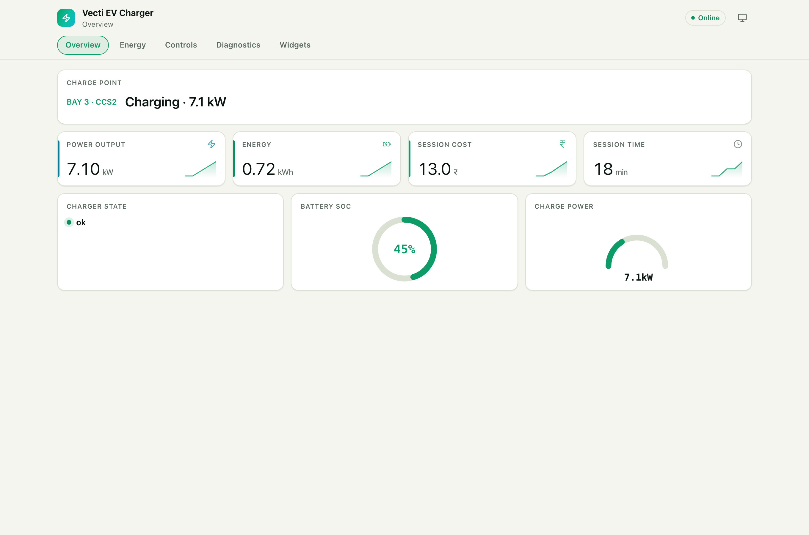 |
| 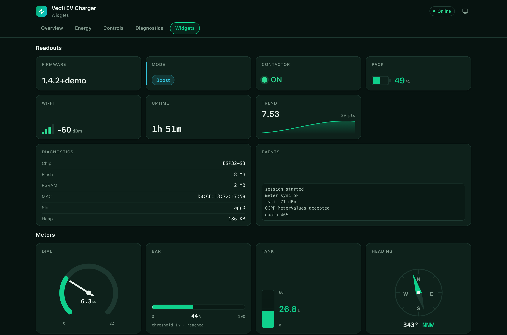 | 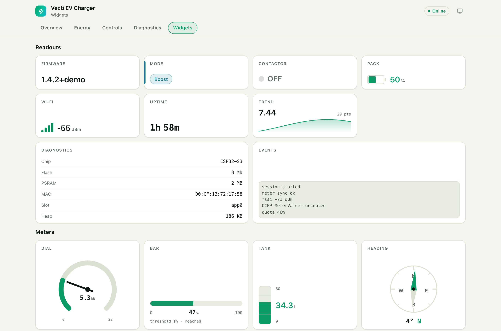 |

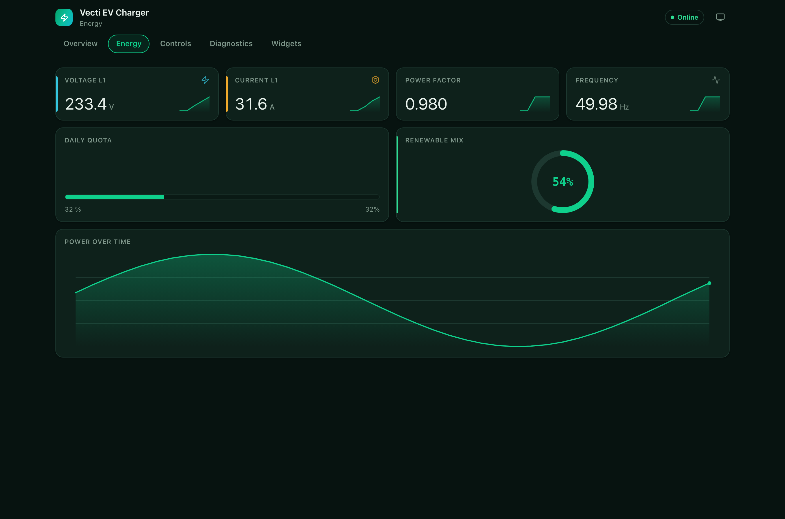 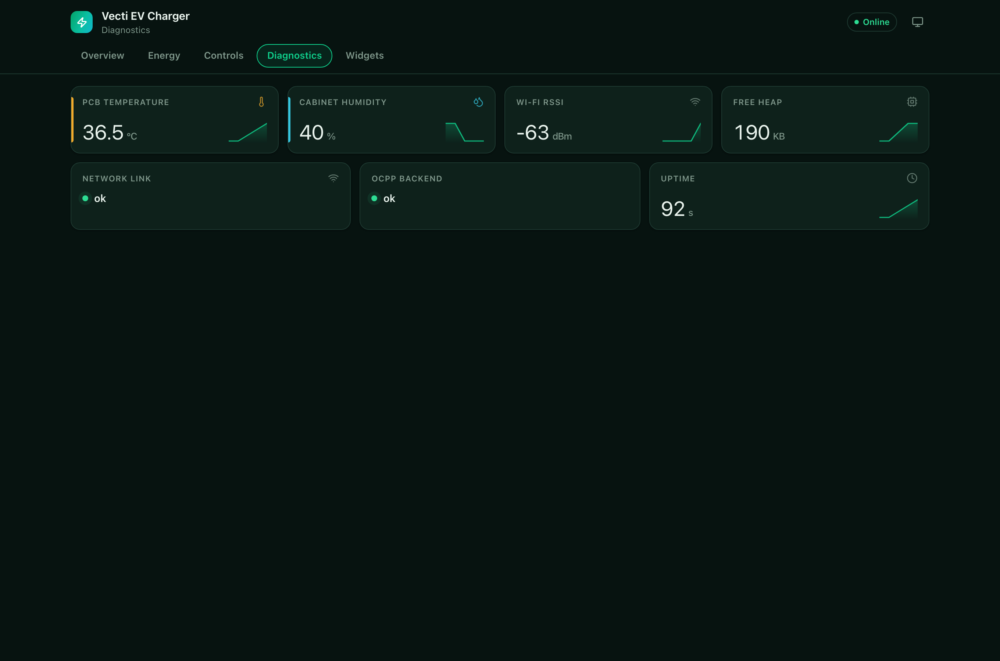

On a phone the horizontal tab strip collapses into a slide-in drawer, so no tab ever
scrolls off-screen:

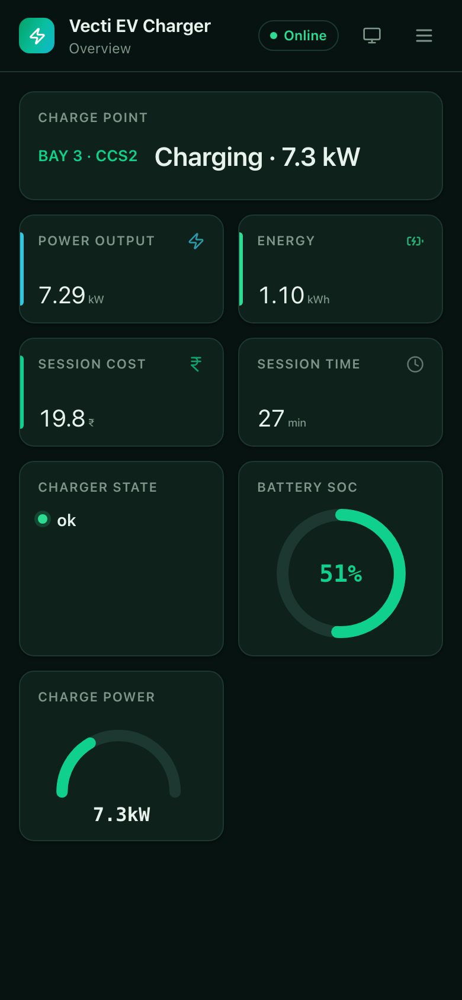 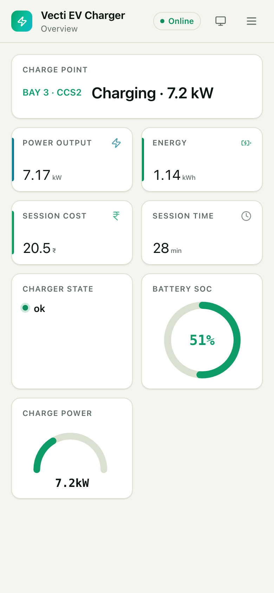

### VectiOTA · VectiSerial · VectiNet

| | Dark | Light | Phone |
|---|---|---|---|
| **VectiOTA** | 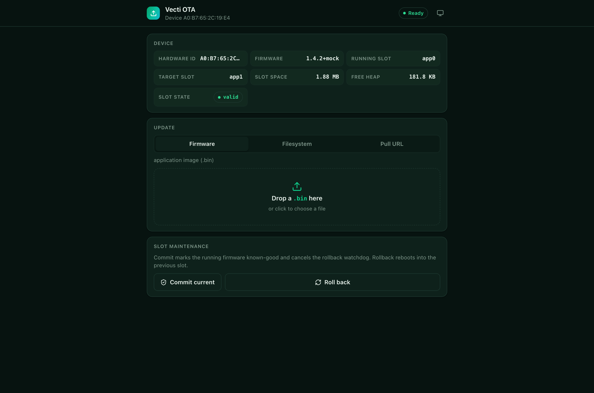 | 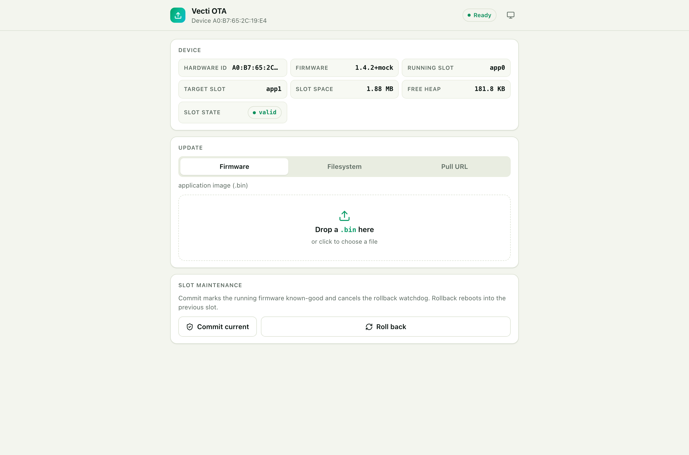 | 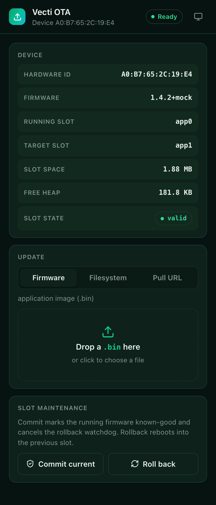 |
| **VectiSerial** | 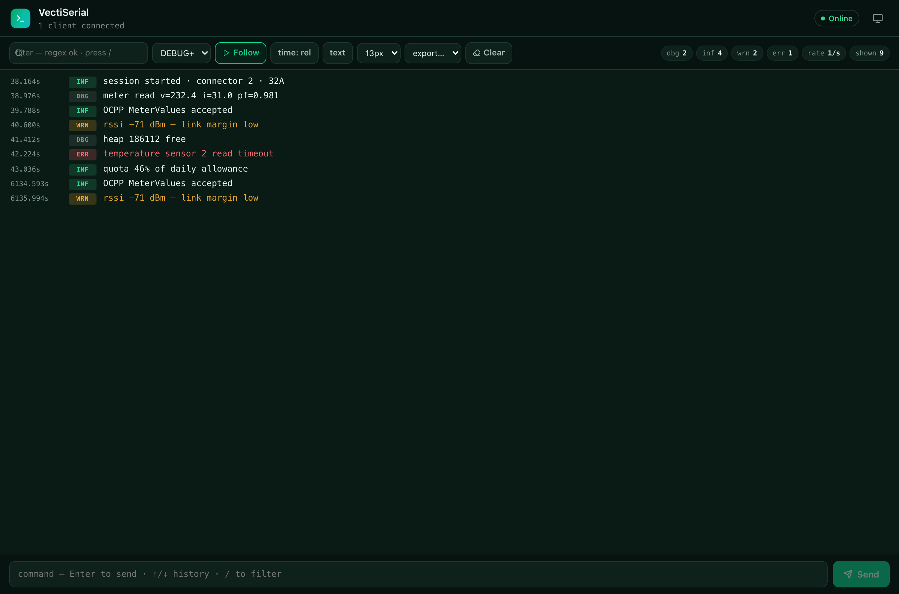 | 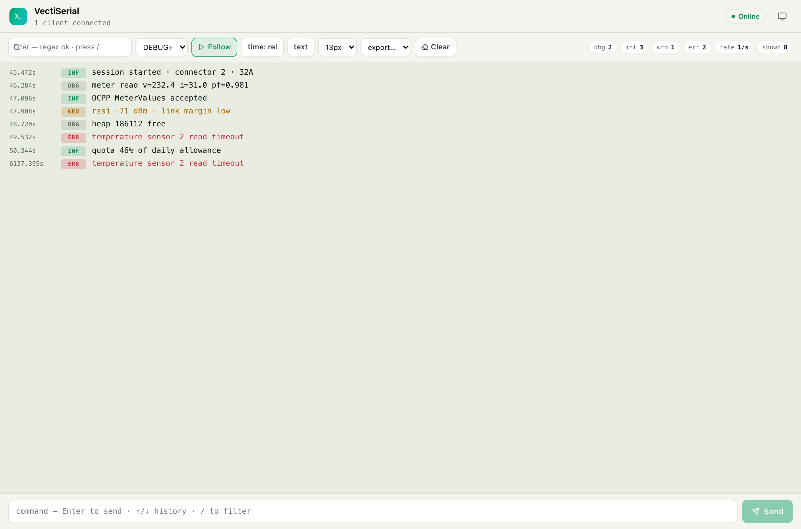 | 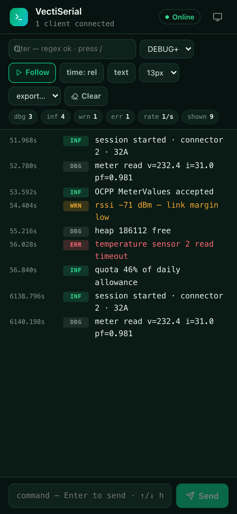 |
| **VectiNet** | 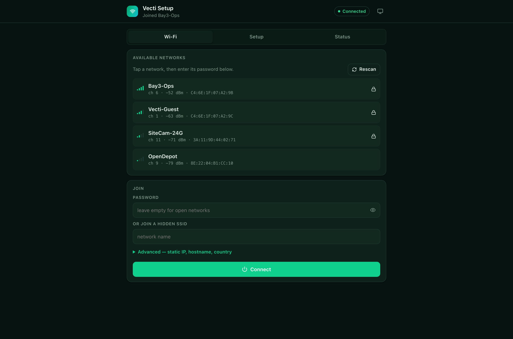 | 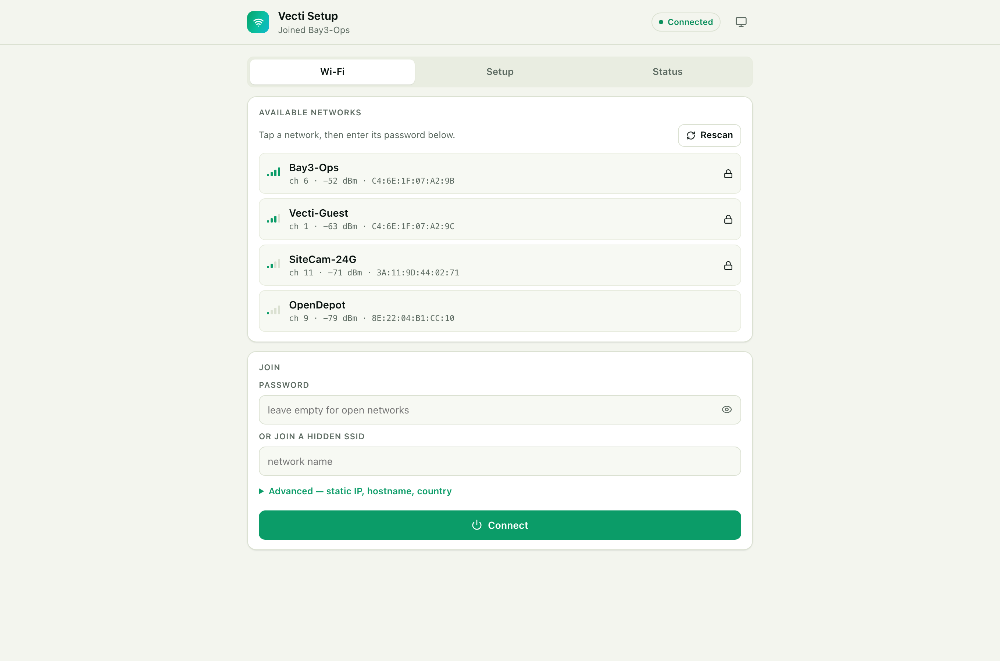 | 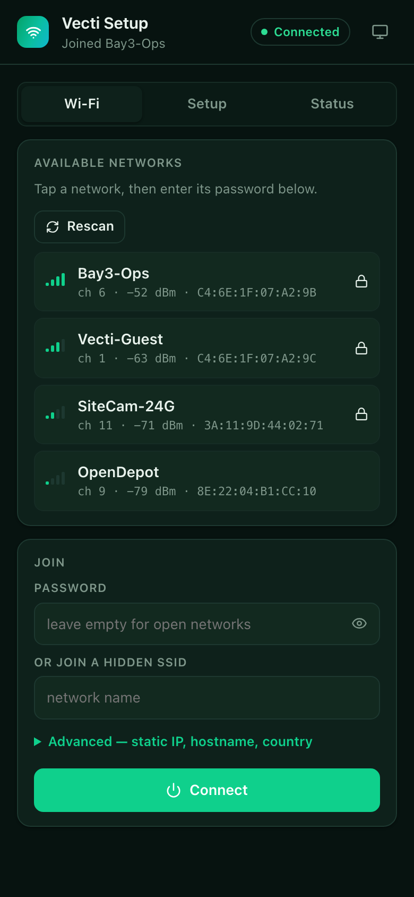 |

---

## 🚀 Quick start

Each library mounts onto an `AsyncWebServer` you already have. Line counts below are
what you *add* to a sketch that is already on Wi-Fi with a server object — counted
honestly, no hiding a setup block behind an ellipsis.

### VectiOTA — 3 lines

```cpp
#include <VectiOTA.h>                        // 1

void setup() {
  VectiOTA.begin(&server, "admin", "vecti"); // 2  →  /ota
  server.begin();
}

void loop() { VectiOTA.loop(); }             // 3  (rollback timer + pull mode)
```

### VectiSerial — 3 lines

```cpp
#include <VectiSerial.h>                     // 1

void setup() {
  VectiSerial.begin(&server, "admin", "vecti"); // 2  →  /serial + /serial/ws
  server.begin();
}

void loop() {
  VectiSerial.loop();                        // 3  (drains the log ring, reaps sockets)
  VectiSerial.inf("heap=%u", ESP.getFreeHeap());
}
```

### VectiNet — 4 lines

```cpp
#include <VectiNet.h>                        // 1

void setup() {
  VectiNet.begin(&server);                   // 2  →  /wifi + captive portal
  server.begin();
  VectiNet.autoConnect();                    // 3  (non-blocking; portal on failure)
}

void loop() { VectiNet.loop(); }             // 4
```

No `WiFi.begin()` anywhere — VectiNet owns the radio. With nothing in NVS it raises the
`Vecti-Setup` AP and the portal.

### VectiDash — 5 lines

```cpp
#include <VectiDash.h>                                                  // 1
vecti::DashCard temp(vecti::DashType::Number, "temp", "Temperature", "°C"); // 2

void setup() {
  VectiDash.add(&temp);                                                 // 3
  VectiDash.begin(&server, "admin", "vecti");                           // 4  →  / and /dash
  server.begin();
}

void loop() {
  temp.setValue(readTemp());
  VectiDash.tick();                                                     // 5
}
```

### All four at once

```cpp
#include <WiFi.h>
#include <ESPAsyncWebServer.h>
#include <VectiOTA.h>
#include <VectiSerial.h>
#include <VectiNet.h>
#include <VectiDash.h>

AsyncWebServer server(80);
vecti::DashCard temp(vecti::DashType::Number, "temp", "Temperature", "°C", 0, 50);
vecti::DashCard led (vecti::DashType::Switch, "led",  "Onboard LED");

void setup() {
  Serial.begin(115200);
  pinMode(LED_BUILTIN, OUTPUT);

  VectiNet.setApCredentials("Vecti-Setup");
  VectiNet.setHostname("vecti");
  VectiNet.setMdnsName("vecti");
  VectiNet.begin(&server);          // /wifi …

  VectiSerial.begin(&server);       // /serial + /serial/ws
  VectiOTA.setID(WiFi.macAddress());
  VectiOTA.setFWVersion("1.0.0");
  VectiOTA.begin(&server);          // /ota …

  led.onChange([](const String &v) { digitalWrite(LED_BUILTIN, v == "1"); });
  VectiDash.add(&temp);
  VectiDash.add(&led);
  VectiDash.begin(&server);         // / and /dash + /dash/ws

  server.begin();
  VectiNet.autoConnect();
  VectiOTA.commit();                // "this image booted fine" — cancels rollback
}

void loop() {
  VectiNet.loop();
  VectiSerial.loop();
  VectiOTA.loop();
  temp.setValue(analogRead(4) * 0.1f);
  VectiDash.tick();
}
```

Then open `http://vecti.local/`.

> ⚠️ **Threading.** ESPAsyncWebServer callbacks run on the **AsyncTCP task**; `loop()`
> runs on the **Arduino task**. Never block inside a callback — no `delay()`, no
> `ESP.restart()`, no long HTTP fetch. Set a flag and act in `loop()`. The libraries
> already defer their own reboots this way. `VectiSerial::onMessage` fires on the
> AsyncTCP task; `DashCardBase::onChange` is queued and applied inside `VectiDash.tick()`,
> so it runs on the loop task.

---

## 🧩 How it fits together

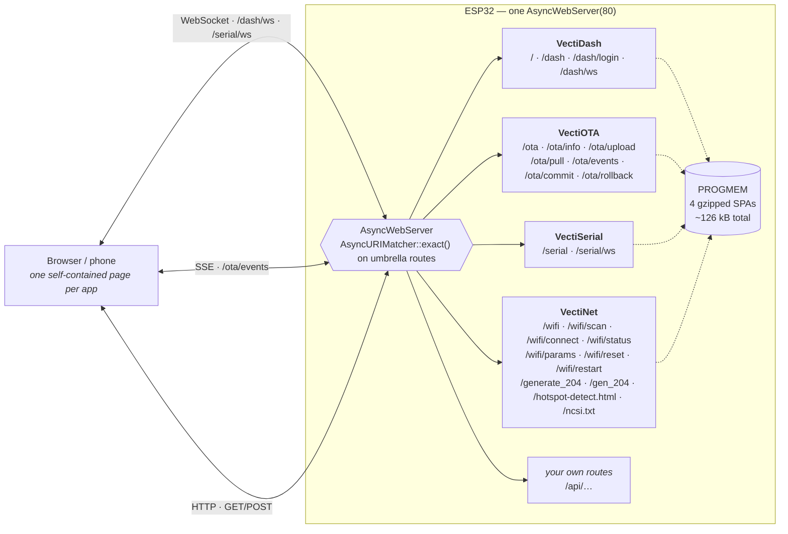

The four libraries never collide on a route, and they never own the server — you pass in
your own `AsyncWebServer` and keep adding your own endpoints alongside.

### Endpoint map

| Path | Method | Library | Purpose |
|---|---|---|---|
| `/` | GET | VectiDash | 302 → `/dash` |
| `/dash` | GET | VectiDash | Dashboard SPA |
| `/dash/login` | GET | VectiDash | Credential challenge in anonymous-read mode |
| `/dash/ws` | WS | VectiDash | Layout + value frames, inbound `cmd` frames |
| `/ota` | GET | VectiOTA | Updater UI |
| `/ota/info` | GET | VectiOTA | JSON: hwId, fwVersion, title, brand, heap, partitions, update flags |
| `/ota/upload` | POST | VectiOTA | Multipart firmware / filesystem upload |
| `/ota/pull` | POST | VectiOTA | `{"url":"…","mode":"firmware"}` — device fetches it |
| `/ota/events` | SSE | VectiOTA | Live progress to every open tab |
| `/ota/commit` | POST | VectiOTA | Mark current slot valid |
| `/ota/rollback` | POST | VectiOTA | Revert to previous slot + reboot |
| `/serial` | GET | VectiSerial | Console UI |
| `/serial/ws` | WS | VectiSerial | Log stream + command input |
| `/wifi` | GET | VectiNet | Provisioning portal |
| `/wifi/scan` | GET | VectiNet | JSON: visible networks |
| `/wifi/connect` | POST | VectiNet | Join / save a network |
| `/wifi/status` | GET | VectiNet | JSON diagnostics: RSSI, BSSID, gateway, DNS, uptime |
| `/wifi/params` | GET/POST | VectiNet | Custom-parameter form, NVS-backed |
| `/wifi/reset` | POST | VectiNet | Erase NVS + reboot |
| `/wifi/restart` | POST | VectiNet | Reboot only |
| `/generate_204` `/gen_204` `/hotspot-detect.html` `/ncsi.txt` | GET | VectiNet | OS captive-portal probes |

---

## 🎛 The widget catalogue

`DashType` has **50 types — 49 widgets plus `Custom`**, the raw-HTML escape hatch.
Every one of them renders in the bundled UI, and every one is free.

<sub>Counted with `grep -c 'case DashType::' libraries/VectiDash/src/VectiDash.cpp` → 50.</sub>

**All values cross the wire as strings.** `setValue()` has overloads for `int`,
`unsigned`, `long`, `float`, `double`, `bool`, `const char*` and `String`; structured
widgets take JSON *inside* that string.

### Readouts — 14

| Key | `DashType` | Shows | Wire value |
|---|---|---|---|
| `number` | `Number` | Big numeric KPI with unit + auto sparkline | numeric string |
| `text` | `Text` | Free text; empty renders `—` | any string |
| `status` | `Status` | Coloured dot + label | free text; the dot's tone is derived from it |
| `badge` | `Badge` | Compact pill | any string |
| `led` | `Led` | ON / OFF / BLINK indicator | `1` `true` `on` = on · `blink` = blinking · anything else = off |
| `temperature` | `Temperature` | Temperature readout | numeric string |
| `humidity` | `Humidity` | Humidity readout | numeric string |
| `battery` | `Battery` | Battery pictogram, % of `min..max` | numeric string; trailing `+` (or `unit="charging"`) shows the charging bolt |
| `signal` | `Signal` | 4-bar Wi-Fi strength | RSSI in dBm, e.g. `-67` |
| `uptime` | `Uptime` | `d h m s` breakdown | uptime in **seconds** |
| `table` | `Table` | Key/value table | `[["Key","Val"],…]` or `"k=v;k=v"` |
| `logview` | `LogView` | Scrolling log pane | `["line","line"]` or newline-separated |
| `image` | `Image` | Inline image | `http(s):`/`data:` URL, otherwise treated as base64 PNG |
| `sparkline` | `Sparkline` | Bare trend line | `[1,2,3]` or `"1,2,3"` |

### Meters — 8

| Key | `DashType` | Shows | Wire value |
|---|---|---|---|
| `gauge` | `Gauge` | 180° arc gauge | numeric string, scaled over `min..max` |
| `dial` | `Dial` | Needle dial | numeric string, `min..max` |
| `donut` | `Donut` | Ring with % in the middle | numeric string, `min..max` |
| `progress` | `Progress` | Horizontal progress bar | numeric string, `min..max` |
| `bar` | `Bar` | Bar with optional target mark | numeric string; `setStep()` draws the target mark |
| `level` | `Level` | Tank / fill level, tinted low→critical | numeric string, `min..max` |
| `compass` | `Compass` | Heading + 16-point name | degrees `0..360` (wraps) |
| `thermo` | `Thermo` | Thermometer column | numeric string, `min..max` |

### Charts — 5

| Key | `DashType` | Shows | Wire value |
|---|---|---|---|
| `chart` | `Chart` | Line / area / bar over x | `{"x":[…],"y":[…]}` — or use `chartPushXY(x, y)` |
| `multichart` | `MultiChart` | Up to 5 overlaid series | `{"x":[…],"s":[{"n":"L1","y":[…]}]}` |
| `histogram` | `Histogram` | Labelled bars | `{"l":["a","b"],"v":[1,2]}` |
| `scatter` | `Scatter` | XY point cloud | `{"x":[…],"y":[…]}` |
| `heatmap` | `Heatmap` | Row-major grid, max 2048 cells | `{"w":8,"v":[…]}` |

`chartPushXY()` transmits x alongside y, so an irregular sample cadence draws with the
right spacing — you do not have to push on a fixed interval. `chartSetMaxPoints()`
controls the ring depth (default 50).

### Controls — 20

Interactive widgets call `onChange(cb)`; the payload is the string below. The device
echoes every accepted value back to *all* connected clients, so multiple open tabs stay
in sync.

| Key | `DashType` | Does | Wire value (both ways) |
|---|---|---|---|
| `button` | `Button` | Fire-once action; inherits the card's `DashColor` so an E-STOP is not brand-green | sends `1` |
| `confirm` | `ConfirmButton` | Two-click armed button | sends `1` on the second click |
| `momentary` | `Momentary` | Dead-man / hold-to-run | sends `1` on press, `0` on release |
| `switch` | `Switch` | Toggle | `1` / `0` (`true` also reads as on) |
| `slider` | `Slider` | Continuous slider | numeric string, `min..max` step `step` |
| `range` | `RangeSlider` | Two-handle range | `"lo,hi"` |
| `stepper` | `Stepper` | −/+ with hold-to-repeat | numeric string, `min..max` step `step` |
| `dropdown` | `Dropdown` | Select | the chosen option string |
| `radio` | `Radio` | Radio group | the chosen option string |
| `checklist` | `Checklist` | Multi-select | pipe-joined selection, `"A\|B"` |
| `input` | `Input` | Single-line text; commits on Enter/blur | any string (`unit` becomes the placeholder) |
| `textarea` | `Textarea` | Multi-line text | any string, newlines preserved |
| `password` | `Password` | Masked text with reveal | any string |
| `keypad` | `Keypad` | Numeric keypad with an Enter key | the buffered digits, sent on Enter |
| `joystick` | `Joystick` | Drag-to-steer pad, self-centring | `"x,y"` |
| `xypad` | `XYPad` | 2-axis pad that stays where you left it | `"x,y"` |
| `knob` | `Knob` | Rotary knob | numeric string, `min..max` step `step` |
| `color` | `Color` | Colour picker | `#rrggbb` |
| `datetime` | `DateTime` | Date + time picker | Unix epoch **seconds** |
| `qrcode` | `QrCode` | Renders a QR on-device | the payload string, e.g. `WIFI:S:ssid;T:WPA;P:pass;;` |

`dropdown`, `radio` and `checklist` take their options from
`setOptions("Eco|Standard|Boost")` — pipe-separated, the same convention VectiNet uses
for its parameter dropdowns.

### Layout & escape hatch — 3

| Key | `DashType` | Does | Wire value |
|---|---|---|---|
| `header` | `Header` | Full-width section title; no card chrome | label only |
| `divider` | `Divider` | Full-width rule; no card chrome | — |
| `custom` | `Custom` | Your own HTML in the card body, via `setCustomHtml()` | injected into `<span id="dash-<id>-out">` inside your snippet on every broadcast |

> `custom` renders firmware-supplied markup verbatim — that is the point of it. A
> `<script>` in the snippet never executes, but a sketch that interpolates untrusted
> input into the snippet is injecting into its own page. Escape what you interpolate.

---

## 📦 Install

Dependency floor, for all four:

| Dependency | Minimum | Why |
|---|---|---|
| `ESP32Async/ESPAsyncWebServer` | **^3.11.0** | all four call `AsyncURIMatcher::exact()`, which does not exist below 3.11.0 — and which lives in ESPAsyncWebServer, **not** in the Arduino core |
| `ESP32Async/AsyncTCP` | **^3.4.0** (VectiDash declares ^3.4.10) | |
| `bblanchon/ArduinoJson` | **^7.4.0** | not needed by VectiSerial |

### PlatformIO — from GitHub

```ini
[env:esp32s3]
platform  = espressif32
board     = esp32-s3-devkitc-1
framework = arduino
build_flags = -std=gnu++17
build_unflags = -std=gnu++11
lib_deps =
  https://github.com/vectivolt/VectiOTA.git
  https://github.com/vectivolt/VectiSerial.git
  https://github.com/vectivolt/VectiNet.git
  https://github.com/vectivolt/VectiDash.git
  ESP32Async/ESPAsyncWebServer @ ^3.11.0
  ESP32Async/AsyncTCP          @ ^3.4.10
  bblanchon/ArduinoJson        @ ^7.4.0
```

Take only the ones you want — the four are independent.

### PlatformIO — from a local checkout

```ini
lib_extra_dirs = ../mcu_libraries/libraries
lib_deps =
  ESP32Async/ESPAsyncWebServer @ ^3.11.0
  ESP32Async/AsyncTCP          @ ^3.4.10
  bblanchon/ArduinoJson        @ ^7.4.0
```

### Arduino IDE

Not in the Library Manager. Copy the folders you want out of `libraries/` into
`~/Documents/Arduino/libraries/`, then install **ESPAsyncWebServer**, **AsyncTCP** and
**ArduinoJson** through the Library Manager. Restart the IDE.

### Cloning this repo

The four libraries are git **submodules** — a plain `git clone` leaves `libraries/*`
empty and every build fails with *"no such file or directory: VectiOTA.h"*.

```bash
git clone --recurse-submodules https://github.com/vectivolt/mcu_libraries.git
# already cloned without them?
git submodule update --init --recursive
```

### Supported platforms

| Target | Status |
|---|---|
| **ESP32** (all four libraries) | ✅ Built and run on an ESP32-S3 |
| **ESP8266** — VectiOTA only | ⚠️ `library.json` declares `espressif8266` and the source has real ESP8266 paths (BearSSL HMAC, `Updater.h`). Not tested. |
| **ESP8266** — Serial / Net / Dash | ❌ Not claimed. VectiNet `#error`s on non-ESP32: it needs Preferences/NVS, ESPmDNS and `esp_wifi`. |
| **RP2040 / RP2350+W** | Plausible future target — ESPAsyncWebServer already supports it. Not done. |
| **STM32, NXP** | No. No async web server, no onboard Wi-Fi. |

What is genuinely ESP-specific in *our* code: `esp_ota_ops`, NVS `Preferences`,
`ESPmDNS`, `mbedtls`. ESPAsyncWebServer 3.11.0 itself declares `espressif32`,
`espressif8266`, `raspberrypi` and `libretiny`, so the web layer ports further than we
currently do.

---

## 📏 What it costs you

Measured, not estimated. The gzipped PROGMEM blob is what actually consumes flash.

| App | Raw HTML | Gzipped blob in flash |
|---|---:|---:|
| VectiDash | 155,079 B | **46,811 B** |
| VectiNet | 82,969 B | **28,498 B** |
| VectiOTA | 71,475 B | **25,822 B** |
| VectiSerial | 67,383 B | **24,862 B** |
| **Total UI** | | **125,993 B ≈ 126 kB** |

Whole-firmware footprint of the bundled demo, which exercises all four libraries at
once — ESP32-S3-DevKitC-1, 8 MB flash, 2 MB PSRAM, `default_8MB.csv` partitions:

- **Flash 1,226,013 B — 36.7 % of 3,342,336**
- **RAM 62,440 B — 19.1 % of 327,680**

VectiDash is the heavy one because it carries 49 widgets. It is heavier than ESP-DASH's
blob. That is the trade.

---

## 🔬 Verified on hardware — and what is not

Reference device: **ESP32-S3 rev v0.2, QFN56, 8 MB flash, 2 MB embedded PSRAM,
USB-Serial/JTAG, MAC `D0:CF:13:72:17:58`.** The device was exercised **over USB serial
only — it was never joined to a LAN.**

**Verified:**

- Flashes: 1,226,384 bytes written, esptool hash verified.
- Boots cleanly. PSRAM initialises. No panic, no reset loop.
- HTTP server starts; routes `/ /dash /ota /serial /wifi` register.
- mDNS starts (`vecti-demo.local`).
- With no stored credentials it enters the captive-portal state, which is correct.
- **No memory leak.** Soak with the history ring cut to 16 entries and a 4 s heartbeat:
  heap fell from 247,596 B while the ring filled, then went **flat at 244,188 B from
  ~72 s onward** and stayed flat. The steady ~96 B/min decline seen at production
  settings is the 512-entry ring filling, not a leak; the ±496 B oscillation is one
  alloc/free cycle of the JSON serialisation buffer.

**Not verified — do not assume otherwise:**

- HTTP endpoints serving real responses over a network
- The WebSocket dashboard against real hardware
- OTA upload / pull / rollback on real hardware
- Captive-portal provisioning end to end

---

## 🚧 Honest limitations

**The LGPL question.** Our code is Apache-2.0. But all four libraries link
**ESPAsyncWebServer** and **AsyncTCP**, which are **LGPL-3.0**. On an MCU there is no
dynamic linking, so LGPL §4's relink obligations attach to the binary you ship. We do
**not** claim "zero copyleft obligations" — that would be false. What is true: our
source is Apache-2.0 and readable, and **every competitor in this space inherits exactly
the same async dependency.** Talk to your counsel about §4 either way.

**Firmware signing is symmetric.** `setSigningKey()` is HMAC-SHA256. The key ships
inside the firmware image, so anyone who can read the flash can forge a valid signature.
It raises the bar over "a stolen Wi-Fi password is enough"; it is not code signing.
Asymmetric signing (Ed25519) is a known future improvement, not a shipped feature.

**Pulled images carry no signature.** `POST /ota/pull` has no `X-Vecti-Signature` to
check, so pin a CA with `setPullCACert()`. An `https://` pull with neither a CA nor
`allowInsecurePullTls(true)` is refused rather than trusting whatever answers the DNS
query.

**Rate limiting is a small ring.** Eight per-IP slots. Enough for an office network, not
a DoS-resistant cache.

**NVS writes are not transactional.** VectiNet writes the network count last, so a power
cut mid-write can lose the newest slot — but it can never make NVS claim a slot it does
not hold.

**Project maturity.** VectiSuite is new. **No users, no CI, no test suite, not in the
Arduino Library Manager.** The incumbents it is compared against above are mature,
widely deployed and heavily tutorialised. If you need something that thousands of
people have already hit the sharp edges of, that is a real argument for them.

---

## 🛠 Repository layout

```
mcu_libraries/
├── demo/                    PlatformIO sketch wiring all four libraries
│   ├── platformio.ini
│   └── src/main.cpp
├── docs/screenshots/        PNGs used here and in the per-library docs
├── libraries/               ← git submodules
│   ├── VectiOTA/            README + examples inside
│   ├── VectiSerial/
│   ├── VectiNet/
│   └── VectiDash/
├── ui/                      Svelte sources for the four SPAs
│   ├── apps/{dash,net,ota,serial}/
│   ├── shared/widgets/      one .svelte per widget + CONTRACT.md
│   └── scripts/             build, gzip → PROGMEM, screenshot capture
└── tools/
    ├── mock_device.js       fake device for UI work — no ESP32 needed
    └── preview_proxy.js     localhost proxy for screenshotting a live device
```

Build and flash the demo:

```bash
cd demo
pio run
pio run -t upload
pio device monitor -b 115200
```

With no `DEMO_WIFI_SSID` / `DEMO_WIFI_PASS` build flags the demo boots straight into the
VectiNet setup portal — which is the flow a first-time user should see anyway.

Regenerate the screenshots:

```bash
node tools/mock_device.js &
node ui/scripts/capture-docs.mjs
```

---

## ✅ Production checklist

- [ ] Set credentials on every UI: `VectiOTA.begin(&server, "admin", "<strong>")`, same for Serial, Dash, and `VectiNet.setAuth()`
- [ ] `VectiOTA.setSigningKey("<hex>")` — and read the symmetric-key caveat above
- [ ] `VectiOTA.setRollbackTimeoutMs(30000)`, then `VectiOTA.commit()` from `setup()` **after** your self-test
- [ ] `VectiOTA.allowFilesystemUpdates(false)` if you never ship a filesystem image
- [ ] `VectiOTA.setPullCACert(...)` if you use pull mode over HTTPS
- [ ] `VectiSerial.setMirrorToHardwareSerial(false)` on headless devices
- [ ] `VectiNet.setApCredentials("MyProduct-Setup", "<strong>")` — an open setup AP in a public space is a free config console
- [ ] `VectiNet.setCountryCode(...)` for the region you ship to
- [ ] `VectiDash.begin(..., allowAnonymousRead=false)` if even reading telemetry should require a login
- [ ] `VectiOTA.setID(...)` with something unique — the MAC works, a serial number is better

---

## 🤝 Contributing

PRs welcome.

- C++17. No C++20-only features — VectiOTA still has to build for ESP8266.
- Comments explain **why**, not what.
- A new widget needs four things in sync: a `DashType` enumerator (**append**, never
  reorder), a case in `typeName()`, a `.svelte` file registered in
  `ui/shared/widgets/index.js`, and a usage path in `demo/src/main.cpp`. Read
  [`ui/shared/widgets/CONTRACT.md`](ui/shared/widgets/CONTRACT.md) first — it covers
  props, the string-value rule, accessibility and the no-new-dependencies rule.
- After editing Svelte sources, run `npm run build` in `ui/` to refresh the matching
  `*_ui_gz.h` PROGMEM blob. Never hand-edit those files.

---

## 📄 License

**Apache-2.0** — full text in [LICENSE](LICENSE). Free for commercial products, no
attribution required. See the LGPL note under [Honest limitations](#-honest-limitations)
for what the async dependency adds on top.

<sub>Author: <b>Chinmoy Bhuyan</b> · <a href="mailto:chinmoy@joulepoint.com">chinmoy@joulepoint.com</a> · © 2026 VectiVolt</sub>
