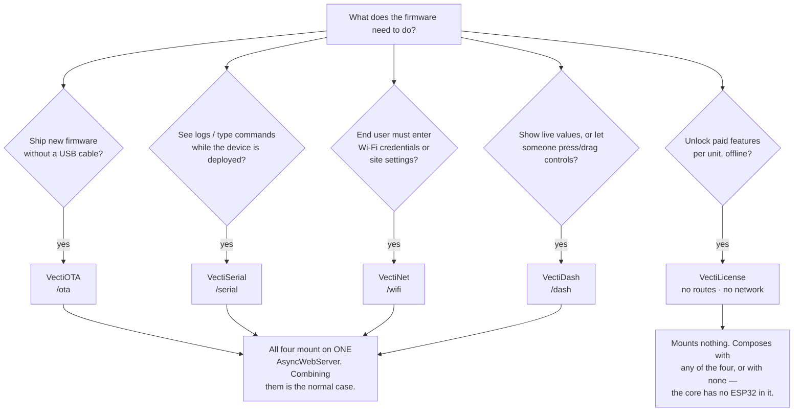
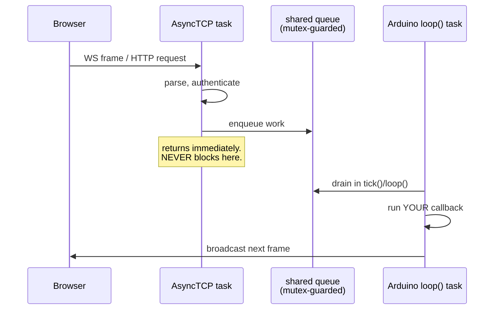
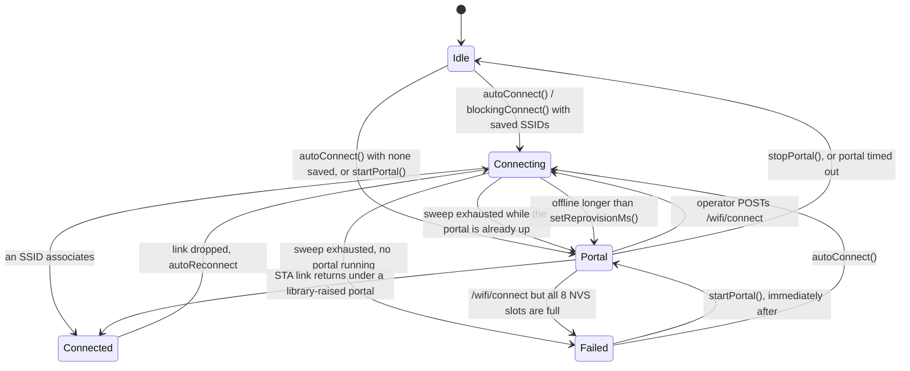

# VectiSuite — the AI agent's reference 🤖

Everything an agent needs to write **compiling, correct** firmware against
VectiOTA, VectiSerial, VectiNet, VectiDash and VectiLicense on the first
attempt. Every signature here was transcribed from the headers in
`libraries/Vecti{OTA,Serial,Net,Dash}/src/*.h` and
`libraries/VectiLicense/include/vectilicense/vectilicense.h`; every endpoint
from the matching `.cpp`. Where this file and your prior knowledge disagree,
this file is right — and where this file and the headers disagree, **the headers
are right**.

The first four are ESP32 Arduino libraries that share one `AsyncWebServer`. The
fifth, **VectiLicense**, is a freestanding C99 library with no server, no routes
and no network: it verifies Ed25519 licence blobs locally. It has one rule that
overrides everything else in this document — [the device verifies and never
mints](#-vectilicense--the-rule-the-api-and-the-hal).

Short version for a busy agent: [`../AGENTS.md`](../AGENTS.md).
Flat digest: [`../llms.txt`](../llms.txt).

---

## 🌳 Which library do I need?



Reach for a **plain `AsyncWebServer` handler** instead when you need a bespoke
JSON API, a file upload that is not firmware, or a page these four do not draw.
None of the libraries prevents that — just do not mount it on `/`, `/ota*`,
`/serial*`, `/wifi*` or `/dash*`.

Do **not** reach for VectiLicense to sign firmware images — that is VectiOTA's
`setSigningKey()`, and it is symmetric HMAC. VectiLicense signs *licences*.

---

## 📦 Install and version facts you must not get wrong

### PlatformIO

```ini
[env:esp32s3]
platform  = espressif32 @ ^6.7.0
board     = esp32-s3-devkitc-1
framework = arduino
build_flags = -std=gnu++17
build_unflags = -std=gnu++11
lib_deps =
    ESP32Async/ESPAsyncWebServer @ ^3.11.0
    ESP32Async/AsyncTCP          @ ^3.4.0
    bblanchon/ArduinoJson        @ ^7.4.0
```

| Fact | Why it matters |
|---|---|
| **ESPAsyncWebServer `^3.11.0` is a floor, not a preference** | All four libraries call `AsyncURIMatcher::exact()`. It does not exist below 3.11.0. A `^3.7.0` constraint lets the resolver pick a version the sources cannot compile against. |
| **`AsyncURIMatcher` comes from ESPAsyncWebServer, not the Arduino ESP32 core** | Older documentation (and older model weights) place it in the core. It is not there. |
| **AsyncTCP `^3.4.0`** | `libraries/VectiDash/library.json` pins `^3.4.10`; the other three pin `^3.4.0`. Resolving to ≥3.4.10 satisfies all four. |
| **ArduinoJson `^7.4.0`** | Required by VectiOTA, VectiNet, VectiDash. VectiSerial deliberately has no JSON dependency — it hand-rolls its frames. |
| **The demo builds on arduino-esp32 2.0.17 / platform espressif32 6.13.0** | That is the combination that was actually built and flashed. |
| `lib_ignore = AsyncTCP_RP2040W, ESPAsyncTCP` | If a global PlatformIO library store holds RP2040/ESP8266 async TCP ports, the dependency finder pulls one in and fails on an `#error` meant for another board. |
| **VectiLicense needs none of the three** | Not ESPAsyncWebServer, not AsyncTCP, not ArduinoJson — not even `<string.h>`, which is a hosted header, so `core/` declares the three functions it calls (`memcpy`, `memset`, `memcmp`) itself. Your runtime must still provide those symbols; every bare-metal runtime does. Do not add dependencies to a licensing-only sketch. |

Add the fifth submodule the same way as the others:

```ini
lib_deps =
    https://github.com/vectivolt/VectiLicense.git
```

### Platform support — be precise

| Target | VectiOTA | VectiSerial | VectiNet | VectiDash |
|---|---|---|---|---|
| ESP32 (verified on ESP32-S3) | ✅ | ✅ | ✅ | ✅ |
| ESP8266 | declared in `library.json`, real code paths (`Updater.h`, BearSSL HMAC) | ✗ | ✗ (`#error`) | ✗ |
| RP2040 / RP2350+W | plausible future target — **not** supported today | | | |
| STM32 / NXP | no — no async web server, no onboard Wi-Fi. Do not promise them. | | | |

What is ESP-specific in *this* code: `esp_ota_ops`, NVS `Preferences`,
`ESPmDNS`, `mbedtls`. ESPAsyncWebServer itself declares `espressif32,
espressif8266, raspberrypi, libretiny`, so the web layer ports further than
these libraries currently do.

VectiLicense is on a different axis entirely — say so precisely, because the
gap between "portable" and "tested" is wide here:

| VectiLicense layer | Portable to | Actually built? |
|---|---|---|
| `core/` — Ed25519 verify, SHA-256/512, base32, parse, constant-time compare | any conforming C99 target | ✅ **compile-verified and tested.** Host clang with `-Wall -Wextra -Werror -Wpedantic -Wconversion`; `arm-none-eabi-gcc` for Cortex-M4 and M0+ with `-ffreestanding -nostdinc -Os`, both as `ctest` cases |
| `hal/posix` (Linux, Pi, macOS), `hal/none` (the stub to fill in) | POSIX hosts / anything | ✅ compiled and exercised by the test suite |
| `transport/` — CAN/BLE chunk reassembly, UART line framing | anything moving 160 chars | ✅ compile-verified, tested, cross-compiled |
| `bridge/vl_bridge.h` — `vecti::License` | any C++11, no Arduino | ✅ compiled and tested on the host |
| `hal/esp32`, `hal/rp2040`, `hal/stm32`, `hal/nxp` | those families | ❌ **never compiled, never run.** Written to each vendor's documented API |
| `bridge/vl_bridge_{net,dash,serial,ota}.h` | Arduino/ESP32 | ❌ **never compiled against the real sibling libraries.** Each is behind `__has_include`, which is exactly why nothing has ever type-checked them |

Never state or imply that the ESP32 HAL or any bridge is tested. Tell the user
to expect an include-path fix on the first build.

### Measured footprint

Gzipped PROGMEM blob (what actually costs flash), byte-counted from the
`*_ui_gz.h` arrays:

| App | raw HTML | gzipped blob |
|---|---:|---:|
| VectiDash | 155,079 B | **46,811 B** |
| VectiNet | 82,969 B | **28,498 B** |
| VectiOTA | 71,475 B | **25,822 B** |
| VectiSerial | 67,383 B | **24,862 B** |

Total embedded UI ≈ **126 kB** (125,993 bytes). A demo exercising all four at once on an
ESP32-S3 (8 MB flash, `default_8MB.csv`) measured **flash 1,226,013 B (36.7 %
of 3,342,336)** and **RAM 62,440 B (19.1 % of 327,680)**.

---

## 🧵 The threading model — read this before you write a callback

There are exactly **two tasks**.



| Callback | Runs on | Blocking allowed? |
|---|---|---|
| `DashCardBase::onChange` | **loop() task**, from inside `VectiDash.tick()` | A slow callback delays *your own* loop, not the server. Still keep it under your push interval. |
| `VectiSerial::onMessage` | **AsyncTCP task** | ❌ No `delay()`, no `ESP.restart()`, no NVS/flash write. Logging is fine — it only appends to a ring. |
| `VectiOTA::onStart/onProgress/onEnd/onError/onBeforeReboot` | **AsyncTCP task** (upload path) | ❌ Same rules. `onBeforeReboot` returning `false` suppresses the automatic reboot. |
| `VectiNet::onState`, `VectiNet::onConfig` | **loop() task**, always — even when an HTTP POST caused the change | Safe to touch WiFi, NVS, other libraries. |

Blocking on the AsyncTCP task stalls **every** connection on the device, and
`ESP.restart()` there tears the TCP stack down from inside its own callback —
the client never sees the response it was waiting for. The libraries themselves
defer every reboot for exactly this reason (`VectiOTA::_scheduleReboot`,
`VectiNet::_rebootAt`), which is *why* their `loop()` hooks are mandatory.

The escape hatch is always the same three lines:

```cpp
volatile bool rebootRequested = false;
// in the callback:  rebootRequested = true;
// in loop():        if (rebootRequested) ESP.restart();
```

`vl_verify()` obeys the same rule for a different reason: it is tens of
milliseconds of Ed25519 on an ESP32 and wants ~5 KB of stack. Running it on the
AsyncTCP task starves every other socket, and a `blob_store()` NVS write there
is a blocking flash erase on the task servicing them. Queue on the callback,
verify in `loop()`.

---

## 🔑 VectiLicense — the rule, the API and the HAL

`libraries/VectiLicense/include/vectilicense/vectilicense.h` is the entire
public surface. C99, `extern "C"`-guarded, links into C and C++ alike. Nothing
allocates, recurses, blocks or touches a file, and `core/` has no writable
static state at all.

### The rule that overrides everything else

**The device verifies. It never mints, and it structurally cannot.**

The firmware embeds a 32-byte Ed25519 **public** key. The private key lives in
one file on the vendor's machine —
`libraries/VectiLicense/tools/vl_mint.py` — and never ships. There is **no
signing function anywhere in the device build**: it was deleted from the
vendored Ed25519, not disabled.

If a user asks for on-device licence generation, self-activation, or a
"licensing server call", the correct answer is that none of those exist by
design, and explaining why is the useful reply:

| Never generate this | Why |
|---|---|
| A private key, seed, or signing routine in firmware | That recreates the keygen this library exists to remove. The previous symmetric design shipped the minting secret in every image; one flash dump unlocked every unit the vendor would ever sell. |
| An HTTP / MQTT call to an activation endpoint | There is none. No server, no endpoint, no protocol. `vl_verify()` is pure local computation and needs no network, ever. |
| `if (vl_verify(...)) unlock();` | Every failure is **negative**, therefore truthy. That unlocks the product on every rejection. Compare against `VL_OK`. |
| An all-zero placeholder public key | 32 zero bytes are a valid **low-order** curve point, and a signature against a low-order key can be forged with no private key at all. `core/` rejects such keys outright so it fails closed — but write it as a real point, from `vl_mint.py keygen`, so it fails closed for the right reason. |

### The functions — all of them

```c
#include "vectilicense/vectilicense.h"

vl_status_t vl_verify(const char *blob,
                      const vl_config_t *cfg,
                      const vl_hal_t *hal,
                      vl_license_t *out);

vl_status_t vl_compute_fingerprint(const vl_hal_t *hal,
                                   uint8_t out_fingerprint[VL_FINGERPRINT_LEN]);

vl_status_t vl_encode_device_id(const uint8_t fingerprint[VL_FINGERPRINT_LEN],
                                char *out, size_t out_capacity);

int         vl_has_feature(const vl_license_t *lic, unsigned bit);   /* 0..31 */

vl_status_t vl_posture(const vl_hal_t *hal, vl_posture_t *out);

const char *vl_status_str(vl_status_t status);   /* never NULL, for any int */
const char *vl_version_str(void);                /* "vectilicense/1.0.0" */
```

| Function | Contract |
|---|---|
| `vl_verify` | The whole library. `out` may be NULL if you only want the verdict. On **any** failure `*out` is zeroed, so a caller who ignores the return code sees no features rather than stale ones. Returns `VL_OK` only when every *applicable* check passed. |
| `vl_compute_fingerprint` | `SHA-256("vectilicense:fingerprint:v1" ‖ (len_u8 ‖ segment)*)` over every segment the HAL yields, in order. `VL_ERR_PLATFORM` if the HAL yields none. `vl_verify()` calls it itself; you call it to show the customer their id. |
| `vl_encode_device_id` | First 16 bytes of a fingerprint → 26 Crockford-base32 characters. `out_capacity` must be ≥ `VL_DEVICE_ID_STR_BUF_LEN` (27) or `VL_ERR_BUFFER_TOO_SMALL`. |
| `vl_has_feature` | No error return by design: returns 0 for NULL, for `bit > 31`, and for a clear bit. An unreadable licence has no features. |
| `vl_posture` | **Reports, never enforces.** Fails soft: a NULL `hal`, or a HAL with no `secure_posture`, gives `VL_POSTURE_UNKNOWN` in both fields and returns `VL_OK`. `VL_ERR_INVALID_ARG` only for a NULL `out`. |
| `vl_status_str` | Never returns NULL — not for a valid code, not for a garbage int. Safe directly inside a log format string. |

### The HAL — one struct, one required member

```c
typedef struct vl_hal {
    /* REQUIRED. Enumerate hardware identity segments, idx 0..n-1.
     * Write at most `cap` bytes to `out` and set *out_len.
     * Return VL_ERR_NO_MORE_SEGMENTS to end the list. */
    vl_status_t (*read_id_segment)(void *ctx, uint32_t idx,
                                   uint8_t *out, size_t cap, size_t *out_len);

    /* OPTIONAL. Wall-clock epoch seconds. NULL => validity windows are not
     * enforced and vl_verify reports that it could not check them. */
    vl_status_t (*now_epoch)(void *ctx, uint32_t *out_epoch);

    /* OPTIONAL. Monotonic high-water mark, to blunt clock rollback.
     * Both NULL or both set. */
    vl_status_t (*hwm_load)(void *ctx, uint32_t *out);
    vl_status_t (*hwm_store)(void *ctx, uint32_t value);

    /* OPTIONAL. Persist the activated licence blob. NULL => caller stores it. */
    vl_status_t (*blob_load)(void *ctx, char *out, size_t cap, size_t *out_len);
    vl_status_t (*blob_store)(void *ctx, const char *blob, size_t len);

    /* OPTIONAL. Platform security posture, for reporting only. */
    vl_status_t (*secure_posture)(void *ctx, vl_posture_t *out);

    void *ctx;
} vl_hal_t;
```

**Only `read_id_segment` is required.** The core behaves correctly in all 64
combinations of the optional members being NULL, and there is a test matrix
asserting exactly that. Callbacks must not allocate and must not block
indefinitely; anything other than `VL_OK` (or the documented sentinel) is a hard
failure and `vl_verify()` fails closed.

Four things agents get wrong about the HAL:

- **`vl_verify()` never calls `blob_load` or `blob_store`.** It is handed a
  blob; storage is the application's business. They live in the struct so the
  bridges and examples have one place to find them.
- **Segments are hashed in order with a one-byte length prefix**, so `{"AB","C"}`
  and `{"A","BC"}` differ. The set *and* the order are part of the on-wire
  format: changing either invalidates every licence already issued. Freeze them
  before the first shipment.
- **`VL_FLAG_ENFORCE_HWM` needs all three of `now_epoch`, `hwm_load`,
  `hwm_store`.** Setting it without them is `VL_ERR_INVALID_ARG`, never a silent
  downgrade — a mark with no clock to compare against is not weaker rollback
  protection, it is none.
- **`hal/none` fails on purpose.** Its `read_id_segment` returns
  `VL_ERR_PLATFORM` so you find out at bring-up. Never "fix" it by returning a
  constant: that gives every unit the same fingerprint, so one licence unlocks
  the whole production run and no licence is ever revocable — and it fails
  *silently*, all the way to the customer.

Ready-made HALs live in `libraries/VectiLicense/hal/`, each exposing a factory:

| Header | Factory | Identity it reads | Built? |
|---|---|---|---|
| `hal/esp32/vl_hal_esp32.h` | `const vl_hal_t *vl_hal_esp32(void)` | eFuse base MAC + chip model/cores/revision/features + SPI flash JEDEC id; NVS storage; Secure Boot posture | ❌ never |
| `hal/rp2040/vl_hal_rp2040.h` | `vl_hal_rp2040()` | QSPI flash chip unique id | ❌ never |
| `hal/stm32/vl_hal_stm32.h` | `vl_hal_stm32()` | 96-bit factory UID | ❌ never |
| `hal/nxp/vl_hal_nxp.h` | `vl_hal_nxp()` | Kinetis `SIM->UIDx`, or i.MX RT OCOTP | ❌ never |
| `hal/posix/vl_hal_posix.h` | `vl_hal_posix(const char *iface, const char *state_path)` | interface MAC + `/etc/machine-id` — **weak**, a cloned image with a spoofed MAC reproduces it | ✅ tested |
| `hal/none/vl_hal_none.h` | `vl_hal_none()` | nothing; fails closed | ✅ tested |

Porting a new board is copying `hal/none/` and writing one function. The
walkthrough is `libraries/VectiLicense/docs/PORTING.md`.

### Config and result

```c
typedef struct { uint8_t key_id; uint8_t key[VL_PUBKEY_LEN]; } vl_pubkey_t;

typedef struct {
    const vl_pubkey_t *keys;
    size_t             key_count;
    uint8_t            family;
    const uint32_t    *revoked_serials;
    size_t             revoked_count;
    uint32_t           flags;      /* VL_FLAG_REQUIRE_CLOCK | VL_FLAG_ENFORCE_HWM */
} vl_config_t;

typedef struct {
    uint8_t  version, key_id, family;
    uint32_t features;
    uint8_t  device_id[VL_DEVICE_ID_LEN];
    uint32_t not_before, not_after, serial;
    uint32_t checked;              /* VL_CHECKED_* bitmask */
} vl_license_t;

typedef enum { VL_POSTURE_UNKNOWN = 0, VL_POSTURE_OFF = 1, VL_POSTURE_ON = 2 }
    vl_posture_state_t;
typedef struct { vl_posture_state_t secure_boot, flash_encryption; } vl_posture_t;
```

Build **one `const vl_config_t`** and pass its address; it is never written to.
Carrying more than one key is how rotation works — `key_id` in the payload
selects. `revoked_serials = NULL` **or** `revoked_count = 0` disables the
revocation check, and `VL_CHECKED_REVOCATION` then stays clear so a caller can
tell "not revoked" from "not checked".

**`checked` is the field agents forget.** `VL_OK` means every *applicable* check
passed; `checked` says which were applicable.

| Bit | Set when |
|---|---|
| `VL_CHECKED_SIGNATURE` | always, on `VL_OK` |
| `VL_CHECKED_DEVICE` | always, on `VL_OK` |
| `VL_CHECKED_TIME` | the HAL had a clock and the window was enforced |
| `VL_CHECKED_REVOCATION` | a non-empty deny-list was configured and consulted |
| `VL_CHECKED_HWM` | `VL_FLAG_ENFORCE_HWM` was set |

With no `now_epoch`, `vl_verify()` returns **`VL_OK` for an expired licence** and
leaves `VL_CHECKED_TIME` clear. That is the documented contract, not a bug — a
device with no RTC would otherwise reject every time-limited licence it was ever
issued. If expiry matters, read the bit or set `VL_FLAG_REQUIRE_CLOCK`.

```c
if (st == VL_OK && lic.not_after != 0u && !(lic.checked & VL_CHECKED_TIME)) {
    /* This licence has an expiry that nobody enforced. Decide what that means. */
}
```

### Status codes

`VL_OK` is 0. **Every failure is negative**, and no function in this library
returns `VL_OK` on any error path.

| Code | Value | Usually means |
|---|---:|---|
| `VL_ERR_INVALID_ARG` | −1 | a bug in your integration, not a bad licence |
| `VL_ERR_BUFFER_TOO_SMALL` | −2 | you passed fewer than `VL_DEVICE_ID_STR_BUF_LEN` bytes |
| `VL_ERR_BAD_FORMAT` | −3 | truncated paste, extra characters, a `U`, a smart quote |
| `VL_ERR_BAD_MAGIC` | −4 | the customer pasted something that is not a licence |
| `VL_ERR_BAD_VERSION` | −5 | minted by a newer tool; upgrade the firmware |
| `VL_ERR_BAD_FAMILY` | −6 | right customer, wrong SKU |
| `VL_ERR_UNKNOWN_KEY` | −7 | key rotated out, or firmware predates the key |
| `VL_ERR_BAD_SIGNATURE` | −8 | forgery, corruption, **or the wrong vendor key in the build** |
| `VL_ERR_DEVICE_MISMATCH` | −9 | a copied licence — or a repaired board whose identity changed |
| `VL_ERR_NOT_YET_VALID` | −10 | clock is wrong, or the licence starts later |
| `VL_ERR_EXPIRED` | −11 | genuinely expired, or the clock is wrong |
| `VL_ERR_REVOKED` | −12 | on the compiled-in deny-list |
| `VL_ERR_CLOCK_ROLLBACK` | −13 | clock moved backwards; also what a dead RTC battery looks like |
| `VL_ERR_NO_CLOCK` | −14 | `VL_FLAG_REQUIRE_CLOCK` on a board with no `now_epoch` |
| `VL_ERR_PLATFORM` | −15 | a HAL callback failed. **Never treat as "unlicensed" without logging it** |
| `VL_ERR_NO_MORE_SEGMENTS` | −16 | HAL sentinel; never reaches the application |
| `VL_ERR_NOT_FOUND` | −17 | `blob_load`: never activated. Not worth logging as an error |
| `VL_ERR_INTERNAL` | −18 | an invariant broke; report it |

### The blob, and what `vl_verify` does with it

100 binary bytes → 160 Crockford-base32 characters.

| Offset | Size | Field |
|---|---|---|
| 0 | 1 | `magic` — `VL_MAGIC` = `0x56` (`'V'`) |
| 1 | 1 | `version` — `VL_FORMAT_VERSION` = `0x01` |
| 2 | 1 | `key_id` — selects among the embedded public keys |
| 3 | 1 | `family` — product line |
| 4 | 4 | `features` — little-endian u32 bitmap |
| 8 | 16 | `device_id` — first `VL_DEVICE_ID_LEN` bytes of the fingerprint |
| 24 | 4 | `not_before` — LE epoch seconds, `0` = unbounded |
| 28 | 4 | `not_after` — LE epoch seconds, `0` = perpetual |
| 32 | 4 | `serial` |
| 36 | 64 | `signature` — Ed25519 over `"vectilicense:v1" ‖ 0x00 ‖ payload[0..35]` |

`-`, space, tab, CR and LF may appear anywhere as grouping and are ignored; the
input is case-insensitive and the Crockford aliases `I`/`l` → `1` and `O` → `0`
are folded. **The decoded bytes are canonical; the string is not** — anything
keyed on the string (a redeemed-blob list, a de-duplicator) must canonicalise by
decoding and re-encoding, not by stripping dashes.

Checks run in this order and stop at the first failure:

1. arguments · 2. length and alphabet · 3. magic, version, family, key lookup —
**all three before any crypto**, so a hostile blob cannot cost a signature
verification per attempt · 4. Ed25519 signature · 5. device fingerprint,
constant-time compare · 6. revocation · 7. validity window · 8. clock high-water
mark.

Size buffers with the macros, never the digits: `VL_BLOB_STR_BUF_LEN` (161),
`VL_DEVICE_ID_STR_BUF_LEN` (27), `VL_FINGERPRINT_LEN` (32), `VL_PUBKEY_LEN`
(32).

### Cost, and where to call it

| | |
|---|---|
| Flash | 9,195 B (Cortex-M4) / 9,319 B (Cortex-M0+), `-Os`, measured |
| Static RAM | **0 bytes.** Nothing allocates |
| Stack | 4,376 B deepest chain — give the calling task ≥5 KB |
| One verify | 2.8 ms on an Apple M1 Pro at `-O2`. Tens of ms on a 240 MHz ESP32 and hundreds on a Cortex-M0+ are **estimates, not measurements** |

Call it **at boot and when a blob arrives**, from the loop task or a work task.
Never from an interrupt handler, never from a network stack's callback.

### Minting — on your machine, never on the device

```bash
# once, ever, on a machine you trust
python3 libraries/VectiLicense/tools/vl_mint.py keygen --key vendor.key --key-id 1

# per order — the customer sends 26 characters, you send back 160
python3 libraries/VectiLicense/tools/vl_mint.py issue --key vendor.key \
        --device-id 7V3VAR49YVAVNKKRJT0FR2RAE0 \
        --family 2 --features 0x0d --serial 1001 \
        --expires 2027-01-01 --qr licence.png

# on a support call — decodes any blob, no key needed
python3 libraries/VectiLicense/tools/vl_mint.py inspect <blob>
```

`keygen` writes the key `0600` and prints the public half as a paste-ready C
array; `vl_mint.py` refuses to load a group- or world-readable key file. Signing
is O(1) and stateless: no database, no pre-generation, no per-device state, no
server that has to stay up. `inspect` states plainly that decoding proves
nothing about authenticity — only the device's `vl_verify()` does that.

### Optional: transport helpers and the C++ bridge

`vl_verify()` takes a NUL-terminated string, so HTTP, MQTT, BLE with a large
characteristic, a QR scan, a file and a technician typing all need **no helper
code**. Exactly two situations do:

```c
#include "vl_line.h"      /* UART / USB-CDC / telnet: bytes in, one line out */
void        vl_line_reset(vl_line_t *l);
vl_status_t vl_line_push(vl_line_t *l, char ch);   /* VL_OK = a line is ready in l->buf */

#include "vl_chunk.h"     /* CAN / ISO-TP / BLE GATT: MTU-limited reassembly */
vl_status_t vl_chunk_reset(vl_chunk_t *c, size_t chunk_size, size_t total_len);
vl_status_t vl_chunk_feed(vl_chunk_t *c, uint32_t seq, const void *data, size_t len);
vl_status_t vl_chunk_complete(const vl_chunk_t *c, char *out, size_t cap, size_t *n);
```

`bridge/vl_bridge.h` is a header-only C++11 facade with no `Arduino.h`:
`vecti::License(cfg, hal)` with `begin()`, `activate()`, `submit()`, `pump()`,
`ok()`, `status()`, `statusText()`, `feature(bit)`, `checked()`, `deviceId()`,
`blob()`, `clear()`. **`submit()` queues, `pump()` verifies** — that split is
the whole point: `submit()` is safe from an AsyncTCP-task callback, `pump()`
runs on the loop task and does the Ed25519 verify and the NVS write.

`bridge/vl_bridge_{net,dash,serial,ota}.h` wire that into VectiNet's portal,
three VectiDash cards, a VectiSerial `license` command, and an OTA gate. Each is
behind `__has_include`, so an uninstalled sibling compiles to nothing — and
**none of the four has ever been compiled against its real sibling library.**

---

## 📘 Exact API surface

### VectiOTA — `libraries/VectiOTA/src/VectiOTA.h`

Global: `extern vecti::VectiOTAClass VectiOTA;`

```cpp
enum class vecti::OtaMode : uint8_t { Firmware = 0, Filesystem = 1 };
enum class vecti::OtaAuth : uint8_t { None = 0, Basic = 1, Token = 2 };

using OtaStartCb    = std::function<void(OtaMode mode)>;
using OtaProgressCb = std::function<void(size_t current, size_t total)>;
using OtaEndCb      = std::function<void(bool success, const String &message)>;
using OtaErrorCb    = std::function<void(const String &reason)>;
using OtaRebootCb   = std::function<bool()>;
```

| Method | Notes |
|---|---|
| `void begin(AsyncWebServer *server, const String &username = "", const String &password = "")` | A non-empty `username` sets `OtaAuth::Basic`. Fills `hwId` from the eFuse MAC if `setID()` was not called. |
| `void loop()` | **Mandatory.** Deferred reboot, rollback watchdog, pull-queue. ~5 µs when idle. |
| `void setAuth(OtaAuth mode, const String &userOrToken, const String &password = "")` | Also re-applies auth to the `/ota/events` middleware. |
| `void clearAuth()` | `setAuth(OtaAuth::None, "", "")`. |
| `void setID(const String &id)` | Shown on the page and in `/ota/info`. |
| `void setFWVersion(const String &ver)` | Default `"1.0.0"`. |
| `void setTitle(const String &title)` | |
| `void setBrandColor(const String &css)` | Default `"#7c5cff"`. |
| `void setSigningKey(const String &hexKey)` | Enables HMAC-SHA256 over the upload body. Empty disables. |
| `void setPullCACert(const char *pemRootCa)` | **Not copied** — must outlive the device. |
| `void allowInsecurePullTls(bool enabled)` | An `https://` pull with neither this nor a CA set is refused. |
| `void setRateLimitMs(uint32_t ms)` | Default 5000, per remote IP, 8-slot ring. |
| `void allowFirmwareUpdates(bool)` / `allowFilesystemUpdates(bool)` / `allowPullMode(bool)` | All default `true`. |
| `void setRollbackTimeoutMs(uint32_t ms)` | Only arms when the bootloader is actually awaiting a verdict — a serially flashed build is never affected. |
| `void commit()` | Call from `setup()` after your self-test. |
| `void rollback()` | No-op (emits `rollback-unavailable`) with no other valid slot. |
| `void onStart(OtaStartCb)` / `onProgress(OtaProgressCb)` / `onEnd(OtaEndCb)` / `onError(OtaErrorCb)` / `onBeforeReboot(OtaRebootCb)` | All fire on the AsyncTCP task. |
| `bool isUpdating() const` | |
| `size_t bytesWritten() const` / `size_t totalBytes() const` | |
| `uint8_t progressPct() const` | |

### VectiSerial — `libraries/VectiSerial/src/VectiSerial.h`

Global: `extern vecti::VectiSerialClass VectiSerial;` — it derives from `Print`,
so `VectiSerial.println("x")` and `VectiSerial.printf(...)` work.

```cpp
enum class vecti::LogLevel : uint8_t { Debug = 0, Info = 1, Warn = 2, Error = 3 };
using SerialMessageCb = std::function<void(const String &command)>;
```

| Method | Notes |
|---|---|
| `void begin(AsyncWebServer *server, const String &username = "", const String &password = "")` | A second `begin()` only updates credentials; routes stay as first registered. Bumps an NVS boot counter. |
| `void loop()` | **Mandatory, twice over.** Reaps disconnected clients (skip it and every dropped tab leaks) *and* emits queued lines. Stop calling it and logging stops entirely. |
| `void debug(const String &)` / `info(...)` / `warn(...)` / `error(...)` | One log entry each. |
| `void dbg(const char *fmt, ...)` / `inf(...)` / `wrn(...)` / `err(...)` | printf-style, compiler-checked. |
| `void onMessage(SerialMessageCb cb)` | **AsyncTCP task.** See the threading table. |
| `void setHistorySize(size_t n)` | Default 256 lines. |
| `void setTitle(const String &t)` / `setBrandColor(const String &css)` | Safe from either task. Default brand `"#2ee5a0"`. |
| `void setMirrorToHardwareSerial(bool on)` | Default `true`. |
| `size_t write(uint8_t)` / `size_t write(const uint8_t*, size_t)` | `Print` overrides; a line flushes on CR or LF, accumulator capped at 512 B. |

### VectiNet — `libraries/VectiNet/src/VectiNet.h`

Global: `extern vecti::VectiNetClass VectiNet;` — **ESP32 only**, the header
`#error`s elsewhere.

```cpp
enum class vecti::NetState : uint8_t { Idle=0, Connecting=1, Connected=2, Portal=3, Failed=4 };
enum class vecti::NetParamType : uint8_t {
  Text=0, Password, Number, Toggle, Dropdown, Color, Header, Divider, Textarea, Display
};
struct vecti::NetParam {
  String key, label; NetParamType type;
  String value, hint, opts; int min = 0, max = 0;
};
struct vecti::NetCreds { String ssid, pass; bool hidden = false; };
using NetStateCb = std::function<void(NetState)>;
using NetCfgCb   = std::function<void(const std::vector<NetParam>&)>;
```

| Method | Notes |
|---|---|
| `void setApCredentials(const String &ssid, const String &password = "")` | Default AP SSID `"Vecti-Setup"`. |
| `void setHostname(const String &h)` / `setCountryCode(const String &cc)` / `setMdnsName(const String &n)` | A value set in code **wins over NVS** permanently. Leave unset to let the portal own it. |
| `void setPortalTimeoutMs(uint32_t)` | Default 180000; `0` = never time out. |
| `void setConnectTimeoutMs(uint32_t)` | Default 15000. |
| `void setReprovisionMs(uint32_t)` | Default 60000. Portal auto-raises after this long offline. |
| `void setStaticIP(IPAddress ip, IPAddress gw, IPAddress mask, IPAddress dns = (uint32_t)0)` | |
| `void clearStaticIP()` | |
| `void setBrandColor(const String &css)` / `setTitle(const String &t)` | Defaults `"#3da9fc"` / `"VectiNet · Setup"`. |
| `void setAutoReconnect(bool on)` | Default `true`. |
| `void setUiDefaultTab(const String &tab)` | `"wifi"` \| `"params"` \| `"status"`. |
| `void setUiHideWifiTab(bool hide)` | For AP-only setup appliances. |
| `void setAuth(const String &user, const String &pass)` | Gates **every** `/wifi` route including the HTML and the read-only JSON. Call before `begin()`. |
| `bool saveCredentials(const String &ssid, const String &password, bool hidden = false)` | Updates in place or appends. **Returns `false` when the 8 NVS slots are full** — check it. |
| `void clearAllCredentials()` | |
| `std::vector<NetCreds> savedNetworks() const` | |
| `void addParameter(const NetParam &p)` | **Call before `begin()`.** Same key replaces in place. |
| `void begin(AsyncWebServer *server)` | Loads NVS, sets `WIFI_STA`, hostname, country, mounts routes. |
| `void autoConnect()` | Returns immediately; `loop()` drives the sweep. |
| `bool blockingConnect(uint32_t timeoutMs = 20000)` | `timeoutMs` is the whole budget, not per network. |
| `void startPortal()` / `void stopPortal()` | |
| `void resetAndReboot()` | Wipes NVS, reboots. |
| `void onState(NetStateCb)` / `void onConfig(NetCfgCb)` | Both on the loop() task. |
| `void loop()` | **Mandatory.** DNS, portal timeout, reprovision watchdog, deferred reboot, connect sweep. |
| `NetState getState() const` | |
| `IPAddress localIP() / gatewayIP() / subnetMask() / apIP() const` | |
| `String bssid() const` / `int rssi() const` / `uint8_t channel() const` | |
| `String activeSsid() const` / `String paramValue(const String &key) const` | Return copies — safe from either task. |

### VectiDash — `libraries/VectiDash/src/VectiDash.h`

Globals: `extern vecti::VectiDashClass VectiDash;`. `vecti::DashCard` is an
alias for `vecti::DashCardBase` — declared inside the namespace as
`using DashCard = DashCardBase;` (`VectiDash.h:183`).

```cpp
enum class vecti::DashColor : uint8_t { Default=0, Success, Warning, Danger, Info, Primary };
enum class vecti::ChartType : uint8_t { Line=0, Bar, Area };
enum class vecti::NotifyLevel : uint8_t { Info=0, Success, Warn, Error };
using DashChangeCb = std::function<void(const String &payload)>;
```

**Card constructors** (three overloads — pick the one that matches):

```cpp
DashCard(DashType t, const String &id, const String &label);
DashCard(DashType t, const String &id, const String &label, const String &unit);
DashCard(DashType t, const String &id, const String &label, const String &unit,
         float lo, float hi);
```

| `DashCardBase` method | Notes |
|---|---|
| `void setLabel(const String&)` / `setUnit(const String&)` | |
| `void setColor(DashColor)` | Also tints Button / ConfirmButton — a `Danger` E-STOP does not render brand-green. |
| `void setTab(const String&)` | Must match a name passed to `VectiDash.addTab()`. |
| `void setHidden(bool)` | |
| `void setWidth(uint8_t w)` | 1..12 grid units; `0` = auto. |
| `void onChange(DashChangeCb cb)` | Fires on the **loop() task** from inside `tick()`. |
| `void setValue(int)` / `(unsigned)` / `(long)` / `(bool)` / `(const char*)` / `(const String&)` | `bool` → `"1"`/`"0"`. |
| `void setValue(float v, int digits = 2)` / `void setValue(double v, int digits = 2)` | |
| `void setValueStr(const String &s)` | The one true setter; no-ops if unchanged. |
| `void setRange(float lo, float hi)` | Defaults 0..100. |
| `void setStep(float st)` | Default 1. On a `Bar` card it also draws a threshold marker. |
| `void chartPushXY(float x, float y)` | Appends; rolls at `maxPoints`. |
| `void chartSetSeries(const float *xs, const float *ys, size_t n)` | Keeps the newest `maxPoints`. |
| `void chartSetMaxPoints(size_t n)` | Default 50. |
| `void chartSetType(ChartType t)` | Carried in the layout frame; the bundled UI draws all three the same. |
| `void setCustomHtml(const String &html)` | Injected as markup — a `<script>` inside never executes. |
| `void setOptions(const String &pipeSeparated)` | `"Eco\|Standard\|Boost"` for Dropdown / Radio / Checklist; EC level for QrCode. |
| `String options() const` / `DashType type() const` / `String id() const` / `String value() const` | |
| `bool dirty() const` / `void clean()` / `void ingest(const String&)` / `void describe(JsonObject&) const` | Internal plumbing; you will not normally call these. |

| `VectiDashClass` method | Notes |
|---|---|
| `void begin(AsyncWebServer *server, const String &username = "", const String &password = "", bool allowAnonymousRead = false)` | With `allowAnonymousRead`, anonymous clients get layout + value frames but their `cmd` frames are ignored until they hit `/dash/login`. |
| `void add(DashCardBase *card)` | **The card must outlive VectiDash** — make it global or static, never a `setup()` local. |
| `void refreshLayout()` | Force a fresh layout push after runtime changes. |
| `void tick()` | **Mandatory.** Applies queued `cmd` frames (this is where `onChange` runs), reaps clients, broadcasts. Rate-limited to one pass per `setMinPushIntervalMs()`. |
| `void addTab(const String &name)` | |
| `void setTitle(const String&)` / `setBrandColor(const String&)` / `setTheme(const String&)` | Theme is `"dark"` \| `"light"` \| `"auto"`. Brand default `"#7c5cff"`. |
| `void setMinPushIntervalMs(uint32_t ms)` | Default 100 (≤10 Hz). |
| `void notify(NotifyLevel lvl, const String &message, uint32_t ttlMs = 5000)` | Broadcast toast. |

---

## 🧪 Copy-paste recipes

Each of these compiles as written against the dependency floor above. Replace
`YOUR_SSID` / `YOUR_PASS` and the credentials.

### 1. Minimal — one library, nothing else

```cpp
#include <WiFi.h>
#include <ESPAsyncWebServer.h>
#include <VectiSerial.h>

AsyncWebServer server(80);

void setup() {
  Serial.begin(115200);
  WiFi.mode(WIFI_STA);
  WiFi.begin("YOUR_SSID", "YOUR_PASS");
  while (WiFi.status() != WL_CONNECTED) delay(200);

  VectiSerial.begin(&server, "admin", "vecti");
  server.begin();
  VectiSerial.inf("up at %s", WiFi.localIP().toString().c_str());
}

void loop() {
  VectiSerial.loop();
}
```

### 2. Dashboard with N widgets

```cpp
#include <WiFi.h>
#include <ESPAsyncWebServer.h>
#include <VectiDash.h>
#include <math.h>

AsyncWebServer server(80);
using vecti::DashCard;
using vecti::DashType;
using vecti::DashColor;

// Cards are GLOBALS on purpose: VectiDash.add() stores the pointer.
DashCard cTemp  (DashType::Temperature, "temp",  "Coolant",   "°C", 0, 120);
DashCard cGauge (DashType::Gauge,       "load",  "Load",      "%",  0, 100);
DashCard cMode  (DashType::Dropdown,    "mode",  "Mode");
DashCard cPump  (DashType::Switch,      "pump",  "Pump");
DashCard cStop  (DashType::ConfirmButton,"stop", "EMERGENCY STOP");
DashCard cTrend (DashType::Chart,       "trend", "Coolant trend", "°C");
DashCard cLog   (DashType::LogView,     "log",   "Recent events");

void setup() {
  Serial.begin(115200);
  WiFi.mode(WIFI_STA);
  WiFi.begin("YOUR_SSID", "YOUR_PASS");
  while (WiFi.status() != WL_CONNECTED) delay(200);

  VectiDash.setTitle("Pump skid");
  VectiDash.setTheme("auto");
  VectiDash.addTab("Live");
  VectiDash.addTab("Control");

  cTemp .setTab("Live");    cTemp .setWidth(3);
  cGauge.setTab("Live");    cGauge.setWidth(3);
  cTrend.setTab("Live");    cTrend.setWidth(12); cTrend.chartSetMaxPoints(120);
  cLog  .setTab("Live");    cLog  .setWidth(6);

  cMode .setTab("Control"); cMode .setWidth(4);
  cMode .setOptions("Eco|Standard|Boost");
  cPump .setTab("Control"); cPump .setWidth(4);
  cStop .setTab("Control"); cStop .setWidth(4); cStop.setColor(DashColor::Danger);

  // onChange runs on the loop() task, so this is safe. It is still your loop.
  cPump.onChange([](const String &v) { digitalWrite(LED_BUILTIN, v == "1"); });
  cMode.onChange([](const String &v) { Serial.printf("mode -> %s\n", v.c_str()); });
  cStop.onChange([](const String &) {
    VectiDash.notify(vecti::NotifyLevel::Error, "E-STOP latched");
  });

  VectiDash.add(&cTemp);  VectiDash.add(&cGauge); VectiDash.add(&cTrend);
  VectiDash.add(&cLog);   VectiDash.add(&cMode);  VectiDash.add(&cPump);
  VectiDash.add(&cStop);

  VectiDash.begin(&server, "admin", "vecti");
  server.begin();

  pinMode(LED_BUILTIN, OUTPUT);
  cLog.setValue("[boot] firmware 1.0.0\n[net] link up");
}

void loop() {
  static uint32_t last = 0;
  uint32_t now = millis();
  if (now - last >= 1000) {
    last = now;
    float t = 60.0f + 8.0f * sinf(now / 9000.0f);
    cTemp .setValue(t, 1);
    cGauge.setValue((int)(50 + 30 * sinf(now / 7000.0f)));
    cTrend.chartPushXY(now / 1000.0f, t);          // NOT setValue()
  }
  VectiDash.tick();
}
```

### 3. OTA with auth + HMAC signing

```cpp
#include <WiFi.h>
#include <ESPAsyncWebServer.h>
#include <VectiOTA.h>

AsyncWebServer server(80);

// openssl rand -hex 32
constexpr const char *SIGNING_KEY =
  "a9f1c0e7b9a3f6d8c2b4e6a8d0c2f4a6e8b0d2c4f6a8b0c2e4f6a8b0c2d4e6f8";

bool selfTestPasses() { return ESP.getFreeHeap() > 40000; }

void setup() {
  Serial.begin(115200);
  WiFi.mode(WIFI_STA);
  WiFi.begin("YOUR_SSID", "YOUR_PASS");
  while (WiFi.status() != WL_CONNECTED) delay(200);

  VectiOTA.setID(WiFi.macAddress());
  VectiOTA.setFWVersion("1.4.2");
  VectiOTA.setSigningKey(SIGNING_KEY);        // uploads must carry X-Vecti-Signature
  VectiOTA.setRateLimitMs(5000);
  VectiOTA.setRollbackTimeoutMs(30000);       // revert unless commit() lands in 30 s
  VectiOTA.allowFilesystemUpdates(false);     // firmware images only

  VectiOTA.onEnd([](bool ok, const String &msg) {
    Serial.printf("OTA end ok=%d %s\n", ok, msg.c_str());
  });

  VectiOTA.begin(&server, "admin", "strong-password");
  server.begin();

  if (selfTestPasses()) VectiOTA.commit();
  else Serial.println("self-test failed — bootloader will roll back");
}

void loop() {
  VectiOTA.loop();
}
```

Uploading against it from CI:

```bash
SIG=$(openssl dgst -sha256 -mac HMAC -macopt hexkey:$SIGNING_KEY -hex firmware.bin | awk '{print $2}')
curl -u admin:strong-password \
     -X POST "http://device.local/ota/upload?mode=firmware" \
     -H "X-Vecti-Signature: $SIG" \
     -F "update=@firmware.bin"
```

> With a signing key set, the browser drag-and-drop UI **cannot** upload — it
> does not sign, so it comes back `400 sig-missing`. `/ota/upload` becomes a
> CI-only endpoint. That is the intended trade, but tell the user about it.

For token auth in a headless pipeline:

```cpp
VectiOTA.begin(&server, "", "");                       // no Basic
VectiOTA.setAuth(vecti::OtaAuth::Token, "s3cr3t-token");
// curl -H "X-Vecti-Token: s3cr3t-token" ...
```

> In Token mode `/ota/events` answers **401 by design** — a browser cannot
> attach a custom header to an `EventSource`, so the stream is denied rather
> than left as the one unauthenticated hole. There is no live progress bar in
> token mode.

### 4. Provisioning with custom parameters

```cpp
#include <WiFi.h>
#include <ESPAsyncWebServer.h>
#include <VectiNet.h>

AsyncWebServer server(80);

void setup() {
  Serial.begin(115200);

  VectiNet.setApCredentials("MyProduct-Setup");     // open AP; add a password in public
  VectiNet.setHostname("myproduct");
  VectiNet.setMdnsName("myproduct");                // → http://myproduct.local/wifi
  VectiNet.setTitle("MyProduct · Setup");
  VectiNet.setReprovisionMs(120000);                // portal returns after 2 min offline

  using P = vecti::NetParam;
  using T = vecti::NetParamType;
  // EVERY addParameter() must precede begin().
  VectiNet.addParameter(P{"sec1",    "Broker",        T::Header,   "","","",0,0});
  VectiNet.addParameter(P{"mqtt_h",  "MQTT host",     T::Text,     "broker.local","fqdn or ip","",0,0});
  VectiNet.addParameter(P{"mqtt_p",  "MQTT port",     T::Number,   "1883","","",1,65535});
  VectiNet.addParameter(P{"mqtt_pw", "MQTT password", T::Password, "","","",0,0});
  VectiNet.addParameter(P{"region",  "Region",        T::Dropdown, "EU","","EU|US|APAC|IN|other",0,0});
  VectiNet.addParameter(P{"verbose", "Verbose logs",  T::Toggle,   "1","","",0,0});
  VectiNet.addParameter(P{"serial",  "Device serial", T::Display,  "SN-0042","","",0,0});

  VectiNet.onState([](vecti::NetState s) {
    if (s == vecti::NetState::Connected)
      Serial.println("http://" + WiFi.localIP().toString() + "/wifi");
    else if (s == vecti::NetState::Portal)
      Serial.println("portal: http://" + WiFi.softAPIP().toString() + "/wifi");
  });
  VectiNet.onConfig([](const std::vector<vecti::NetParam> &) {
    Serial.printf("broker = %s:%s\n",
                  VectiNet.paramValue("mqtt_h").c_str(),
                  VectiNet.paramValue("mqtt_p").c_str());
  });

  VectiNet.begin(&server);
  server.begin();
  VectiNet.autoConnect();
}

void loop() {
  VectiNet.loop();
}
```

Parameter type notes an agent gets wrong:

- `Header`, `Divider` and `Display` are **presentation only** — never persisted,
  never round-tripped on save. `Display` renders `value` read-only with a copy
  button (device fingerprint, serial, build id).
- A `Password` parameter's stored value is **never sent to the browser**. An
  empty box on save means "unchanged". It can be replaced from the portal but
  not blanked — that takes `/wifi/reset` or a firmware change.
- `Dropdown` options live in `opts` as `"one|two|three"`.

### 5. Console with a command table

```cpp
#include <WiFi.h>
#include <ESPAsyncWebServer.h>
#include <VectiSerial.h>
#include <map>
#include <functional>

AsyncWebServer server(80);

// onMessage() is on the AsyncTCP task. Anything fatal or slow goes through here.
volatile bool rebootRequested = false;

std::map<String, std::function<void(const String &)>> commands;

void dispatch(const String &line) {
  int sp = line.indexOf(' ');
  String head = sp < 0 ? line : line.substring(0, sp);
  String args = sp < 0 ? ""   : line.substring(sp + 1);
  auto it = commands.find(head);
  if (it == commands.end()) { VectiSerial.wrn("unknown '%s'", head.c_str()); return; }
  it->second(args);                       // logging from here is safe
}

void setup() {
  Serial.begin(115200);
  WiFi.mode(WIFI_STA);
  WiFi.begin("YOUR_SSID", "YOUR_PASS");
  while (WiFi.status() != WL_CONNECTED) delay(200);

  VectiSerial.setTitle("Field console");
  VectiSerial.setHistorySize(512);
  VectiSerial.begin(&server, "admin", "vecti");
  server.begin();

  commands["help"]   = [](const String &) {
    for (auto &kv : commands) VectiSerial.inf("  %s", kv.first.c_str());
  };
  commands["heap"]   = [](const String &) { VectiSerial.inf("heap = %u", ESP.getFreeHeap()); };
  commands["reboot"] = [](const String &) { VectiSerial.wrn("rebooting"); rebootRequested = true; };

  VectiSerial.onMessage(dispatch);
  VectiSerial.inf("ready — type 'help'");
}

void loop() {
  VectiSerial.loop();                     // flushes the "rebooting" line first
  if (rebootRequested) ESP.restart();
}
```

### 6. All four together

Route ownership when you combine them: **VectiDash owns `/`** (it 302s to
`/dash`). VectiNet deliberately does *not* mount `/` — its captive portal pops
via `/generate_204`, `/gen_204`, `/hotspot-detect.html` and `/ncsi.txt` instead.
Nothing else collides.

```cpp
void setup() {
  Serial.begin(115200);

  VectiNet.setApCredentials("Widget-Setup");
  VectiNet.addParameter({"site","Site name", vecti::NetParamType::Text,
                         "Bay 3","","",0,0});
  VectiNet.begin(&server);

  VectiSerial.begin(&server, "admin", "vecti");

  VectiOTA.setFWVersion("1.0.0");
  VectiOTA.begin(&server, "admin", "vecti");

  VectiDash.add(&cTemp);
  VectiDash.begin(&server, "admin", "vecti");

  server.begin();                 // once, after all four
  VectiNet.autoConnect();
  VectiOTA.commit();
}

void loop() {
  VectiNet.loop();
  VectiSerial.loop();
  VectiOTA.loop();
  VectiDash.tick();
}
```

A working version of exactly this lives in `demo/src/main.cpp`.

### 7. Licensing — gate a feature, offline

Plain C, no Arduino, no server. This is the pattern to reach for by default;
the C++ bridge below is only worth it when a paste arrives on the AsyncTCP task.

```c
#include "vectilicense/vectilicense.h"
#include "vl_hal_esp32.h"          /* hal/esp32/ — or vl_hal_posix.h, or your own */

#define FEATURE_MODBUS   0u        /* define your bits in a header your order
                                      system also reads; never reuse a retired bit */

/* Paste this array from `vl_mint.py keygen`. It is PUBLIC — safe in the repo,
   safe in the firmware, useless to an attacker. Ship two key ids from day one
   so rotation is a config change instead of a recall. */
static const vl_pubkey_t VENDOR_KEYS[] = {
    { .key_id = 1, .key = { 0x02, 0x1a, /* ...30 more... */ } },
};
static const uint32_t REVOKED[] = { 4242, 9001 };      /* optional deny-list */

static const vl_config_t CFG = {
    .keys            = VENDOR_KEYS,
    .key_count       = sizeof VENDOR_KEYS / sizeof VENDOR_KEYS[0],
    .family          = 2,                              /* this product line */
    .revoked_serials = REVOKED,
    .revoked_count   = sizeof REVOKED / sizeof REVOKED[0],
    .flags           = 0,                              /* no clock on this board */
};

static vl_license_t g_lic;
static vl_status_t  g_status = VL_ERR_NOT_FOUND;

/* 1. Show the customer their device id — 26 characters they read out or scan. */
void show_device_id(void) {
    const vl_hal_t *hal = vl_hal_esp32();
    uint8_t fp[VL_FINGERPRINT_LEN];
    char    id[VL_DEVICE_ID_STR_BUF_LEN];              /* 27, not 26 */

    if (vl_compute_fingerprint(hal, fp) == VL_OK &&
        vl_encode_device_id(fp, id, sizeof id) == VL_OK) {
        log_info("device id: %s", id);                 /* "7V3VAR49YVAVNKKRJT0FR2RAE0" */
    }
}

/* 2. Verify whatever 160 characters arrived — portal, console, QR, file, MQTT.
      Verify FIRST, store second: a stored-but-invalid blob survives a power
      cycle and the customer cannot clear it. */
void activate(const char *blob) {
    const vl_hal_t *hal = vl_hal_esp32();

    g_status = vl_verify(blob, &CFG, hal, &g_lic);
    if (g_status != VL_OK) {
        log_warn("licence refused: %s", vl_status_str(g_status));
        return;                                        /* g_lic is already zeroed */
    }
    if (hal->blob_store) {
        hal->blob_store(hal->ctx, blob, strlen(blob));
    }
    if (g_lic.not_after != 0u && !(g_lic.checked & VL_CHECKED_TIME)) {
        log_warn("expiry present but NOT enforced — this board has no clock");
    }
}

/* 3. Re-verify at every boot. A licence that was good at the factory is not
      evidence about this boot: flash gets swapped, boards get repaired. */
void licence_boot(void) {
    const vl_hal_t *hal = vl_hal_esp32();
    char   blob[VL_BLOB_STR_BUF_LEN];                  /* 161 */
    size_t len;

    if (hal->blob_load &&
        hal->blob_load(hal->ctx, blob, sizeof blob, &len) == VL_OK) {
        g_status = vl_verify(blob, &CFG, hal, &g_lic);
    }
}

/* 4. Gate. Fail closed on the crypto, fail OPEN on the business policy — a
      hard stop turns a dead RTC battery into a field return. */
int modbus_enabled(void) {
    return g_status == VL_OK && vl_has_feature(&g_lic, FEATURE_MODBUS);
}
```

If the blob arrives on the AsyncTCP task — a VectiNet portal POST, a
VectiSerial command, a WebSocket frame — do **not** verify there. Queue it:

```cpp
#include <VectiLicense.h>          // pulls in the C API + the C++ bridges

static const vl_hal_t *hal = vl_hal_esp32();
static vecti::License  license(&CFG, hal);

void setup() { license.begin(); }                    // re-verify what is stored

// AsyncTCP task — memcpy into one slot and set a flag. Nothing else.
void onPastedBlob(const String &s) { license.submit(s.c_str(), s.length()); }

void loop() {
  if (license.pump()) {                              // loop task: verify + store
    if (license.ok()) VectiSerial.inf("licensed, serial %lu",
                                      (unsigned long)license.license()->serial);
    else              VectiSerial.err("refused: %s", license.statusText());
  }
}
```

One slot, one writer: while a blob is pending, `submit()` returns `false`
rather than overwriting a buffer `pump()` may be reading.

> ⚠️ Neither snippet has ever been compiled. `hal/esp32` and all four bridge
> headers are written to documented APIs and have never been built. The C API
> itself, and `vecti::License`, are covered by the host test suite.

---

## 🎛️ The complete widget table — all 50 `DashType` types

50 types: **49 widgets plus `Custom`**, the raw-HTML escape hatch.

`DashType::X` → the string `typeName()` emits → the renderer key. **Every value
crosses the wire as a string.** Structured widgets carry JSON *inside* that
string.

Measured: 50 enumerators in `DashType`, 50 `case` arms in `typeName()`,
34 keys in `ui/shared/widgets/index.js` plus 16 types rendered inline by the
dashboard shell — 50 in total, none unrendered.

### Readouts (14)

| `DashType` | key | `setValue()` must contain | Example |
|---|---|---|---|
| `Number` | `number` | any number | `c.setValue(23.4f, 1);` |
| `Text` | `text` | any string; empty shows `—` | `c.setValue("Idle");` |
| `Status` | `status` | a word: `ok\|online\|connect\|valid\|success\|live\|good\|ready`* → green, `warn\|degrad\|pending` → amber, `err\|off\|fail\|invalid\|fault\|alarm` → red | `c.setValue("online");` |
| `Badge` | `badge` | short string | `c.setValue("v1.4.2");` |
| `Led` | `led` | `"1"`, `"0"`, `"true"`, `"false"`, `"on"`, or `"blink"` | `c.setValue(digitalRead(2));` |
| `Temperature` | `temperature` | number (`unit` is the suffix) | `c.setValue(23.5f, 1);` |
| `Humidity` | `humidity` | number | `c.setValue(48.0f, 1);` |
| `Battery` | `battery` | percent; a trailing `+` means charging | `c.setValue("87+");` |
| `Signal` | `signal` | dBm (negative) | `c.setValue(WiFi.RSSI());` |
| `Uptime` | `uptime` | **seconds** | `c.setValue((int)(millis()/1000));` |
| `Table` | `table` | `[["Key","Val"],…]` JSON **or** `"k=v;k=v"` | `c.setValue("heap=204kB;rssi=-58");` |
| `LogView` | `logview` | `["line","line"]` JSON **or** newline-separated | `c.setValue("boot ok\nlink up");` |
| `Image` | `image` | `http(s):`/`data:` URL; anything else is treated as bare base64 PNG | `c.setValue("https://x/p.png");` |
| `Sparkline` | `sparkline` | `[1,2,3]` JSON **or** `"1,2,3"` | `c.setValue("4,7,6,9");` |

\* `Status` matches those tokens at the **start** of the value; the others match anywhere.

### Meters (8) — all read `setRange(lo, hi)`

| `DashType` | key | `setValue()` must contain | Example |
|---|---|---|---|
| `Gauge` | `gauge` | number within range | `c.setRange(0,100); c.setValue(72);` |
| `Dial` | `dial` | number within range | `c.setValue(1450);` |
| `Donut` | `donut` | number within range | `c.setValue(64);` |
| `Progress` | `progress` | number within range | `c.setValue(37);` |
| `Bar` | `bar` | number within range; `setStep()` draws a threshold marker | `c.setStep(80); c.setValue(72);` |
| `Level` | `level` | number within range | `c.setValue(41);` |
| `Compass` | `compass` | degrees, wrapped into 0–360 | `c.setValue(287);` |
| `Thermo` | `thermo` | number within range | `c.setValue(21.5f, 1);` |

### Charts (5)

| `DashType` | key | `setValue()` must contain | Example |
|---|---|---|---|
| `Chart` | `chart` | `{"x":[…],"y":[…]}` — **use `chartPushXY()`, not `setValue()`** | `c.chartPushXY(t, v);` |
| `MultiChart` | `multichart` | `{"x":[…],"s":[{"n":"L1","y":[…]}]}` — max 5 series, extras dropped | `c.setValue("{\"x\":[0,1],\"s\":[{\"n\":\"L1\",\"y\":[3,4]}]}");` |
| `Histogram` | `histogram` | `{"l":["a","b"],"v":[1,2]}` — max 24 bars | `c.setValue("{\"l\":[\"A\",\"B\"],\"v\":[3,7]}");` |
| `Scatter` | `scatter` | `{"x":[…],"y":[…]}` — max 400 points | `c.setValue("{\"x\":[1,2],\"y\":[5,9]}");` |
| `Heatmap` | `heatmap` | `{"w":8,"v":[…]}` row-major; `w ≤ 64`, cells truncated at 2048 | `c.setValue("{\"w\":4,\"v\":[1,2,3,4,5,6,7,8]}");` |

### Controls (20)

The "sends" column is what arrives in `onChange(const String &v)`.

| `DashType` | key | value it holds / **sends** | Example |
|---|---|---|---|
| `Button` | `button` | holds nothing; **sends `"1"`** on click | `c.onChange([](const String&){ fire(); });` |
| `ConfirmButton` | `confirm` | **sends `"1"`** only on a second click inside 3 s | `c.setColor(DashColor::Danger);` |
| `Momentary` | `momentary` | **sends `"1"`** on press, **`"0"`** on release | `c.onChange([](const String &v){ jog(v=="1"); });` |
| `Switch` | `switch` | holds `"1"`/`"0"`/`"true"`; **sends `"1"`/`"0"`** | `c.setValue(relayOn);` |
| `Slider` | `slider` | number in `[min,max]`; **sends the number** | `c.setRange(0,32); c.setStep(1);` |
| `RangeSlider` | `range` | `"lo,hi"`; **sends `"lo,hi"`** | `c.setValue("18,24");` |
| `Stepper` | `stepper` | number, stepped by `setStep()` | `c.setRange(1,10); c.setValue(4);` |
| `Dropdown` | `dropdown` | one option string; needs `setOptions()` | `c.setOptions("Eco\|Standard\|Boost");` |
| `Radio` | `radio` | one option string; needs `setOptions()` | `c.setOptions("A\|B\|C");` |
| `Checklist` | `checklist` | pipe-joined subset, e.g. `"Eco\|Boost"` | `c.setValue("A\|C");` |
| `Input` | `input` | free text; **sends on change**. `unit` is the placeholder | `c.setValue("bay-3");` |
| `Textarea` | `textarea` | multi-line text | `c.setValue("line 1\nline 2");` |
| `Password` | `password` | secret string; **sends on commit** | `c.onChange(savePsk);` |
| `Keypad` | `keypad` | digit buffer; **sends on Enter** | `c.onChange(checkPin);` |
| `Joystick` | `joystick` | `"x,y"`, each **−100..100**; releases to `"0,0"` | `c.onChange([](const String &v){ drive(v); });` |
| `XYPad` | `xypad` | `"x,y"`, each **0..100**, centre `"50,50"` | `c.setValue("50,50");` |
| `Knob` | `knob` | number in `[min,max]`, snapped to `setStep()` | `c.setRange(0,11); c.setValue(7);` |
| `Color` | `color` | `#rrggbb` (lowercase or upper) | `c.setValue("#6366f1");` |
| `DateTime` | `datetime` | **Unix epoch seconds** | `c.setValue((long)time(nullptr));` |
| `QrCode` | `qrcode` | the payload; `setOptions()` sets EC level `L\|M\|Q\|H` | `c.setValue("WIFI:S:lab;T:WPA;P:pw;;");` |

### Layout / escape hatch (3)

| `DashType` | key | value | Example |
|---|---|---|---|
| `Header` | `header` | none — renders `label` as a section heading, no card chrome | `DashCard h(DashType::Header,"s1","Power");` |
| `Divider` | `divider` | none — a rule across the grid | `DashCard d(DashType::Divider,"d1","");` |
| `Custom` | `custom` | `setCustomHtml()` supplies markup; `setValue()` is injected into `<span id="dash-<id>-out">` | see below |

```cpp
DashCard hero(vecti::DashType::Custom, "hero", "Status");
hero.setWidth(12);
hero.setCustomHtml("<b>Uptime:</b> <span id='dash-hero-out'>—</span>");
// then, in loop():
hero.setValue(String(millis() / 1000) + " s");
```

`setCustomHtml()` content is injected as markup, so a `<script>` inside it never
executes — but the snippet **is** rendered verbatim. If you interpolate anything
untrusted into it, you are injecting into the dashboard page. Do not build the
snippet from a value that came off the network.

---

## 🔌 The wire protocol

### VectiDash — WebSocket `/dash/ws`

```mermaid
sequenceDiagram
    participant C as Client
    participant D as Device
    C->>D: GET /dash  (Basic auth if configured)
    D-->>C: 200 gzip HTML + Set-Cookie jdash=<ticket>
    C->>D: WS upgrade /dash/ws  (Cookie: jdash=<ticket>)
    D-->>C: (write authority decided at handshake)
    C->>D: {"type":"hello"}
    D-->>C: {"type":"layout", …}   (carries every card's value)
    loop every tick(), ≥100 ms apart
        D-->>C: {"type":"upd","cards":[{"id":…,"value":…}]}
    end
    C->>D: {"type":"cmd","id":"pump","value":"1"}
    Note over D: queued; applied in tick()<br/>on the loop task. No echo —<br/>the callback may clamp or refuse.
```

**Client → server**

| Frame | Shape |
|---|---|
| hello | `{"type":"hello"}` — asks for a fresh layout + values |
| cmd | `{"type":"cmd","id":"<cardId>","value":"<string>"}` — ignored unless the socket authenticated at handshake |

**Server → client**

| Frame | Shape |
|---|---|
| layout | `{"type":"layout","title":…,"brand":…,"theme":…,"tabs":[…],"cards":[…]}` |
| upd | `{"type":"upd","cards":[{"id":…,"value":…}]}` — dirty cards only |
| notify | `{"type":"notify","level":"info\|success\|warn\|error","message":…,"ttl":<ms>}` |

Each `cards[]` entry in a layout frame carries, always:
`id, type, label, unit, color, tab, min, max, step, width, hidden, chartType,
value` — plus `custom` and `opts` **only when non-empty**.

Limits enforced by the firmware: inbound message ≤ **4096 bytes** (larger is
dropped), ≤ **32** queued `cmd` frames per `tick()` (excess dropped — the queue
is last-write-wins anyway).

**HTTP routes**: `GET /` → 302 to `/dash`; `GET /dash` → gzipped UI;
`GET /dash/login` → 302 + ticket cookie (the only route that challenges when
`allowAnonymousRead` is on).

Auth mechanics worth knowing: browsers never attach Basic credentials to a
WebSocket upgrade, so the page GET plants a per-boot ticket cookie
(`jdash=<hex>`, `HttpOnly; SameSite=Strict`) and the upgrade presents that.
Basic is still accepted for non-browser clients. The ticket never rotates and is
plaintext on the wire — put the device behind TLS or a trusted LAN.

### VectiSerial — WebSocket `/serial/ws`

Connect with `?since=<seq>` to replay only what you missed.

**Client → server:** `{"type":"cmd","text":"<command>"}` — **single frame only**.
There is no reassembly buffer; a fragmented command is dropped and an error line
is logged.

**Server → client**

| Frame | Shape |
|---|---|
| hist | `{"type":"hist","boot":<n>,"title":…,"brand":…,"lines":[{"seq":…,"ms":…,"lvl":0-3,"text":…}]}` — at most **64 lines per frame**, sent as many frames as needed |
| line | `{"type":"line","seq":…,"ms":…,"lvl":0-3,"text":…}` |
| clients | `{"type":"clients","n":<count>}` |

`lvl` is `0=DEBUG 1=INFO 2=WARN 3=ERROR`. `ms` is uptime in milliseconds,
monotonic across the 49.7-day `millis()` rollover.

`seq` is **64-bit**: `(bootId << 32) + line-number-in-this-boot`, with `bootId`
an NVS counter bumped once per `begin()`. It rises across reboots so a
reconnecting tab's dedupe high-water mark still works. Parse it with
`strtoull` / `BigInt`, never `toInt()`. A changed `boot` value in a `hist` frame
means the device restarted.

**HTTP route**: `GET /serial` → gzipped UI. Auth, when set, gates both the page
*and* the socket upgrade.

### VectiOTA — HTTP + Server-Sent Events

| Method | Path | Request | Response |
|---|---|---|---|
| GET | `/ota` | — | gzipped UI |
| GET | `/ota/info` | — | JSON: `hwId, fwVersion, title, brand, freeHeap, currentSlot, nextSlot, freeOta, slotState, updating, allowFw, allowFs, allowPull` |
| POST | `/ota/upload` | multipart body; `?mode=firmware\|filesystem`; header `X-Vecti-Signature: <hex>` when a signing key is set | `200 OK` · `400` (`sig-missing`, `sig-mismatch`, `sig-unavailable`, `no image received`) · `403` (`fw-disabled`, `fs-disabled`) · `409 busy` · `429 rate-limited` · `500` (`begin-failed:…`, `write-short:…`, `end-failed:…`) |
| POST | `/ota/pull` | JSON `{"url":"…","mode":"firmware"}` | `202 queued` · `400` (`missing body`, `bad-json`, `missing-url`) · `403` (pull disabled) · `409 busy` · `413 body-too-large` · `429 rate-limited` · `501` (unsupported target) |
| GET | `/ota/events` | — | SSE stream |
| POST | `/ota/commit` | — | `200 committed` |
| POST | `/ota/rollback` | — | `200 rolling back` · `409 rollback-unavailable` · `429 rate-limited` · `501` (non-ESP32) |

`slotState` is `pending` \| `valid` \| `invalid` \| `unknown`.

SSE events on `/ota/events`:

| event | data |
|---|---|
| `progress` | `{"written":N,"total":N,"mode":"firmware\|filesystem"}` — emitted every ~32 KB and on the final chunk |
| `status` | `start:<content-type>` · `complete` · `busy` · `aborted` · `rate-limited` · `rollback-unavailable` · `rollback-watchdog` · `pull-complete` · `pull-timeout` · `pull-stalled` · `pull-truncated` · `pull-no-length` · `pull-tls-unpinned` · `pull-begin-failed` · `pull-http-<code>` · `pull-write-short` · `pull-update-begin:<err>` · `pull-end:<err>` · `pull-unsupported` |

Auth applies to **every** route above. In `OtaAuth::Token` mode `/ota/events`
is set to `AUTH_DENIED` — there is no live progress in token mode.

The signature covers exactly the bytes the client sends as the file part (the
image itself), computed incrementally and compared once the last chunk lands,
**before** `Update.end(true)` marks the slot bootable.

### VectiNet — HTTP JSON

| Method | Path | Request | Response |
|---|---|---|---|
| GET | `/wifi` | — | gzipped portal UI |
| GET | `/generate_204` `/gen_204` `/hotspot-detect.html` `/ncsi.txt` | — | the same portal UI, so Android / iOS / macOS / Windows auto-pop it |
| GET | `/wifi/scan` | — | `{"networks":[{"ssid","rssi","ch","bssid","sec"}]}` — **cached**; a fresh scan starts on a 10 s cooldown and never while connecting |
| POST | `/wifi/connect` | `{"ssid","password","hidden","hostname","countryCode","staticIp","gateway","netmask","dns","dhcp"}` | `200 ok` · `400 bad json\|ssid required\|bad ip` · `409 busy` |
| GET | `/wifi/params` | — | `{"params":[{"key","label","type","value","hint","opts","min","max"}]}` — a `password` param's value is always empty |
| POST | `/wifi/params` | `{"<key>":<value>,…}` | `200 ok` · `400 bad json` |
| GET | `/wifi/status` | — | `{"title","brand","state","ssid","ip","gateway","mask","dns","bssid","channel","rssi","hostname","mdns","mac","heap","uptime_s","uiDefaultTab","uiHideWifi"}` |
| POST | `/wifi/reset` | — | `200 ok`, then wipes NVS and reboots ~300 ms later |
| POST | `/wifi/restart` | — | `200 ok`, then reboots ~300 ms later |

`state` is the `NetState` integer: `0 Idle · 1 Connecting · 2 Connected ·
3 Portal · 4 Failed`.

On `/wifi/connect`, absent static-IP fields mean **unchanged**, not "clear".
Clearing takes an explicit `{"dhcp":true}` or `clearStaticIP()` in code.



Two arrows that look missing are genuinely absent. **A portal timeout never
lands in `Failed`** — `loop()` calls `stopPortal()` (which drops the state to
`Idle`, or `Connected` if the link happens to be up) and then `autoConnect()`,
so the visible path is `Portal → Idle → Connecting`. And the reprovision
watchdog only arms on the `Connected → Connecting` drop, so it fires from
`Connecting`, never straight out of `Connected`. `Failed` is a momentary state:
`_pumpConnect()` sets it and calls `startPortal()` on the next line, so a
sketch polling `getState()` will usually see `Portal`.

---

## 🚨 Common mistakes — wrong → right

### 1. Blocking on the AsyncTCP task

```cpp
// ❌ WRONG — onMessage runs on the AsyncTCP task. This tears the TCP stack
// down from inside its own callback; the browser never sees a response and
// every other socket on the device stalls first.
VectiSerial.onMessage([](const String &cmd) {
  if (cmd == "reboot") { delay(1000); ESP.restart(); }
});
```

```cpp
// ✅ RIGHT — flag it, act in loop().
volatile bool rebootRequested = false;

VectiSerial.onMessage([](const String &cmd) {
  if (cmd == "reboot") { VectiSerial.wrn("rebooting"); rebootRequested = true; }
});

void loop() {
  VectiSerial.loop();               // flushes that line to the browser first
  if (rebootRequested) ESP.restart();
}
```

### 2. `parseFloat(v) || min` swallows a legitimate 0

```js
// ❌ WRONG — a real 0 is falsy, so a reading of 0 renders as `min`.
const n = parseFloat(value) || card.min;
```

```js
// ✅ RIGHT — this is exactly what num() in $shared/lib/net.js does.
const n = Number.isFinite(parseFloat(value)) ? parseFloat(value) : card.min;
```

The C++ side has the same trap:

```cpp
// ❌ WRONG — "0" and "" both give 0.0, and "abc" does too.
float v = payload.toFloat();
if (!v) v = fallback;
```

```cpp
// ✅ RIGHT — decide from the string, not from the parsed value.
float v = payload.length() ? payload.toFloat() : fallback;
```

### 3. Forgetting the loop hook

```cpp
// ❌ WRONG — the page loads and then nothing ever changes. No error, no log.
void loop() {
  temp.setValue(readTemp());
}
```

```cpp
// ✅ RIGHT — tick() is what serialises and broadcasts, and what runs onChange.
void loop() {
  temp.setValue(readTemp());
  VectiDash.tick();
}
```

Same failure with the others, different symptom: no `VectiSerial.loop()` means
**nothing is ever logged anywhere** (not even to hardware Serial) and every
dropped tab leaks its client struct. No `VectiOTA.loop()` means a successful
upload never reboots into the new image. No `VectiNet.loop()` means the connect
sweep never advances and the portal never times out.

### 4. `setValue()` on a chart

```cpp
// ❌ WRONG — overwrites the encoded {"x":[…],"y":[…]} with a bare number.
// The renderer JSON.parse()s it, fails, and draws nothing.
chart.setValue(temperature);
```

```cpp
// ✅ RIGHT — push points; the library encodes and rolls the series.
chart.chartSetMaxPoints(120);
chart.chartPushXY(millis() / 1000.0f, temperature);
// or, for a series you already hold:
chart.chartSetSeries(xs, ys, n);
```

### 5. Assuming callback values are numbers

```cpp
// ❌ WRONG — v is a String. This does not compile, and if it did the
// semantics would be wrong for pads and checklists.
slider.onChange([](int v) { setDuty(v); });
```

```cpp
// ✅ RIGHT — the signature is std::function<void(const String &)>.
slider.onChange([](const String &v) { setDuty(v.toInt()); });

pad.onChange([](const String &v) {          // "x,y"
  int comma = v.indexOf(',');
  if (comma < 0) return;
  int x = v.substring(0, comma).toInt();
  int y = v.substring(comma + 1).toInt();
  steer(x, y);
});

modes.onChange([](const String &v) {        // checklist: "Eco|Boost"
  bool eco = v.indexOf("Eco") >= 0;
});
```

### 6. Two libraries on the same route

```cpp
// ❌ WRONG — VectiDash already mounts "/" (302 → /dash). This handler either
// never fires or shadows the dashboard, depending on registration order.
VectiDash.begin(&server);
server.on("/", HTTP_GET, [](AsyncWebServerRequest *r) {
  r->send(200, "text/html", "<h1>hi</h1>");
});
```

```cpp
// ✅ RIGHT — pick a path none of the four owns, and match it exactly so it
// cannot swallow their sub-paths under the 3.x BackwardCompatible default.
VectiDash.begin(&server);
server.on(AsyncURIMatcher::exact("/api/health"), HTTP_GET,
          [](AsyncWebServerRequest *r) { r->send(200, "application/json", "{\"ok\":true}"); });
```

Reserved prefixes: `/`, `/dash*`, `/ota*`, `/serial*`, `/wifi*`,
`/generate_204`, `/gen_204`, `/hotspot-detect.html`, `/ncsi.txt`.

### 7. Wrong dependency floor

```ini
; ❌ WRONG — resolves to 3.7.x, which has no AsyncURIMatcher.
; Build fails with: 'AsyncURIMatcher' has not been declared
lib_deps = ESP32Async/ESPAsyncWebServer @ ^3.7.0
```

```ini
; ✅ RIGHT
lib_deps =
    ESP32Async/ESPAsyncWebServer @ ^3.11.0
    ESP32Async/AsyncTCP          @ ^3.4.0
    bblanchon/ArduinoJson        @ ^7.4.0
```

### 8. Card is a local, not a global

```cpp
// ❌ WRONG — add() stores the pointer. This card dies at the end of setup()
// and every later tick() reads freed memory.
void setup() {
  vecti::DashCard temp(vecti::DashType::Number, "t", "Temp");
  VectiDash.add(&temp);
}
```

```cpp
// ✅ RIGHT — file scope (or `static`).
vecti::DashCard temp(vecti::DashType::Number, "t", "Temp");
void setup() { VectiDash.add(&temp); }
```

### 9. `addParameter()` after `begin()`

```cpp
// ❌ WRONG — the parameter never appears on the portal form.
VectiNet.begin(&server);
VectiNet.addParameter({"mqtt_h","MQTT host", vecti::NetParamType::Text,
                       "","","",0,0});
```

```cpp
// ✅ RIGHT — every parameter first, then begin().
VectiNet.addParameter({"mqtt_h","MQTT host", vecti::NetParamType::Text,
                       "","","",0,0});
VectiNet.begin(&server);
```

### 10. Ignoring `saveCredentials()`'s return value

```cpp
// ❌ WRONG — the 9th network is accepted here and silently gone after reboot…
// except it is not even accepted: this returns false and you never noticed.
VectiNet.saveCredentials(ssid, pass);
```

```cpp
// ✅ RIGHT — 8 NVS slots, and full means full.
if (!VectiNet.saveCredentials(ssid, pass))
  VectiSerial.err("network list full (8) — clear one first");
```

### 11. Arming rollback and never committing

```cpp
// ❌ WRONG — 30 s after the OTA reboot, the bootloader reverts to the old
// image. The user reports "the update didn't stick".
VectiOTA.setRollbackTimeoutMs(30000);
VectiOTA.begin(&server, "admin", "vecti");
```

```cpp
// ✅ RIGHT — commit() once the new image has proved itself.
VectiOTA.setRollbackTimeoutMs(30000);
VectiOTA.begin(&server, "admin", "vecti");
server.begin();
if (selfTestPasses()) VectiOTA.commit();
```

### 12. `String::toInt()` on a VectiSerial `seq`

```js
// ❌ WRONG — seq is (bootId << 32) + line. This truncates and the dedupe
// high-water mark goes backwards on the next boot.
const seq = parseInt(frame.seq, 10) | 0;
```

```js
// ✅ RIGHT — it stays inside Number's exact-integer range (2^53).
const seq = Number(frame.seq);
```

```cpp
// C++ side: strtoull, never toInt().
uint64_t since = strtoull(param.c_str(), nullptr, 10);
```

### 13. A private key in the firmware

```c
// ❌ WRONG — and it is the exact failure VectiLicense was built to remove.
// One flash dump yields a universal keygen for every unit you will ever ship.
static const uint8_t VENDOR_SEED[32] = { 0x9a, 0x77, /* ... */ };
static bool self_activate(void) { return sign_locally(VENDOR_SEED, my_device_id()); }
```

```c
// ✅ RIGHT — 32 PUBLIC bytes. Dump the flash and you get a public key.
// There is no signing function anywhere in the device build; it was deleted
// from the vendored Ed25519, not disabled.
static const vl_pubkey_t VENDOR_KEYS[] = {
    { .key_id = 1, .key = { 0x02, 0x1a, /* ...30 more, from vl_mint.py keygen... */ } },
};
```

### 14. Treating `vl_verify()`'s status as a bool

```c
// ❌ WRONG — every failure is NEGATIVE, therefore truthy. This unlocks the
// product on VL_ERR_BAD_SIGNATURE, VL_ERR_EXPIRED, VL_ERR_DEVICE_MISMATCH…
if (vl_verify(blob, &CFG, hal, &lic)) unlock();
```

```c
// ✅ RIGHT — VL_OK is 0 and is the only success. Log the reason: "refused"
// is a support ticket, "licence is for a different device" is a two-minute fix.
vl_status_t st = vl_verify(blob, &CFG, hal, &lic);
if (st == VL_OK) unlock();
else             log_warn("unlicensed: %s", vl_status_str(st));
```

### 15. Assuming an internet call, or an activation server

```cpp
// ❌ WRONG — there is no server, no endpoint and no protocol. This device may
// never see a network at all; that is the headline feature, not a limitation.
HTTPClient http;
http.begin("https://license.example.com/activate?id=" + deviceId);
```

```c
// ✅ RIGHT — pure local computation. The transport contract is "160 characters
// arrived from somewhere": captive portal, QR scan, serial console, MQTT, a
// file on a USB stick, a technician typing.
vl_status_t st = vl_verify(blob, &CFG, hal, &lic);
```

### 16. `VL_OK` read as "the expiry was enforced"

```c
// ❌ WRONG on any board without an RTC — with hal->now_epoch NULL the validity
// window is skipped entirely and an expired licence returns VL_OK.
if (vl_verify(blob, &CFG, hal, &lic) == VL_OK) enable_subscription_features();
```

```c
// ✅ RIGHT — VL_OK means every APPLICABLE check passed. `checked` says which
// were applicable. Alternatively set CFG.flags = VL_FLAG_REQUIRE_CLOCK to
// refuse outright when there is no clock.
if (vl_verify(blob, &CFG, hal, &lic) == VL_OK) {
    if (lic.not_after != 0u && !(lic.checked & VL_CHECKED_TIME)) {
        log_warn("expiry not enforced — no clock on this device");
    }
    enable_subscription_features();
}
```

---

## 📷 Screenshots

Real captures live in `docs/screenshots/` (2× DPI, PNG). Available:
`dash-overview-dark` `dash-overview-light` `dash-energy-dark`
`dash-controls-light` `dash-diagnostics-dark` `dash-widgets-dark`
`dash-widgets-light` `dash-overview-phone` `dash-widgets-phone`
`ota-dark` `ota-light` `ota-phone` `serial-dark` `serial-light` `serial-phone`
`net-dark` `net-light` `net-phone`.

Regenerate with `node tools/mock_device.js &` then
`node ui/scripts/capture-docs.mjs`.

---

## ✅ What is verified, and what is not

Verified on a real **ESP32-S3 rev v0.2, QFN56, 8 MB flash, 2 MB PSRAM**:

- Builds and flashes (1,226,384 bytes written, esptool hash verified).
- Boots cleanly, PSRAM initialises, no panic or reset loop.
- HTTP server starts; `/ /dash /ota /serial /wifi` registered.
- mDNS starts (`vecti-demo.local`).
- With no stored credentials it enters the captive-portal state, correctly.
- **No memory leak.** Soaked with the history ring cut to 16 entries and a 4 s
  heartbeat: heap fell from 247,596 B while the ring filled, then went flat at
  244,188 B from ~72 s and stayed flat. The slow decline at production settings
  is the 512-entry ring filling, not a leak.

**Not verified — do not imply otherwise.** The device was exercised over USB
serial only and was never joined to a LAN, so none of this has been observed
end to end on hardware: HTTP endpoints serving real responses over the network,
the WebSocket dashboard against real hardware, OTA upload / pull / rollback on
real hardware, captive-portal provisioning end to end.

VectiSuite is new: no users yet, no CI, and it is not in the Arduino Library
Manager. The four web libraries have no test suite. If a user is choosing
between this and a mature incumbent, say so.

### VectiLicense specifically

**Nothing about it has run on any board.** What *is* executed is a host test
suite — nine `ctest` cases over six binaries: SHA-256/512 and RFC 8032 Ed25519
known-answer vectors, the base32 codec, every rejection path of `vl_verify()`, a
sweep that flips all 800 bits of a valid blob and asserts every one is refused, a
64-cell matrix over the optional HAL callbacks, `vecti::License`, and a mutation
fuzzer under ASan + UBSan that asserts anything accepted decodes to exactly the
bytes the vendor signed. Plus two freestanding `arm-none-eabi-gcc`
cross-compiles, which compile only: nothing links those objects and no ARM
object produced there has ever executed.

`examples/posix/vl_activate.c` has been compiled **and run** on macOS, exercising
keygen → issue → activate → re-check end to end against a locally generated key.

**Never compiled and never run, anywhere:** `hal/esp32`, `hal/rp2040`,
`hal/stm32`, `hal/nxp`, all four `bridge/vl_bridge_{net,dash,serial,ota}.h`
shims, and `examples/esp32-arduino`. Do not present any of them as tested.

---

## 📄 Licensing — the honest position

- **VectiSuite's own code is Apache-2.0.** Full text in each library's `LICENSE`.
- The four web libraries link **ESPAsyncWebServer** and **AsyncTCP**, both
  **LGPL-3.0**. On an MCU there is no dynamic linking, so LGPL §4 relink
  obligations attach to the shipped binary. **Never tell a user this stack
  carries "zero copyleft obligations".** Every comparable library in this space
  inherits the same dependency. **VectiLicense links neither**, so a
  licensing-only firmware inherits no copyleft from this suite; its one vendored
  dependency is the verification half of TweetNaCl, which is public domain.
- VectiOTA's HMAC firmware signing is **symmetric** — the key ships inside the
  firmware image, so anyone who can read the image can forge a signature.
  Asymmetric signing *of firmware images* is a known future improvement, **not**
  a shipped feature. **Do not offer VectiLicense as the fix:** it is asymmetric,
  but it signs licences, not images.
- The VectiDash ticket cookie and HTTP Basic credentials are plaintext on the
  wire. Put the device behind TLS or a trusted LAN.

### How to talk about VectiLicense's security

**Never write "uncrackable", "unbreakable" or "military-grade".** None would be
true, and this repository does not use those words anywhere.

An attacker who can rewrite the firmware can patch out the branch that reads
`vl_verify()`'s result. That is not a weakness in Ed25519 or in this library — it
is what "the attacker owns the hardware" means, and it is true of FlexLM,
Sentinel, Denuvo and every other software licensing scheme ever written.

What v1 structurally eliminates is the **keygen**. The earlier symmetric HMAC
design verified a licence by *recomputing* it, so the value that checked a
licence was the value that minted one, and it shipped in every firmware image:
one flash dump from one customer produced a universal code generator for the
whole product line. That is gone, because the secret is no longer in the
firmware to find. After a full flash dump an attacker still cannot mint for
their own device, set feature bits they did not buy, extend an expiry, reuse
another device's licence, or replay across product families — every one of those
fields is inside the signed payload.

The only real mitigation for firmware patching is a hardware root of trust — on
ESP32, **Secure Boot v2 + Flash Encryption**. `vl_posture()` reports whether the
platform has one; it never enforces. Without it, licensing is a speed bump
against casual copying, not a wall.

Two more honesty requirements when advising on enforcement:

- **The fingerprint is only as strong as the HAL.** MCU HALs read eFuses, factory
  UIDs or OTP and are strong. `hal/posix` reads an interface MAC and
  `/etc/machine-id`: a cloned image with a spoofed MAC reproduces it. On a
  general-purpose OS, call it a deterrent, not a boundary.
- **Fail closed on the crypto, fail open on the business policy.** The failure
  that costs real money is not piracy — it is a paying customer whose board was
  repaired, whose eFuse MAC therefore changed, or whose RTC battery died, and
  whose device now refuses to run on a Saturday night. Recommend nag, degrade or
  grace. Reserve a hard stop for the case where running unlicensed is itself the
  harm.
