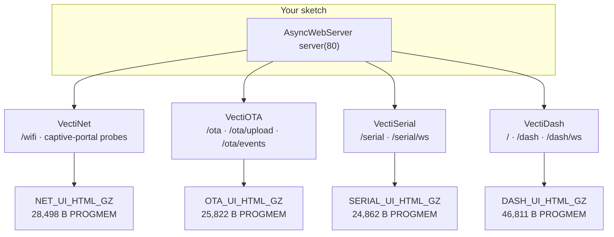
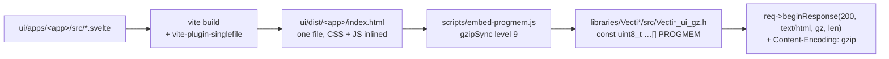
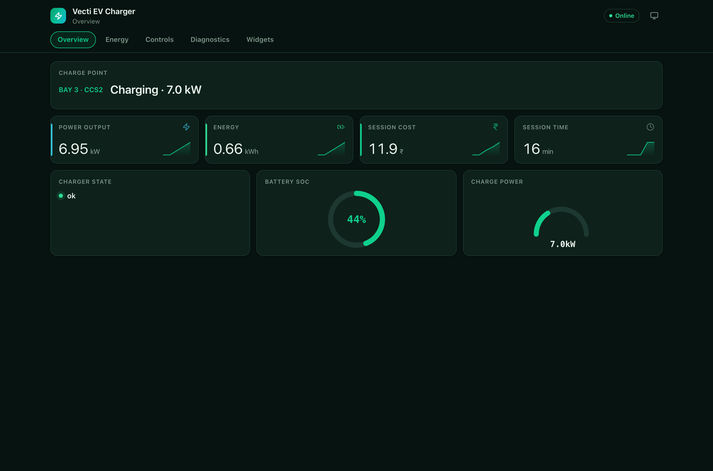
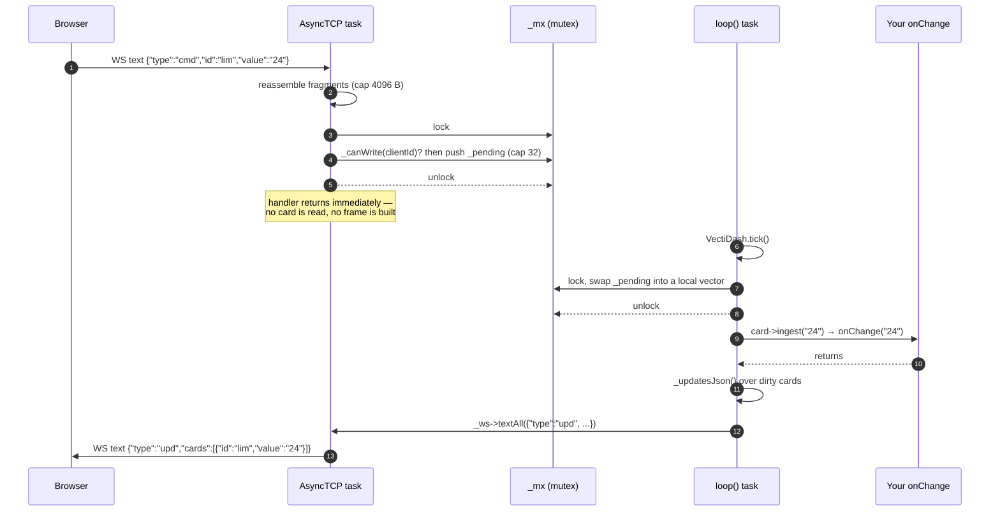
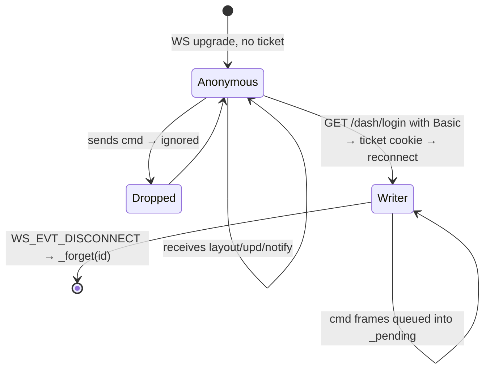

# VectiSuite architecture 🏗

How the four libraries fit together on one ESP32: one HTTP server, four route
namespaces, four pre-built web apps living in flash, and two FreeRTOS tasks that
must not touch each other's data.

Read this before you write a sketch that does anything unusual — a custom route,
a blocking callback, a second server instance. Everything here is taken from the
source in `libraries/Vecti*/src/`.

- [One server, four tenants](#-one-server-four-tenants)
- [Route ownership](#-route-ownership)
- [Why `exact()` matters](#-why-exact-matters)
- [The UI build pipeline](#-the-ui-build-pipeline)
- [Threading model](#-threading-model)
- [Memory strategy](#-memory-strategy)
- [Auth model](#-auth-model)
- [The WebSocket handshake ticket](#-the-websocket-handshake-ticket)
- [Footprint](#-footprint)
- [Licensing](#-licensing)

---

## 🧩 One server, four tenants

You create the `AsyncWebServer`. All four libraries mount onto it. There is no
second server, no second port, no second TCP stack.

```cpp
#include <ESPAsyncWebServer.h>
#include <VectiOTA.h>
#include <VectiSerial.h>
#include <VectiNet.h>
#include <VectiDash.h>

AsyncWebServer server(80);

void setup() {
  VectiNet.begin(&server);                              // /wifi/*
  VectiSerial.begin(&server, "admin", "vecti");         // /serial, /serial/ws
  VectiOTA.begin(&server, "admin", "vecti");            // /ota/*
  VectiDash.begin(&server, "admin", "vecti");           // /, /dash, /dash/ws

  server.begin();          // call this LAST, after every begin() above
  VectiNet.autoConnect();
}

void loop() {
  VectiNet.loop();
  VectiOTA.loop();
  VectiSerial.loop();
  VectiDash.tick();
}
```

Each library's `begin()` only registers handlers; `server.begin()` starts
listening. Registering after the server is up works with ESPAsyncWebServer, but
mounting everything first keeps the boot ordering obvious.



The blob sizes are the byte counts in the generated `Vecti*_ui_gz.h` headers.

---

## 🗺 Route ownership

Nothing overlaps. Each library owns a prefix, and `/` belongs to exactly one
library (VectiDash, which 302s to `/dash`).

| Route | Method | Library | Matcher |
|---|---|---|---|
| `/` | GET | VectiDash | `exact` — 302 → `/dash` |
| `/dash` | GET | VectiDash | `exact` |
| `/dash/login` | GET | VectiDash | `exact` |
| `/dash/ws` | WS | VectiDash | `AsyncWebSocket` handler |
| `/ota` | GET | VectiOTA | `exact` |
| `/ota/info` | GET | VectiOTA | default |
| `/ota/upload` | POST | VectiOTA | default |
| `/ota/pull` | POST | VectiOTA | default |
| `/ota/commit` | POST | VectiOTA | default |
| `/ota/rollback` | POST | VectiOTA | default |
| `/ota/events` | GET (SSE) | VectiOTA | `AsyncEventSource` handler |
| `/serial` | GET | VectiSerial | `exact` |
| `/serial/ws` | WS | VectiSerial | `AsyncWebSocket` handler |
| `/wifi` | GET | VectiNet | `exact` |
| `/generate_204`, `/gen_204` | GET | VectiNet | `exact` — Android probe |
| `/hotspot-detect.html` | GET | VectiNet | `exact` — iOS / macOS probe |
| `/ncsi.txt` | GET | VectiNet | `exact` — Windows probe |
| `/wifi/scan` | GET | VectiNet | default |
| `/wifi/status` | GET | VectiNet | default |
| `/wifi/params` | GET, POST | VectiNet | default |
| `/wifi/connect` | POST | VectiNet | default |
| `/wifi/reset`, `/wifi/restart` | POST | VectiNet | default |

VectiNet deliberately does **not** mount `/`. The captive-portal pop still works
because all four OS probe URLs — `/generate_204`, `/gen_204`,
`/hotspot-detect.html` and `/ncsi.txt` — are registered explicitly; `/` is left for
whichever library the sketch chose as its primary UI.

Anything you register yourself is free game as long as it does not collide with
the table above. `server.on("/api/foo", ...)` is fine.

---

## 🎯 Why `exact()` matters

ESPAsyncWebServer 3.x defaults to the `BackwardCompatible` URI matcher, where
`on("/ota", ...)` also matches `/ota/info`, `/ota/upload` and everything else
under the prefix — and it matches *first*, because handlers are tried in
registration order. The page handler would swallow the API.

Every page route in the suite therefore uses the explicit matcher:

```cpp
_server->on(AsyncURIMatcher::exact("/ota"), HTTP_GET, handler);
```

`AsyncURIMatcher` comes from **ESPAsyncWebServer**, not the Arduino core, and it
was added in **3.11.0** — which is why all four `library.json` files floor the
dependency at `^3.11.0`. Older docs that call it a core API are wrong.

Two consequences worth internalising:

- With four libraries on one server, `/` registered non-exactly by any of them
  would intercept every request on the device. VectiDash's `/` is `exact()` for
  exactly this reason.
- If you register your own prefix routes, use `exact()` for the page and let the
  default matcher handle the sub-paths, or you will shadow your own API.

There is one more oddity in VectiDash worth knowing about: `/` does **not** serve
the dashboard HTML directly, it 302s to `/dash`. Serving the same body on the
literal one-character path truncated 8–12 KB into the response on the test
hardware (an AsyncTCP single-segment issue); the redirect sidesteps it and the
browser's second GET against `/dash` serves cleanly.

---

## 📦 The UI build pipeline

The four SPAs are Svelte 5 sources in `ui/apps/`. Nothing is fetched at runtime,
nothing lives on LittleFS, and the device never templates HTML.



```bash
cd ui
npm install
npm run build          # builds all four apps, then rewrites the four _ui_gz.h files
```

What each stage does:

1. **`vite build`** with `viteSingleFile({ removeViteModuleLoader: true })`,
   `cssCodeSplit: false`, `assetsInlineLimit: 100000000` and terser. Output is a
   single `index.html` with every stylesheet, script and asset inlined. No
   external requests — the device is often the only thing on the network.
2. **`embed-progmem.js`** reads that file, `gzipSync(raw, { level: 9 })`, and
   writes a `const uint8_t <SYM>[] PROGMEM` array plus `<SYM>_LEN` into the
   library's `_ui_gz.h`. The header is generated; do not hand-edit it.
3. **The C++ side** serves the compressed bytes verbatim with
   `Content-Encoding: gzip`. Browsers inflate transparently.

Only the compressed copy exists in flash. A client that does not advertise
`Accept-Encoding: gzip` gets it anyway — there is nothing to fall back to. In
practice every browser made this decade sends it.

| App | raw HTML | gzipped blob in flash |
|---|---:|---:|
| VectiDash | 155,079 B | 46,811 B |
| VectiOTA | 71,475 B | 25,822 B |
| VectiSerial | 67,383 B | 24,862 B |
| VectiNet | 82,969 B | 28,498 B |

Total embedded UI ≈ 126 kB of flash (125,993 bytes). VectiDash is the heavy one
because it carries all 50 `DashType` renderers — 49 widgets plus `Custom`, the
raw-HTML escape hatch.

Because the HTML is pre-compressed there is **no server-side template
substitution path**. Runtime branding — `setTitle()`, `setBrandColor()` — is
therefore pushed to the browser over the data channel instead: the WebSocket
`layout` frame for VectiDash, the `hist` frame for VectiSerial, `/ota/info` for
VectiOTA, `/wifi/status` for VectiNet. Each SPA applies them by setting
`document.title` and the `--color-brand` CSS custom property.

Caching differs per library, and it is a security decision, not a performance
one:

| Response | `Cache-Control` |
|---|---|
| `/serial`, `/wifi` and probes | `public, max-age=3600` |
| `/ota` with auth off | `public, max-age=3600` |
| `/ota` with auth on | `private, max-age=3600` (+ `Vary: Accept-Encoding`) |
| `/dash` with no credentials configured | `public, max-age=3600` |
| `/dash` with credentials configured | `no-store` |

`/dash` goes `no-store` once credentials exist because that response carries the
handshake ticket cookie; a shared cache holding a copy would hand both the page
and the ticket to the next unauthenticated requester.

### Screenshots



The rest live in [`screenshots/`](screenshots/) — dashboard, OTA, console and
portal, each in dark, light and phone widths.

---

## 🧵 Threading model

This is the part that bites people. **Two tasks** touch the libraries:

| Task | Runs | Reached by |
|---|---|---|
| **AsyncTCP task** | every HTTP handler, every WebSocket event, every SSE write | ESPAsyncWebServer internals |
| **Arduino `loop()` task** | `VectiDash.tick()`, `VectiSerial.loop()`, `VectiOTA.loop()`, `VectiNet.loop()`, all your `setValue()` calls | your sketch |

The rule: **never block on the AsyncTCP task.** No `delay()`, no `ESP.restart()`,
no NVS write, no HTTP fetch, no long flash erase. Blocking there stalls every
other socket on the device and can tear down the stack from inside its own
callback. Set a flag; act in `loop()`.

The libraries all do this internally, which is why every one of them has a loop
hook:

- **VectiOTA** — `_scheduleReboot()` sets `_rebootPending`; `loop()` calls
  `ESP.restart()`. `/ota/pull` stores the URL and sets `_pullPending`; `loop()`
  does the actual HTTP download. A handler cannot reboot itself: `req->send()`
  only *stores* the response, and AsyncTCP writes it after the handler returns.
- **VectiSerial** — `_log()` only appends to the ring under `_mtx`. The two slow
  sinks (hardware `Serial.printf`, `_ws->textAll()`) run in `_pump()`, from
  `loop()`. A sketch that stops calling `VectiSerial.loop()` stops logging.
- **VectiNet** — `/wifi/connect` sets `_pcPending`; `/wifi/params` sets
  `_paramsDirty`. `loop()` does the flash write and fires `onConfig()` /
  `onState()`.
- **VectiDash** — inbound `cmd` frames are queued under `_mx`; `tick()` drains
  them and runs `onChange`.

### Callback task, per library

| Callback | Task |
|---|---|
| `DashCardBase::onChange` | **`loop()`** — applied by `tick()` |
| `VectiSerial::onMessage` | **AsyncTCP** — treat as ISR-adjacent |
| `VectiNet::onState`, `onConfig` | **`loop()`** |
| `VectiOTA::onStart/onProgress/onEnd/onError/onBeforeReboot` | **AsyncTCP** for the upload path, **`loop()`** for the pull path |

> ⚠️ `VectiSerial.onMessage` is the one that surprises people: it fires on the
> AsyncTCP task. Logging from it is explicitly safe (`_log()` only appends under
> a mutex). `delay()`, `ESP.restart()` and NVS writes are not.
>
> `DashCardBase::onChange` goes the other way and is easy to get wrong from
> older notes: inbound `cmd` frames are **queued** by the AsyncTCP task and
> applied by `tick()`, so the callback runs on `loop()`. `VectiDash.h` states
> this on the `onChange()` declaration. Writing it as if it were AsyncTCP-safe
> is harmless; assuming it is loop-safe is correct.

### A dashboard interaction, end to end



Note step 5: the lock is dropped *before* any card is touched, because
`ingest()` runs your callback and your callback is allowed to be slow and to
call back into VectiDash.

Note also what is *not* there: no rebroadcast of the raw command. Your callback
may clamp or reject the value, and echoing the request would pin every open tab
to something the firmware refused. The next `upd` frame carries whatever the
firmware actually settled on.

### What is protected by what

| Library | Lock | Guards |
|---|---|---|
| VectiDash | `std::mutex _mx` | `_writers`, `_rx`, `_pending`, `_needSnapshot` |
| VectiSerial | `asyncsrv::mutex_type _mtx` (recursive) | `_history`, `_seq`, `_sentSeq`, `_title`, `_brandColor`, the `Print` accumulator |
| VectiNet | one FreeRTOS mutex (`paramMx()`) | `p.value` for every parameter, `_activeSsid`, `_hostname` |
| VectiOTA | none — ownership instead | `_uploadOwner` identifies whose transfer owns the updater; `_pullPending` orders the loop handoff |

Card state in VectiDash needs **no** lock at all: the AsyncTCP task never reads a
card and never serialises a frame. That invariant is what makes `setValue()`
free. Serialising a card from a WebSocket callback would race the `String`
reassignment inside `setValueStr()` — a use-after-free, not a torn read.

Two deadlock hazards the code avoids, worth copying if you extend it:

- **VectiSerial ABBA.** `AsyncWebSocket` takes its own client lock before
  invoking the connect handler, which then takes `_mtx` via `_sendHistory()`.
  So `_mtx` must never be held across `textAll()` or `client->text()`. `_pump()`
  copies the line out under the lock and releases it before either sink runs.
- **VectiNet flash.** `paramMx()` is never held across `putString()`, `req->send()`
  or any WiFi call. Copy under the lock, act after releasing it.

---

## 🧠 Memory strategy

The device has ~320 KB of RAM and a heap that fragments from boot. The suite's
approach is: **every buffer that a peer can grow has a hard ceiling, and every
history is a fixed-size ring.** Nothing is unbounded.

| Bound | Value | Where | Why |
|---|---|---|---|
| WS inbound message | 4,096 B/client | `kMaxRxBytes`, VectiDash.cpp | a peer cannot grow a per-client `String` before the JSON ever parses |
| Queued `cmd` frames | 32 | `kMaxPendingCmds`, VectiDash.cpp | a dashboard has one pair of hands on it; the queue is last-write-wins anyway |
| Chart points per card | 50 default | `_chartMax`, `chartSetMaxPoints()` | ~3 KB of encoded JSON at 120 points |
| Dash push interval | 100 ms | `_pushMs`, `setMinPushIntervalMs()` | caps fan-out to 10 Hz |
| Console ring | 256 lines | `_historyMax`, `setHistorySize()` | replayed to every new tab |
| History frame chunk | 64 lines | `kHistChunkLines`, VectiSerial.cpp | ~5 KB/frame; one frame for a 1024-line ring is a 75 KB `String` built by thousands of reallocs |
| `Print` accumulator | 512 B | `kMaxWriteLine` | a CR-only peripheral would otherwise grow it at the full data rate |
| printf re-format | 2,048 B | `kMaxFmtLine` | past this a log line is a data dump |
| OTA rate-limit slots | 8 IPs | `RateSlot _rate[8]` | small-office sized, not DoS-resistant |
| OTA rate limit | 5,000 ms | `setRateLimitMs()` | bounds flash erase-cycle burn |
| `/ota/pull` body | 512 B | `kPullBodyMax` | it is a URL and a mode |
| Pull download | 5 min total / 10 s idle | `kPullTotalMs`, `kPullIdleMs` | a keep-alive socket never reports disconnected |
| SSE progress | every 32 KB | VectiOTA.cpp | plenty for a smooth bar |
| `/wifi/*` body | 4,096 B | `kMaxBodyBytes` | ESPAsyncWebServer imposes none of its own |
| Saved networks | 8 | `kMaxNetworks` | NVS slots `s0..s7` |
| Heatmap cells | 2,048 | Heatmap.svelte | 32,000 spans locks up a phone |
| Scatter points | 400 | Scatter.svelte | |
| Chart series | 5 | MultiChart.svelte | beyond that nobody can tell the colours apart |

Two details behind the numbers:

- **Per-request bodies are per-request.** VectiNet's `collectBody()` allocates
  into `request->_tempObject`, not a function-local `static String`. A single
  static buffer is one buffer for the whole server: two clients POSTing at once
  interleave their chunks and each parses a splice of the other's body. The
  struct is POD because the request frees it with `free()`.
- **The console ring is the queue.** `_sentSeq` marks how far `_pump()` has got;
  nothing is copied into a second outbound queue. A line that falls off the ring
  before `_pump()` sees it is simply gone — the same fate it would have had.

### Measured heap behaviour

From the soak test on real hardware (history ring cut to 16 entries, 4 s
heartbeat): heap fell from 247,596 B while the ring filled, went **flat at
244,188 B from ~72 s onward**, and stayed flat. The ±496 B oscillation is one
alloc/free cycle of the JSON serialisation buffer. At production settings the
steady ~96 B/min decline observed earlier is the 512-entry ring filling — not a
leak.

### Backpressure

`tick()` checks `_ws->availableForWriteAll()` before serialising anything, and
again after sending the layout frame. If any client's send queue is full, the
tick is skipped entirely and the changes coalesce into the next one.

The ceiling worth knowing: `availableForWriteAll()` is all-or-nothing, so **one
backgrounded phone with a full queue pauses updates for every viewer** until
`cleanupClients()` reaps it. That is the price of never dropping a delta.

---

## 🔐 Auth model

Every library gates independently. There is no shared session and no single
sign-on — set the same credentials on each if you want one password.

| Library | Modes | What is gated | Configure with |
|---|---|---|---|
| **VectiOTA** | None / Basic / Token (`X-Vecti-Token`) | every `/ota/*` route, including `/ota/events` | `begin(&s, user, pass)` or `setAuth(OtaAuth::Token, "…")` |
| **VectiSerial** | None / Basic | `/serial` **and** `/serial/ws` | `begin(&s, user, pass)` |
| **VectiNet** | None / Basic | every `/wifi/*` route including the read-only JSON | `setAuth(user, pass)` before `begin()` |
| **VectiDash** | None / Basic (+ ticket cookie) | `/`, `/dash`, `/dash/ws`; optional anonymous read | `begin(&s, user, pass, allowAnonymousRead)` |

Design decisions worth stating outright:

- **The WebSocket is gated, not just the page.** `AsyncWebSocket` is an
  `AsyncWebHandler`, so its auth middleware runs on the upgrade request. Gating
  only the HTML would leave the whole console (and every dashboard control) one
  `wscat` away.
- **`/wifi/status` and `/wifi/scan` are gated too.** They hand out the device
  MAC, the surrounding BSSIDs and every SSID the device can see. That is site
  topology, not public information. The portal HTML is gated for a mechanical
  reason as well: a 401 answering a `fetch()` never prompts — browsers only pop
  the credential dialog on a top-level navigation, and then reuse those
  credentials for the SPA's own requests.
- **Token mode closes the SSE stream.** Browsers cannot attach a custom header to
  an `EventSource`, so in `OtaAuth::Token` mode `/ota/events` is set to
  `AUTH_DENIED` rather than left as the one unauthenticated hole in an otherwise
  gated API. CI pipelines that POST firmware do not need the stream; browser
  users should use Basic.
- **`clearAuth()` re-applies the SSE middleware.** It routes through `setAuth()`
  precisely so the events stream does not keep the old credentials.

Everything here is **plaintext on the wire**. Basic auth, the token and the
ticket are all readable by anyone on the path. Put the device behind TLS or on a
trusted LAN. Do not put it on the open internet.

---

## 🎟 The WebSocket handshake ticket

This is VectiDash-specific and exists for one reason: **browsers do not send
Basic auth credentials on a WebSocket upgrade.** The `WebSocket` constructor
takes no credentials, `XMLHttpRequest`-style auth caching does not apply, and
there is no way to set a header on the handshake from JavaScript. So a
`/dash/ws` upgrade from a browser carries no `Authorization` header even though
the page it came from was authenticated.

The only identity a browser *will* attach to an upgrade is a cookie. So:

```cpp
// VectiDash::begin() — one ticket per boot, only when credentials are set
if (_user.length()) {
  _ticket = String((uint32_t)random(0x7fffffff), HEX)
          + String((uint32_t)random(0x7fffffff), HEX);
}
```

The page GET hands it out, the upgrade presents it:

```cpp
// _auth() — Cookie first, Basic second
if (_ticket.length() && req->hasHeader("Cookie") &&
    req->header("Cookie").indexOf("jdash=" + _ticket) >= 0) return true;
return req->authenticate(_user.c_str(), _pass.c_str());
```

Cookie name is `jdash`. Attributes: `Path=/; HttpOnly; SameSite=Strict`.

```mermaid
sequenceDiagram
  autonumber
  participant B as Browser
  participant D as VectiDash

  B->>D: GET /dash
  D-->>B: 401 WWW-Authenticate: Basic
  Note over B: browser pops the credential dialog<br/>(top-level navigation only)
  B->>D: GET /dash + Authorization: Basic …
  D-->>B: 200 text/html gzip<br/>Set-Cookie: jdash=<ticket>; HttpOnly; SameSite=Strict<br/>Cache-Control: no-store

  B->>D: GET /dash/ws (Upgrade)<br/>Cookie: jdash=<ticket><br/>NO Authorization header
  Note over D: handleHandshake → _auth(req, requireWrite=false)
  D-->>B: 101 Switching Protocols
  Note over D: WS_EVT_CONNECT → _auth(req, requireWrite=true)<br/>writer? remember client->id() in _writers
```

Two subtleties in that flow:

1. **Write authority is decided once, at connect.** The upgrade request object is
   deleted the moment `WS_EVT_CONNECT` returns, so that is the only place the
   ticket can be checked. The verdict is remembered by client id in `_writers`,
   and every later `cmd` frame is checked against that list. `WS_EVT_DISCONNECT`
   removes the id — and because that event fires from the client destructor, it
   also covers evictions triggered by `cleanupClients()` from `tick()`, which is
   why `_forget()` takes the lock.
2. **`allowAnonymousRead` splits the two checks.** The handshake calls
   `_auth(req, requireWrite=false)`, so an anonymous client completes the upgrade
   and receives `layout`, `upd` and `notify` frames. Its `cmd` frames are dropped
   because it is not in `_writers`. In that mode nothing challenges — so
   `/dash/login` exists as the one door a browser can be prompted at. It 401s,
   then 302s to `/dash` with the ticket cookie attached.



**Ceilings, stated plainly.** The ticket never rotates — it is one value per
boot, shared by every authenticated client. It is plaintext on the wire, exactly
like the Basic credentials it stands in for. It is not a session, it is not
revocable per client, and it does not survive a reboot. It solves precisely one
problem: giving a browser's WebSocket upgrade an identity. Anything stronger
needs TLS underneath it.

Non-browser clients (`wscat`, a Python script, a test harness) can still present
Basic auth on the upgrade and are accepted on that path.

---

## 📏 Footprint

Measured on the combined demo (`demo/src/main.cpp`) exercising all four
libraries at once — ESP32-S3-DevKitC-1, 8 MB flash, 2 MB PSRAM,
`default_8MB.csv` partitions:

- **Flash 1,226,013 bytes** — 36.7 % of 3,342,336
- **RAM 62,440 bytes** — 19.1 % of 327,680

Of that flash, 125,993 bytes (≈126 kB) is the four embedded UI blobs. They cost **no RAM**: the
bytes are served straight out of PROGMEM.

### What has actually been verified on hardware

Real board: ESP32-S3 rev v0.2, QFN56, 8 MB flash, 2 MB embedded PSRAM,
USB-Serial/JTAG.

✅ Verified:

- Flashes (1,226,384 bytes written, esptool hash verified) and boots cleanly.
- PSRAM initialises; no panic, no reset loop.
- HTTP server starts; routes `/ /dash /ota /serial /wifi` registered.
- mDNS starts (`vecti-demo.local`).
- With no stored credentials it enters the captive-portal state, which is correct.
- No memory leak (see the soak numbers above).

❌ **Not** verified — do not assume otherwise:

- HTTP endpoints serving real responses over the network.
- The WebSocket dashboard against real hardware.
- OTA upload / pull / rollback on real hardware.
- Captive-portal provisioning end to end.

The device was verified over USB serial only; it was never joined to a LAN.

### Platform support

| Target | VectiOTA | VectiSerial | VectiNet | VectiDash |
|---|---|---|---|---|
| ESP32 (built + run on ESP32-S3) | ✅ | ✅ | ✅ | ✅ |
| ESP8266 | code paths exist (BearSSL HMAC, `Updater.h`), declared in `library.json` | not claimed | `#error` at compile time | not claimed |

What is ESP-specific in *our* code: `esp_ota_ops`, NVS `Preferences`, `ESPmDNS`,
`mbedtls`. ESPAsyncWebServer 3.11.0 itself declares `espressif32, espressif8266,
raspberrypi, libretiny`, so the web layer ports further than these libraries
currently do. RP2040 / RP2350+W is a plausible future target. **STM32 and NXP are
not** — no async web server, no onboard Wi-Fi.

Dependency floor: ESPAsyncWebServer `^3.11.0`, AsyncTCP `^3.4.0`, ArduinoJson
`^7.4.0`. The demo builds on arduino-esp32 2.0.17 (platform espressif32 6.13.0).

---

## ⚖️ Licensing

VectiSuite's own code is **Apache-2.0** — full text in each repo's `LICENSE`.

It links **ESPAsyncWebServer** and **AsyncTCP**, both **LGPL-3.0**. On an MCU
there is no dynamic linking, so LGPL §4's relink obligations attach to the
shipped binary. Do not read "Apache-2.0" as "no copyleft obligations" — the
honest position is: Apache-2.0 for our code, LGPL-3.0 inherited from the async
stack. Every competing library in this space inherits exactly the same
dependency; this is a property of the ecosystem, not a differentiator.

One more honest note, since it is an architecture decision and not a marketing
one: **VectiOTA's firmware signing is symmetric HMAC-SHA256.** The key ships
inside the firmware image. It raises the bar meaningfully against a stolen Wi-Fi
password, and it does nothing against someone who can read your flash.
Asymmetric signing (Ed25519) is a known future improvement, not a shipped
feature.

---

## See also

- [WIRE-PROTOCOL.md](WIRE-PROTOCOL.md) — every endpoint, frame and event.
- [WIDGETS.md](WIDGETS.md) — all 50 `DashType` types with payload formats.
- `ui/shared/widgets/CONTRACT.md` — how to write a new widget.

---

<sub>**Author:** VectiVolt · team@vectivolt.com · (c) 2026 VectiVolt — Apache-2.0</sub>
