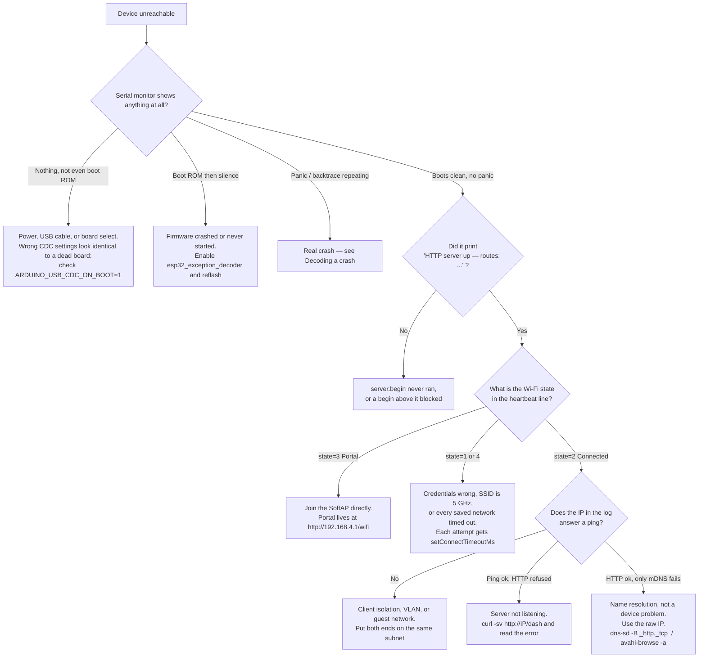
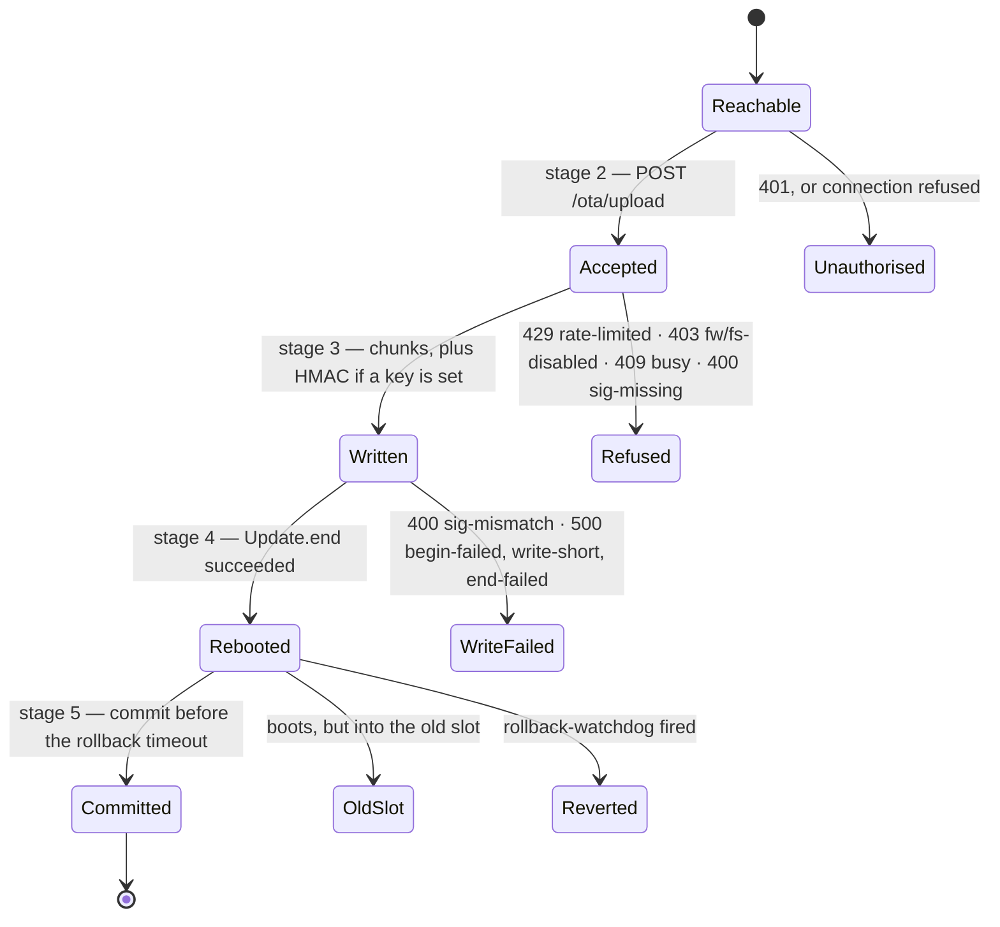

# 🔍 Debugging VectiSuite

Technique, not symptoms. If you already have a symptom, start at
[TROUBLESHOOTING.md](TROUBLESHOOTING.md) and come back here for the procedure it points at.

Everything below runs from the repo root unless stated. `$DEV` is your device's IP or
`vecti-demo.local`.

---

## 🧭 Decision tree: my device is unreachable



`state` values: `0` Idle · `1` Connecting · `2` Connected · `3` Portal · `4` Failed.

---

## 📜 Reading the serial log

```bash
cd demo && pio device monitor -b 115200
```

`demo/platformio.ini` already sets `monitor_filters = esp32_exception_decoder, colorize`
and `monitor_speed = 115200`. On the ESP32-S3 the console is USB-Serial/JTAG — no CP210x
bridge — so the port is `/dev/cu.usbmodem*` and `ARDUINO_USB_CDC_ON_BOOT=1` is what makes
`Serial.print` show up over the same cable used for flashing.

Two different streams share that UART.

### 1. The arduino-esp32 core log

Controlled by `-DCORE_DEBUG_LEVEL=<n>` in `build_flags`. The demo ships at **3**.

| Level | Value | What you get |
|---|---|---|
| None | 0 | silence |
| Error | 1 | `E (…)` — failures only |
| Warn | 2 | + `W (…)` |
| Info | 3 | + `I (…)` — Wi-Fi events, partition info. **The demo's default.** |
| Debug | 4 | + `D (…)` — noisy; use when chasing a Wi-Fi association failure |
| Verbose | 5 | + `V (…)` — floods the UART and will change your timing |

Raising this above 3 is the first thing to try on a Wi-Fi problem and the last thing you
want on during a timing-sensitive repro.

### 2. The VectiSerial mirror

VectiSerial mirrors every line it broadcasts to hardware Serial (on by default;
`setMirrorToHardwareSerial(false)` turns it off). The format comes straight from
`VectiSerial.cpp`:

```
[<uptime_ms>] <LVL> <text>
```

```
[1247] INF HTTP server up — routes: / /dash /ota /serial /wifi
[1249] INF mDNS: http://vecti-demo.local
[1310] INF netState=connecting
[9822] WRN rssi -78 dBm — link margin low
```

`<LVL>` is one of `DBG` `INF` `WRN` `ERR` — `LogLevel::Debug/Info/Warn/Error`, written from
`debug()/info()/warn()/error()` or the printf-style `dbg()/inf()/wrn()/err()`.

Two properties worth knowing when you are reading a long capture:

- **The timestamp is monotonic across the 49.7-day `millis()` rollover.** A high word is
  carried alongside, so a line logged after the wrap never appears to predate one logged
  before it.
- **A line reaches Serial only from `loop()`.** `_log()` just appends to the ring;
  `VectiSerial.loop()` drains it. If your sketch stops calling `loop()`, the log stops —
  and that silence is itself the diagnosis.

### Log level triage cheat-sheet

| You are chasing | Do this |
|---|---|
| Wi-Fi association failure | `-DCORE_DEBUG_LEVEL=4`, watch for the `wifi:` reason code |
| Missing HTTP route | Level 3 is enough — check the routes line the sketch prints |
| A crash | Level 1 + `esp32_exception_decoder` — more output changes the timing |
| A leak | Level 1 or 0, and read the heartbeat instead (below) |

---

## 🌡 Heap soak: real leak vs bounded ring

A heap that falls steadily is not a leak until it fails to flatten. Two things in
VectiSuite consume heap monotonically at boot and then stop: VectiSerial's line ring
(`setHistorySize()`, the demo uses 512) and VectiDash's chart series
(`chartSetMaxPoints()`, default 50). Both look exactly like a leak for as long as they
are filling.

### The heartbeat

The demo prints one line a minute to the hardware UART, deliberately independent of any
browser being attached — a soak on a bench overnight has no browser, which is precisely
the condition a dashboard card cannot report on. From `demo/src/main.cpp`:

```cpp
VectiSerial.inf("heartbeat up=%lus heap=%u min=%u drift=%ld rssi=%d state=%d",
                (unsigned long)(now / 1000), (unsigned)h,
                (unsigned)ESP.getMinFreeHeap(),
                (long)h - (long)heapAtStart,
                WiFi.RSSI(), (int)VectiNet.getState());
```

| Field | Meaning |
|---|---|
| `up` | seconds since boot |
| `heap` | `ESP.getFreeHeap()` right now |
| `min` | `ESP.getMinFreeHeap()` — the low-water mark since boot. This is the number that tells you whether a transient spike nearly killed you. |
| `drift` | `heap` minus the heap at the first heartbeat. **Negative and growing = the thing to explain.** |
| `rssi` | current RSSI, so you can correlate a heap dip with a link event |
| `state` | `NetState`: `0` Idle · `1` Connecting · `2` Connected · `3` Portal · `4` Failed |

Capture it:

```bash
cd demo && pio device monitor -b 115200 | tee /tmp/soak.log
# later
grep heartbeat /tmp/soak.log | tail -60
```

### Distinguishing a fill from a leak

A bounded ring **plateaus at a predictable time**. A leak does not. So do not stare at the
production configuration for six hours — shrink the ring, speed up the line rate, and make
the plateau arrive in about a minute.

This is exactly the measurement that was run on the real ESP32-S3:

| Configuration | Result |
|---|---|
| Production settings (512-entry ring, 60 s heartbeat) | steady **96 B/min** decline |
| Ring cut to 16 entries, heartbeat cut to 4 s | heap fell from **247,596 B**, went **flat at 244,188 B from ~72 s onward**, and stayed flat |

The verdict is in the second row, and specifically in the *timing*:

- 16 retained lines × 4 s between lines = the ring is full at **64 s**. Observed flat from
  **~72 s**. The plateau landed where the ring size says it must.
- Total consumed while filling: `247,596 − 244,188` = **3,408 B** — bounded, one-shot, and
  it never resumed.
- The residual **±496 B** oscillation around the plateau is one alloc/free cycle of the
  JSON serialisation buffer, not drift.

Therefore the 96 B/min seen at production settings is the 512-entry ring filling, not a
leak. **No memory leak.**

Do not extrapolate the per-line cost from those numbers to your own build — line length
varies, and the deque allocates in chunks. Re-run the procedure against *your* log volume:

1. `VectiSerial.setHistorySize(16)` and drop the heartbeat interval to 4000 ms.
2. Soak for 10× the expected fill time.
3. If `drift` flattens and stays flat within ±1 kB → bounded ring, working as designed.
4. If `drift` keeps falling after 10× the fill time → real leak. Restore the production
   ring size, confirm the slope is unchanged (a leak does not care about ring size — a
   fill does), then bisect by commenting out one library's `loop()`/`tick()` call at a time.

The other side of the same coin: `min` falling far below `heap` means you are surviving on
luck. `freeHeap` is *total* free, not the largest contiguous block — a fragmented heap can
report 80 kB free and still fail a 20 kB `Update` allocation.

---

## 🧪 The mock device: develop the UI with no hardware

`tools/mock_device.js` serves the built single-file UIs and speaks enough of each
library's wire protocol to drive them with plausible live data. No ESP32 involved.

```bash
npm --prefix ui install          # once
npm --prefix ui run build        # builds all four apps into ui/dist/ AND re-embeds the PROGMEM headers
node tools/mock_device.js        # http://localhost:3137
```

```
mock device on http://localhost:3137
  /dash  /ota  /serial  /wifi
```

Port override: `PORT=4000 node tools/mock_device.js`.

**What it implements**

| Surface | Behaviour |
|---|---|
| `GET /` | 302 → `/dash` |
| `GET /dash` `/ota` `/serial` `/wifi` | serves `ui/dist/<app>/index.html`; 404 with `build <app> first` if you skipped the build |
| `GET /ota/info` | static snapshot — `hwId`, `fwVersion`, `title`, `brand`, `freeHeap`, `currentSlot`, `nextSlot`, `freeOta`, `slotState`, `updating`, `allowFw/Fs/Pull` |
| `GET /wifi/status` | live-ish snapshot with a ticking `uptime_s` |
| `GET /wifi/scan` | four fake networks at different RSSI, one open |
| `GET /wifi/params` | the full parameter-type spread including `display` and `password` |
| `WS /dash/ws` | `layout` + `upd` on connect, `upd` for all cards every 1 s, `hello` re-sends the snapshot, inbound `cmd` echoes back to every client and raises a `notify` |
| `WS /serial/ws` | a `hist` frame on connect, then a random log line every 1.4 s across all four levels; `cmd` echoes as `recv> …` |
| any `POST` | `200 ok` |

**What it does not implement — do not conclude anything from the mock about these:**
`/ota/upload`, `/ota/events` (SSE progress), `/ota/pull`, rollback, authentication, the
captive-portal probe endpoints, or any real persistence. Every POST is a lie that returns
`200`.

The WebSocket implementation is hand-rolled (~70 lines) rather than pulling in `ws`, so
the repo stays dependency-free for this tool. It handles unfragmented text frames only —
which is all these UIs exchange.

**Regenerating the documentation screenshots** uses the same mock:

```bash
node tools/mock_device.js &
node ui/scripts/capture-docs.mjs      # writes docs/screenshots/*.png at 2× DPI
```

**Driving a *real* device from your dev machine** — for a headless browser, or to point
local tooling at hardware:

```bash
PORT=3137 ESP_HOST=192.168.1.100 node tools/preview_proxy.js
# proxy ready: http://127.0.0.1:3137  →  http://192.168.1.100:80
```

It passes WebSocket upgrades straight through as raw TCP, so the dashboard and console
both work against the real device through it.

---

## 📼 Decoding a PROGMEM blob back to HTML

When the device is serving something you did not expect, the question is usually *what
actually got embedded*. The UI ships as a gzip blob in
`libraries/Vecti<App>/src/Vecti<App>_ui_gz.h`, written by `ui/scripts/embed-progmem.js`.
Turn it back into HTML:

```bash
APP=Dash    # or OTA | Serial | Net
grep -o '0x[0-9a-f][0-9a-f]' libraries/Vecti$APP/src/Vecti${APP}_ui_gz.h \
  | cut -c3- | tr -d '\n' | xxd -r -p > /tmp/$APP.html.gz
gunzip -c /tmp/$APP.html.gz > /tmp/$APP.html
open /tmp/$APP.html      # xdg-open on Linux
```

Sizes for all four, straight out of that pipeline:

```bash
for n in Dash OTA Serial Net; do
  f=libraries/Vecti$n/src/Vecti${n}_ui_gz.h
  grep -o '0x[0-9a-f][0-9a-f]' $f | cut -c3- | tr -d '\n' | xxd -r -p > /tmp/v.gz
  echo "$n gz=$(wc -c < /tmp/v.gz) raw=$(gunzip -c /tmp/v.gz | wc -c)"
done
```

| App | raw HTML | gzipped blob (what costs flash) |
|---|---|---|
| VectiDash | 155,079 B | 46,811 B |
| VectiOTA | 71,475 B | 25,822 B |
| VectiSerial | 67,383 B | 24,862 B |
| VectiNet | 82,969 B | 28,498 B |

Total embedded UI ≈ **126 kB** (125,993 bytes). VectiDash is the large one because it
carries all 50 `DashType` renderers — 49 widgets plus `Custom`, the raw-HTML escape hatch.

Two things this is good for:

- **Confirming a rebuild actually landed.** `git diff --stat libraries/*/src/*_ui_gz.h`
  after `npm --prefix ui run build` — an unchanged blob means your UI edit never made it
  into flash, which is the real cause of most "the fix isn't there" reports.
- **Checking the widget registry that shipped.** `grep -o 'multichart\|heatmap\|qrcode'
  /tmp/Dash.html` tells you whether the blob on the device knows the type your firmware is
  sending. That is the root cause behind
  [`Unsupported widget`](TROUBLESHOOTING.md#-widgets-and-charts).

The header also carries `Vecti<APP>_UI_HTML_GZ_LEN = sizeof(...)`, so the flash cost is
exactly the byte count above.

---

## 💥 Decoding a crash

`demo/platformio.ini` already carries the filter:

```ini
monitor_filters = esp32_exception_decoder, colorize
```

With it on, `pio device monitor` rewrites the raw backtrace addresses into
file:line using the ELF from the current build. The rules that make it actually work:

1. **The ELF must match the running binary.** Decode against the same build you flashed.
   A rebuild between flash and crash gives you confident, wrong line numbers.
2. **Do not `pio run -t clean`** before decoding — the ELF is what the decoder reads.
3. **Turn `CORE_DEBUG_LEVEL` down**, not up. Verbose logging changes timing and can move
   or hide a race.

Decoding by hand, when you have a backtrace pasted from someone else's terminal:

```bash
cd demo
pio pkg exec -p toolchain-xtensa-esp32s3 -- xtensa-esp32s3-elf-addr2line \
  -pfiaC -e .pio/build/esp32s3-n8r2/firmware.elf \
  0x42008a1c 0x4200a3f0 0x4037c1e5
```

Reading the panic header before the backtrace matters as much as the backtrace:

| Panic line | Usually means |
|---|---|
| `LoadProhibited` / `StoreProhibited` | null or freed pointer — in this codebase, a card or client touched from the wrong task |
| `IllegalInstruction` | jumped into freed/corrupt memory, often a `std::function` whose captured object died |
| `Interrupt wdt timeout on CPU0/1` | something blocked in a callback — see the threading rules below |
| `Task watchdog got triggered ... loopTask` | `loop()` blocked; the async server is starved |
| `Guru Meditation ... Cache disabled but cached memory region accessed` | flash access from an ISR, or a PROGMEM read during an SPI flash operation |
| `assert failed: ... tcpip_api_call ... Invalid mbox` | an lwIP call before `WiFi.mode()` initialised the netif |
| `Brownout detector was triggered` | not a software bug — power. Check the USB supply before reading any code. |

### The threading rule that causes most of them

ESPAsyncWebServer callbacks run on the **AsyncTCP task**. `loop()` runs on the **Arduino
task**. On a dual-core ESP32 those genuinely run at the same instant.

| Callback | Runs on | Blocking allowed? |
|---|---|---|
| `DashCardBase::onChange` | loop() task, from inside `VectiDash.tick()` | Yes, but a slow one delays your own loop |
| `VectiSerial.onMessage` | **AsyncTCP task** | **No.** No `delay()`, no `ESP.restart()`, no NVS/flash write. Logging is fine — `_log()` only appends to the ring. |
| `VectiNet.onState` / `onConfig` | loop() task (deliberately deferred, even when an HTTP request caused the change) | Yes |
| `VectiOTA.onStart/onProgress/onEnd/onError` | AsyncTCP task (upload path) | **No** |
| Any raw `server.on(...)` handler you write | **AsyncTCP task** | **No** |

The pattern, straight from the demo:

```cpp
static uint32_t gRebootAtMs = 0;
static void requestReboot(uint32_t inMs) { gRebootAtMs = millis() + inMs; if (!gRebootAtMs) gRebootAtMs = 1; }
static void serviceReboot() {
  if (gRebootAtMs && (int32_t)(millis() - gRebootAtMs) >= 0) ESP.restart();
}
// ...called from loop(), never from a handler.
```

The libraries defer their own reboots the same way — `VectiOTA` schedules through
`_rebootPending` and executes in `loop()`, because the AsyncTCP task is the one that has
to write the `200` the client is still waiting for.

---

## 📦 Bisecting an OTA failure

An OTA has five places to fail and they are cleanly separable. Do not guess — walk them in
order. Open the event stream first; it narrates every stage:

```bash
curl -N http://$DEV/ota/events        # leave this running in a second terminal
```



**Stage 1 — reachable and authorised.** `curl -s http://$DEV/ota/info` returns JSON.
If this fails, it is not an OTA problem; go to the decision tree at the top.

**Stage 2 — the upload is accepted.** Failures here happen at `index == 0`, before a
single byte is written to flash, and each has a distinct status:

```bash
curl -sv -F "firmware=@$BIN" http://$DEV/ota/upload 2>&1 | grep -E '^< HTTP'
```
`429` rate-limited (default 5000 ms per IP) · `403` mode disabled · `409` another transfer
owns the updater · `400 sig-missing`/`sig-unavailable`. Take the rejection at face value —
a refused upload never touches `Update`, which is why the library records the reason
explicitly instead of inferring it from `Update.hasError()`.

**Stage 3 — the bytes land.** Watch `progress` events climb. `begin-failed` means no
partition big enough (`freeOta` in `/ota/info`); `write-short` and `end-failed` mean flash
write or a truncated image. To rule the signature in or out, temporarily
`setSigningKey("")` and retry: if it now succeeds, your HMAC is wrong, not your image.

**Stage 4 — it reboots into the new slot.** Right after the reboot:

```bash
curl -s http://$DEV/ota/info
```
Compare `currentSlot` with the `nextSlot` the pre-upload call reported. If it is unchanged,
either you uploaded in filesystem mode (`?mode=filesystem` lands in SPIFFS/LittleFS, not
the app slot — the `start:` event names the content type that actually ran), or an
`onBeforeReboot` callback returned `false` and suppressed the reboot.

**Stage 5 — it commits.** `slotState` should be `pending` immediately after an OTA boot and
`valid` once the firmware calls `VectiOTA.commit()`. A `rollback-watchdog` event followed
by a reboot into the previous image is the watchdog doing its job: the new firmware did not
commit within `setRollbackTimeoutMs()`. Fix the self-test, do not delete it — the demo's
gate is deliberately strict:

```cpp
if (!committed && (now - startMs) > 20000 && WiFi.status() == WL_CONNECTED) {
  committed = true;
  VectiOTA.commit();
  VectiSerial.inf("self-test passed — firmware slot marked valid");
}
```

Calling `commit()` unconditionally in `setup()` cancels the watchdog on every boot —
including the boot of freshly-flashed firmware that is about to crash, which is precisely
the case rollback exists to catch.

> The rollback watchdog only arms when the bootloader is actually waiting on a verdict for
> the running image, so a serially-flashed build is never affected by any of this.

---

## ⚠️ Two things to keep in mind while you debug

**Firmware signing is symmetric.** `setSigningKey()` is HMAC-SHA256 and the key ships
inside the firmware image. It raises the bar past "has the Wi-Fi password"; it does not
survive an attacker who can read flash. Asymmetric signing (Ed25519) is a known future
improvement, not a shipped feature.

**Licensing.** VectiSuite's own code is Apache-2.0, but it links **ESPAsyncWebServer** and
**AsyncTCP**, which are **LGPL-3.0**. There is no dynamic linking on an MCU, so LGPL §4
relink obligations attach to the shipped binary. Every competing library in this space
inherits the same dependency — but do not ship believing there are no copyleft obligations.

---

## 🔗 See also

- [TROUBLESHOOTING.md](TROUBLESHOOTING.md) — symptom → cause → fix
- [WIRE-PROTOCOL.md](WIRE-PROTOCOL.md) — every frame and endpoint in full
- `ui/shared/widgets/CONTRACT.md` — widget props, value shapes, the `num()` rule
- `libraries/Vecti{OTA,Serial,Net,Dash}/src/*.h` — the API, and the threading contract for
  every callback, written where you will actually read it
