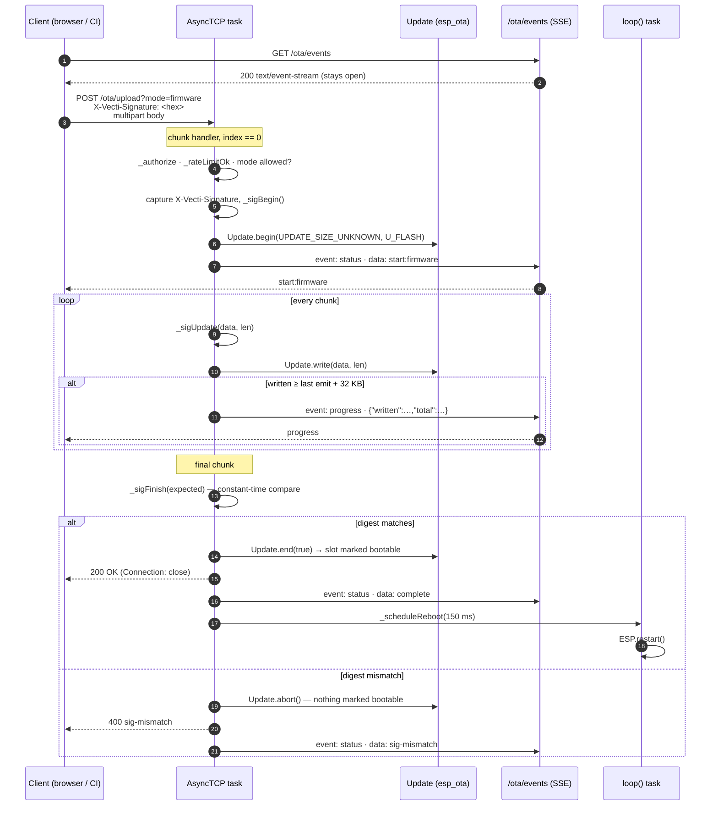
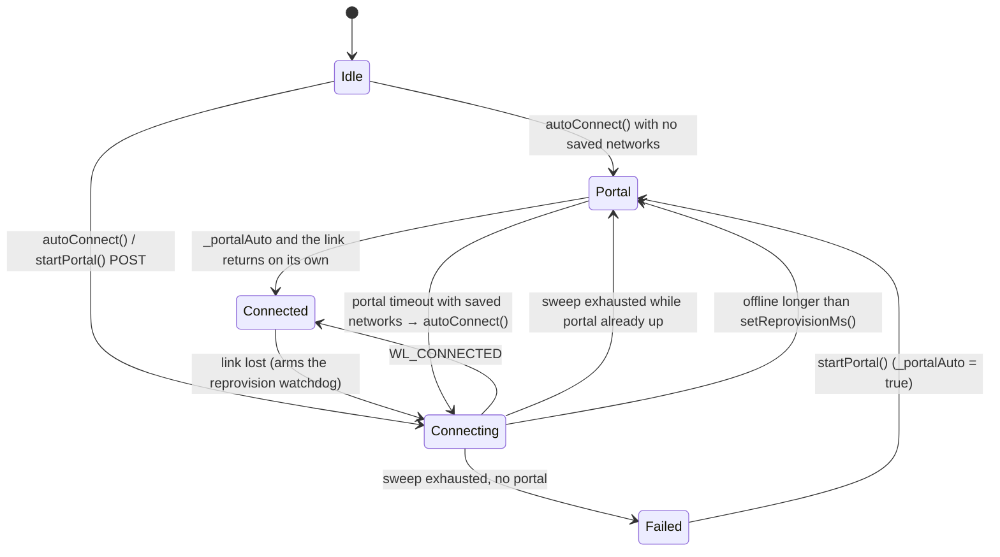

# VectiSuite wire protocol 🔌

Complete reference for everything the four libraries put on the network: every
HTTP endpoint, every WebSocket frame in both directions, and the Server-Sent
Event stream VectiOTA uses for progress.

This is written from the `.cpp` sources, not from the READMEs. If a status code
or a JSON key here disagrees with prose elsewhere, the code is what ships.

Conventions used throughout:

- **Auth** column means: what `_authorize()` / `_authGate()` / `_auth()` requires.
  "Basic" means Basic *or* the library's alternative (token for VectiOTA, the
  handshake ticket for VectiDash). "—" means the library has no auth configured
  by default.
- All JSON is generated by ArduinoJson 7 and is compact (no whitespace).
- All HTML responses are `text/html; charset=utf-8` with
  `Content-Encoding: gzip` and are served from PROGMEM.
- Everything is plaintext. There is no TLS termination on the device.

---

## Table of contents

- [VectiOTA](#-vectiota)
  - [`GET /ota`](#get-ota)
  - [`GET /ota/info`](#get-otainfo)
  - [`POST /ota/upload`](#post-otaupload)
  - [`POST /ota/pull`](#post-otapull)
  - [`POST /ota/commit`](#post-otacommit)
  - [`POST /ota/rollback`](#post-otarollback)
  - [`GET /ota/events` — SSE](#get-otaevents--sse)
  - [Sequence: signed upload](#sequence-a-signed-upload)
- [VectiSerial](#-vectiserial)
  - [`GET /serial`](#get-serial)
  - [`/serial/ws` frames](#serialws-frames)
- [VectiNet](#-vectinet)
  - [Portal + captive-portal probes](#portal--captive-portal-probes)
  - [`GET /wifi/scan`](#get-wifiscan)
  - [`GET /wifi/status`](#get-wifistatus)
  - [`GET /wifi/params`](#get-wifiparams)
  - [`POST /wifi/params`](#post-wifiparams)
  - [`POST /wifi/connect`](#post-wificonnect)
  - [`POST /wifi/reset` · `POST /wifi/restart`](#post-wifireset--post-wifirestart)
  - [DNS hijack](#dns-hijack)
  - [Sequence: provisioning round trip](#sequence-a-provisioning-round-trip)
- [VectiDash](#-vectidash)
  - [HTTP routes](#http-routes)
  - [`/dash/ws` frames](#dashws-frames)
  - [Sequence: connect + update cycle](#sequence-connect--update-cycle)
- [Custom headers](#-custom-headers)

---

## 🔄 VectiOTA

Auth applies to **every** route below, including the SSE stream. Modes:

| `OtaAuth` | How a client authenticates |
|---|---|
| `None` | no credentials required |
| `Basic` | HTTP Basic |
| `Token` | `X-Vecti-Token: <token>` request header |

In `Token` mode `/ota/events` answers **401 for everyone**, browsers included:
an `EventSource` cannot carry a custom header, so the stream is denied rather
than left as the one open hole in a gated API.

### `GET /ota`

Serves the updater SPA.

| | |
|---|---|
| Auth | required |
| Success | `200` `text/html; charset=utf-8`, gzip |
| Headers | `Content-Encoding: gzip`, `Vary: Accept-Encoding`, `Cache-Control: private, max-age=3600` when auth is on, `public, max-age=3600` when off |
| Failure | `401` + `WWW-Authenticate` |

### `GET /ota/info`

Device snapshot. The SPA polls this to pick which upload modes to offer.

| | |
|---|---|
| Auth | required |
| Success | `200 application/json` |

```json
{
  "hwId": "D0CF13721758",
  "fwVersion": "1.0.0+demo",
  "title": "VectiSuite OTA",
  "brand": "#0fd08c",
  "freeHeap": 244188,
  "currentSlot": "app0",
  "nextSlot": "app1",
  "freeOta": 3342336,
  "slotState": "valid",
  "updating": false,
  "allowFw": true,
  "allowFs": true,
  "allowPull": true
}
```

| Field | Type | Notes |
|---|---|---|
| `hwId` | string | `setID()`; defaults to the eFuse MAC as 12 hex digits (ESP32) or the chip id in hex (ESP8266) |
| `fwVersion` | string | `setFWVersion()`, default `"1.0.0"` |
| `title` / `brand` | string | `setTitle()` / `setBrandColor()` — the SPA applies these at runtime |
| `freeHeap` | number | `ESP.getFreeHeap()` |
| `currentSlot` / `nextSlot` | string | ESP32 only — partition labels, or `"?"` |
| `freeOta` | number | ESP32: size of the next OTA partition. ESP8266: `ESP.getFreeSketchSpace()` |
| `slotState` | string | ESP32 only — `"pending"` \| `"valid"` \| `"invalid"` \| `"unknown"` |
| `updating` | bool | a flash is in progress |
| `allowFw` / `allowFs` / `allowPull` | bool | mirrors `allowFirmwareUpdates()` / `allowFilesystemUpdates()` / `allowPullMode()` |

`slotState == "pending"` means the bootloader is waiting on a verdict for the
running image — call `/ota/commit` or let the rollback watchdog fire.

### `POST /ota/upload`

Multipart firmware or filesystem upload. This is the endpoint the drag-and-drop
UI uses and the one a CI pipeline should target.

| | |
|---|---|
| Auth | required |
| Query | `?mode=firmware` (default) or `?mode=filesystem` |
| Body | `multipart/form-data` with one file part (the SPA names it `update`; the field name is not checked) |
| Headers | `X-Vecti-Signature: <64 hex chars>` — **required** when `setSigningKey()` is set, ignored otherwise |
| Rate limit | one accepted start per remote IP per `setRateLimitMs()` (default 5,000 ms) |

```bash
curl -u admin:vecti \
  -F "update=@firmware.bin" \
  "http://192.168.1.50/ota/upload?mode=firmware"
```

With a signature:

```bash
SIG=$(openssl dgst -sha256 -mac HMAC -macopt hexkey:$KEY_HEX -hex firmware.bin | awk '{print $NF}')
curl -u admin:vecti \
  -H "X-Vecti-Signature: $SIG" \
  -F "update=@firmware.bin" \
  "http://192.168.1.50/ota/upload?mode=firmware"
```

The HMAC-SHA256 covers **the image bytes only** — exactly what the browser or
curl sends as the file part, not the multipart envelope. It is computed
incrementally chunk by chunk (the image is larger than free RAM on either chip)
and compared once, in constant time, on the final chunk.

Responses — the body is a bare `text/plain` reason string:

| Status | Body | Cause |
|---|---|---|
| `200` | `OK` | flashed; `Connection: close`; reboot scheduled 150 ms later |
| `400` | `no image received` | POST with no multipart body, or a body that ended before `final` |
| `400` | `sig-missing` | signing key set, no `X-Vecti-Signature` header |
| `400` | `sig-unavailable` | HMAC engine would not start (malformed key, no crypto backend) |
| `400` | `sig-mismatch` | digest did not match — updater aborted before `end(true)` |
| `403` | `fw-disabled` / `fs-disabled` | that mode is turned off |
| `409` | `busy` | another upload or a pull already owns the updater |
| `429` | `rate-limited` | inside the per-IP window |
| `500` | `begin-failed:<updater error>` | `Update.begin()` refused |
| `500` | `write-short:<updater error>` | a partial `Update.write()` |
| `500` | `end-failed:<updater error>` | `Update.end(true)` refused |

Two behaviours worth relying on:

- **Success is never inferred from `Update.hasError()`.** A refused upload never
  touches the updater at all, so `hasError()` would be false and the completion
  handler would answer 200 and reboot into firmware that was never written. The
  chunk handler records the verdict explicitly.
- **A vanished client is cleaned up.** AsyncWebServer never delivers `final=true`
  when the peer disappears mid-body, so the request's `onDisconnect` aborts the
  updater and emits an `aborted` status event. Without it every later upload
  would fail with "already running" until a power cycle.

Reboot is suppressed if your `onBeforeReboot()` callback returns `false`.

### `POST /ota/pull`

Hands the device a URL and lets it fetch its own image. Useful for a fleet: the
build server never needs a route to each device.

| | |
|---|---|
| Auth | required |
| Body | JSON, max **512 bytes** |
| Rate limit | same per-IP limiter as `/ota/upload` |
| Platform | ESP32 only |

```json
{ "url": "https://builds.example.com/fw/1.4.2.bin", "mode": "firmware" }
```

`mode` is `"firmware"` (default) or `"filesystem"`.

| Status | Body | Cause |
|---|---|---|
| `202` | `queued` | accepted; `loop()` will start the download |
| `400` | `missing body` | no body reached the handler |
| `400` | `bad-json` / `missing-url` | body did not parse, or had no `url` |
| `403` | `pull disabled` | `allowPullMode(false)` |
| `409` | `busy` | a pull or upload is already in flight |
| `413` | `body-too-large` | body exceeded 512 bytes |
| `429` | `rate-limited` | inside the per-IP window |
| `501` | `pull unsupported on this target` | ESP8266 |

`202` means *queued*, not *flashed*. The outcome arrives on `/ota/events` as a
`status` event (`pull-complete` or a `pull-*` failure).

**TLS policy.** `WiFiClientSecure` verifies nothing until it is told what to
trust. An `https://` pull with neither `setPullCACert()` nor
`allowInsecurePullTls(true)` is **refused** (`pull-tls-unpinned`) rather than
silently accepting whatever answers the DNS query.

**The server must send a `Content-Length`.** A chunked or length-less response is
refused with `pull-no-length`: there would be no way to tell "server finished"
from "server stalled", and unlike `/ota/upload` there is no signature to catch a
truncated image. Redirects (30x) *are* followed —
`HTTPC_STRICT_FOLLOW_REDIRECTS` — because that is how every release asset and
pre-signed object-store URL works.

### `POST /ota/commit`

Marks the running slot valid and cancels the rollback watchdog. Call it from
your own self-test, not unconditionally at boot.

| | |
|---|---|
| Auth | required |
| Body | none |
| Success | `200 text/plain` `committed` |

Equivalent in C++: `VectiOTA.commit();`

### `POST /ota/rollback`

Reverts to the previous OTA slot and reboots.

| Status | Body | Cause |
|---|---|---|
| `200` | `rolling back` | accepted; `Connection: close`; reboot 200 ms later |
| `409` | `rollback-unavailable` | no other valid slot (serial-flashed image, single-app partition table) |
| `429` | `rate-limited` | inside the per-IP window |
| `501` | `rollback unsupported on this target` | ESP8266 — no A/B slots |

The availability check happens in the handler, not on the loop task, so the
operator gets a real status code. Answering 200 and failing later would leave
them watching an SSE stream that is closed in token mode anyway.

### `GET /ota/events` — SSE

`text/event-stream`. Every connected tab sees the same progress, not just the
one that started the upload.

```
event: progress
id: 148213
data: {"written":262144,"total":1226013,"mode":"firmware"}
```

Each event's `id` is `millis()` at send time.

**`progress`** — emitted every ~32 KB written, and once more on the final chunk.

| Field | Notes |
|---|---|
| `written` | bytes into the updater so far |
| `total` | for an upload, the multipart envelope length until the last chunk, then the true image size. For a pull, the `Content-Length` |
| `mode` | `"firmware"` \| `"filesystem"` \| `"pull"` |

**`status`** — a bare string. The full vocabulary:

| Data | Meaning |
|---|---|
| `start:firmware` / `start:filesystem` | upload accepted, updater open |
| `complete` | upload flashed successfully |
| `aborted` | client vanished mid-body; updater released |
| `busy` | an upload arrived while the updater was owned |
| `rate-limited` | upload, pull or rollback refused by the limiter |
| `fw-disabled` / `fs-disabled` | mode turned off |
| `sig-missing` / `sig-unavailable` / `sig-mismatch` | signature checks |
| `begin-failed:<err>` / `write-short:<err>` / `end-failed:<err>` | updater errors |
| `rollback-unavailable` | `rollback()` had nothing to revert to |
| `rollback-watchdog` | the commit deadline expired; rolling back |
| `pull-tls-unpinned` | `https://` pull with no CA and no explicit insecure opt-in |
| `pull-begin-failed` | `HTTPClient::begin()` refused the URL |
| `pull-http-<code>` | the server answered something other than 200 |
| `pull-no-length` | chunked / length-less response — refused |
| `pull-update-begin:<err>` | `Update.begin()` refused the declared size |
| `pull-write-short` | partial write into the updater |
| `pull-stalled` | socket still connected but silent for 10 s |
| `pull-truncated` | socket closed short of the declared length |
| `pull-timeout` | 5-minute whole-download ceiling hit |
| `pull-complete` | pulled image flashed successfully |
| `pull-end:<err>` | `Update.end(true)` refused |
| `pull-unsupported` | pull attempted on a non-ESP32 target |

### Sequence: a signed upload



Note the ordering at the end: the signature is verified **before** `Update.end(true)`,
because `end(true)` is what marks the new slot bootable. A bad signature has to
abort the updater ahead of it, not after.

---

## 🖥 VectiSerial

Two routes. If a username is set, both are gated — the WebSocket carries the
whole log and accepts commands, so leaving it open would make the password on
`/serial` decorative.

### `GET /serial`

| | |
|---|---|
| Auth | Basic if configured |
| Success | `200 text/html; charset=utf-8`, gzip, `Cache-Control: public, max-age=3600` |
| Failure | `401` + `WWW-Authenticate` |

### `/serial/ws` frames

WebSocket, text frames, JSON. Basic auth is applied to the upgrade via
`AsyncWebSocket::setAuthentication()`, so a non-browser client presents
credentials on the handshake as normal.

**Query parameter** — `?since=<seq>`. On connect the server replays its ring
buffer; passing the highest sequence number you already hold gets you only what
you missed. Parsed with `strtoull` because `seq` does not fit a `long`.

```
ws://192.168.1.50/serial/ws?since=8589934652
```

#### Server → client

**`hist`** — history replay, sent on connect, in chunks of up to **64 lines**.
More than one frame is normal; ingest each independently.

```json
{
  "type": "hist",
  "boot": 37,
  "title": "VectiSuite Console",
  "brand": "#10b981",
  "lines": [
    { "seq": 158913789953, "ms": 1204, "lvl": 1, "text": "HTTP server up" },
    { "seq": 158913789954, "ms": 1210, "lvl": 0, "text": "heap = 244188" }
  ]
}
```

| Field | Notes |
|---|---|
| `boot` | NVS boot counter. A client that sees this change knows the device restarted and can drop state keyed on the old `seq` range |
| `title` / `brand` | `setTitle()` / `setBrandColor()` — applied by the SPA at runtime |
| `lines[].seq` | `(bootId << 32) + line-number-within-this-boot`. Monotonic **across reboots** |
| `lines[].ms` | uptime in ms, extended past the 49.7-day `millis()` rollover |
| `lines[].lvl` | `0` DEBUG, `1` INFO, `2` WARN, `3` ERROR |

**`line`** — one live log line, same shape as a `hist` entry but flat:

```json
{ "type": "line", "seq": 158913789955, "ms": 1240, "lvl": 2, "text": "link down" }
```

**`clients`** — connected-client count, broadcast on every connect and disconnect:

```json
{ "type": "clients", "n": 3 }
```

#### Client → server

**`cmd`** — a command typed in the console input bar:

```json
{ "type": "cmd", "text": "reboot" }
```

The text is dispatched to your `onMessage()` callback **exactly as typed** — no
trimming, no level prefix — so the sketch can implement whatever command
language it likes.

Three parsing details, because the library parses this by hand (no runtime JSON
dependency for two fixed keys):

- **Key order does not matter.** `{"text":"…","type":"cmd"}` is as valid as the
  UI's own order.
- **The `type` discriminator is checked, not assumed.** A frame that merely
  happens to carry a `text` key cannot run commands.
- **Escapes are decoded** — `\n \r \t \b \f \" \\ \/` and `\uXXXX` for control
  bytes. A `\"` inside `set name \"foo\"` does not terminate the value.

**Fragmentation is not supported.** A command long enough to span WebSocket
frames is a paste accident, not a command; it is dropped and the server logs
`command dropped — too long for one WebSocket frame` at ERROR level, so the
device does not merely look hung.

#### Why `seq` survives a reboot

Clients dedupe on a monotonic `seq` and hold that high-water mark across the
auto-reconnect. A device whose counter restarted at 1 would leave every
already-open tab silently discarding the whole log — replayed history *and*
every live line — until it out-counted the previous boot. The console would look
connected and be dead.

So `seq = (bootId << 32) + line`, where `bootId` is an NVS counter (`vecti-serial`
namespace, key `boot`) bumped once in `begin()`. That gives 2³² lines per boot
and keeps `seq` inside JavaScript's exact-integer range (2⁵³) for the first ~2
million boots. If NVS is unavailable `bootId` stays 0 and behaviour degrades to
"correct within a boot".

---

## 📶 VectiNet

`setAuth(user, pass)` gates **every** route below, including the read-only JSON.
An empty user disables the gate, which is what the shipped examples run with.

### Portal + captive-portal probes

All five serve the same portal SPA, all registered with `exact()`:

| Route | Probed by |
|---|---|
| `GET /wifi` | you |
| `GET /generate_204`, `GET /gen_204` | Android |
| `GET /hotspot-detect.html` | iOS / macOS |
| `GET /ncsi.txt` | Windows |

| | |
|---|---|
| Success | `200 text/html; charset=utf-8`, gzip, `Cache-Control: public, max-age=3600` |

`/` is deliberately **not** mounted — that path belongs to whichever library the
sketch chose as its primary UI. Portal pop still works via the probe URLs above
plus the DNS hijack.

### `GET /wifi/scan`

```json
{
  "networks": [
    { "ssid": "Bench-AP", "rssi": -52, "ch": 6, "bssid": "AA:BB:CC:DD:EE:FF", "sec": true }
  ]
}
```

| Field | Notes |
|---|---|
| `sec` | `true` unless the encryption type is `WIFI_AUTH_OPEN` |

**This endpoint serves cached results.** A fresh scan takes the radio off the
SoftAP channel for seconds — rescanning per request freezes the portal page
exactly while it is being browsed, and a scan started during an association
attempt can abort it outright. So the handler returns whatever
`WiFi.scanComplete()` currently holds and only kicks a new scan when: no scan is
running, the state is not `Connecting`, and at least **10 seconds** have passed
since the last one. Poll it; the list fills in.

`startPortal()` kicks a scan immediately, so the first request a phone makes
already has something to show.

### `GET /wifi/status`

The diagnostics endpoint. The portal SPA polls it every 3 s.

```json
{
  "title": "VectiSuite Setup",
  "brand": "#0fd08c",
  "state": 2,
  "ssid": "Bench-AP",
  "ip": "192.168.1.50",
  "gateway": "192.168.1.1",
  "mask": "255.255.255.0",
  "dns": "192.168.1.1",
  "bssid": "AA:BB:CC:DD:EE:FF",
  "channel": 6,
  "rssi": -52,
  "hostname": "vecti-demo",
  "mdns": "vecti-demo.local",
  "mac": "D0:CF:13:72:17:58",
  "heap": 244188,
  "uptime_s": 3612,
  "uiDefaultTab": "wifi",
  "uiHideWifi": false
}
```

`state` is the raw `vecti::NetState` enum:

| Value | State |
|---:|---|
| 0 | `Idle` |
| 1 | `Connecting` |
| 2 | `Connected` |
| 3 | `Portal` |
| 4 | `Failed` |

`uiDefaultTab` (`"wifi"` \| `"params"` \| `"status"`) and `uiHideWifi` are UX
hints from `setUiDefaultTab()` / `setUiHideWifiTab()`; the SPA reads them on
first load. An AP-only setup appliance opens straight on its parameter form.

### `GET /wifi/params`

The custom-parameter form definition.

```json
{
  "params": [
    { "key": "mqtt_h", "label": "MQTT host", "type": "text",
      "value": "broker.local", "hint": "fqdn or ip", "opts": "", "min": 0, "max": 0 },
    { "key": "mqtt_p", "label": "MQTT port", "type": "number",
      "value": "1883", "hint": "", "opts": "", "min": 1, "max": 65535 },
    { "key": "region", "label": "Region", "type": "dropdown",
      "value": "IN", "hint": "", "opts": "EU|US|APAC|IN|other", "min": 0, "max": 0 }
  ]
}
```

`type` is one of: `text`, `password`, `number`, `toggle`, `dropdown`, `color`,
`textarea`, `display`, `header`, `divider`.

> 🔒 **A `password` parameter's `value` is always emitted empty.** The form needs
> the field, never the stored secret. An empty box on save means "unchanged".
> The flip side: a password can be *replaced* from the portal but not *blanked* —
> that takes `/wifi/reset` or a change in firmware.

`header`, `divider` and `display` are presentation-only. Their content is
firmware-owned, recomputed every boot, never persisted to NVS and never written
back on save. `display` renders its value in a monospace box with a
copy-to-clipboard button — for a device fingerprint or serial the operator must
read but never edit.

### `POST /wifi/params`

Flat JSON object, key → new value. Only keys present are touched.

```json
{ "mqtt_h": "broker.lan", "mqtt_p": 8883, "verbose": true, "mqtt_pw": "" }
```

| Status | Body | Cause |
|---|---|---|
| `200` | `ok` | accepted; flash write + `onConfig()` happen on the next `loop()` |
| `400` | `bad json` | body did not parse |
| `413` | `body too large` | over 4,096 bytes |
| `507` | `out of memory` | body buffer allocation failed |

Values are stringified from whatever JSON type arrives: a quoted string passes
through verbatim, a number becomes its decimal text, a bool becomes
`"true"` / `"false"`. A `password` key with an empty value is skipped, not saved.

Persistence and your `onConfig()` callback both happen on the **Arduino task**,
one `loop()` tick later — the POST handler runs on AsyncTCP, where opening the
shared NVS handle underneath a `saveCredentials()` in flight would make every
later write silently fail against a closed handle.

### `POST /wifi/connect`

Provision a network. Every field except `ssid` is optional.

```json
{
  "ssid": "Bench-AP",
  "password": "hunter2",
  "hidden": false,
  "hostname": "vecti-demo",
  "countryCode": "IN",
  "staticIp": "192.168.1.50",
  "gateway": "192.168.1.1",
  "netmask": "255.255.255.0",
  "dns": "192.168.1.1"
}
```

| Field | Type | Notes |
|---|---|---|
| `ssid` | string | **required** |
| `password` | string | empty for an open network |
| `hidden` | bool | metadata only — esp_wifi already sends a directed probe for a configured SSID |
| `hostname` | string | applied immediately via `WiFi.setHostname()` |
| `countryCode` | string | pushed into `esp_wifi_set_country()` immediately, not just NVS — the operator set it *because* the target AP is on ch 12/13 |
| `staticIp` + `gateway` + `netmask` | string | all three required together to apply a static address |
| `dns` | string | optional; defaults to `gateway` |
| `dhcp` | bool | `true` explicitly clears a stored static address |

> ⚠️ **Absent static fields mean "unchanged", not "clear".** The portal sends them
> empty whenever the Advanced panel is untouched, and a technician moving a
> device to another SSID must not silently lose the fixed address every bookmark
> points at. Clearing takes an explicit `{"dhcp": true}` (or `clearStaticIP()`).

| Status | Body | Cause |
|---|---|---|
| `200` | `ok` | queued; `loop()` saves and starts the sweep |
| `400` | `bad json` | body did not parse |
| `400` | `ssid required` | empty or missing `ssid` |
| `400` | `bad ip` | one of the address fields did not parse — nothing is persisted |
| `409` | `busy` | a previous connect is still being applied by `loop()` |
| `413` | `body too large` | over 4,096 bytes |
| `507` | `out of memory` | body buffer allocation failed |

The `409` matters: one slot, one writer. Overwriting instead would free the SSID
and password `String`s that `_applyPendingConnect()` is at that moment writing to
flash — a double-tap on Connect would corrupt NVS, not merely lose an update.

A half-parsed address is rejected outright rather than persisted, because a
device that boots into an unroutable static configuration needs a physical NVS
erase to recover.

**Expect the connection to drop.** If the phone posting this is joined to the
device's own SoftAP, the radio leaves that AP to join the target and kills the
very socket carrying the response. That is success, not failure. The portal SPA
says so and points the operator at the Status tab.

**All 8 slots full** → `saveCredentials()` returns false, the state goes to
`Failed`, and the Status tab is the only surface that reports it (the 200 has
already gone out).

### `POST /wifi/reset` · `POST /wifi/restart`

| Route | Effect |
|---|---|
| `POST /wifi/reset` | `200 ok`, then **wipes the whole `vectinet` NVS namespace** and reboots ~300 ms later |
| `POST /wifi/restart` | `200 ok`, then reboots ~300 ms later |

Both defer the reboot so the HTTP response actually flushes. `req->send()` only
*stores* the response — AsyncTCP writes it after the handler returns, so
restarting inline means the client never learns whether it was accepted.

### DNS hijack

While the portal is up, VectiNet runs a `DNSServer` on UDP **53** answering
**every** query with the SoftAP's IP (wildcard `*`, `DNSReplyCode::NoError`).
Combined with the four OS probe routes, that is what makes the setup page pop
automatically on iOS, Android and Windows.

`VectiNet.loop()` is what services it. Stop calling `loop()` and the portal stops
resolving.

### Sequence: a provisioning round trip

```mermaid
sequenceDiagram
  autonumber
  participant P as Phone
  participant D as DNSServer :53
  participant A as AsyncTCP task
  participant L as loop() task
  participant W as esp_wifi / NVS

  Note over P: joins SoftAP "Vecti-Setup"
  P->>D: DNS A? captive.apple.com
  D-->>P: 192.168.4.1 (wildcard)
  P->>A: GET /hotspot-detect.html
  A-->>P: 200 portal HTML (gzip)

  P->>A: GET /wifi/scan
  A-->>P: 200 {"networks":[…]} (cached)
  Note over A,L: a fresh scan is kicked only on a 10 s cooldown,<br/>and never while state == Connecting

  P->>A: POST /wifi/connect {"ssid":"Bench-AP","password":"…"}
  A->>A: parse · validate IPs · _pcPending already set? → 409
  A->>A: stash _pcSsid/_pcPass/… then set _pcPending
  A-->>P: 200 ok
  Note over A: nothing is saved here — AsyncTCP must not write flash

  L->>L: _applyPendingConnect()
  L->>W: setHostname · esp_wifi_set_country · static/DHCP config
  L->>W: saveCredentials() → NVS (count "n" written LAST)
  L->>L: _startSweep(index of the SSID just provisioned)

  loop one WiFi.begin() per saved network, _connectTimeoutMs each
    L->>W: WiFi.begin(ssid, pass)
    W-->>L: WL_CONNECTED?
  end

  alt associated
    L->>L: _onLinkUp() → stopPortal() → MDNS.begin()
    L->>L: _setState(Connected) → your onState() fires here
    Note over P: the SoftAP is gone; reconnect on the LAN
  else every saved network failed
    L->>L: portal stays up (or is re-raised) → _setState(Portal/Failed)
    P->>A: GET /wifi/status → {"state":3} or {"state":4}
  end
```

The state machine `loop()` drives:



Defaults: `setPortalTimeoutMs(180000)`, `setConnectTimeoutMs(15000)`,
`setReprovisionMs(60000)`. A portal the *sketch* raised with `startPortal()`
stays up until the sketch says otherwise; only a portal the watchdog raised
closes itself when the link comes back.

---

## 📊 VectiDash

### HTTP routes

| Route | Method | Auth | Response |
|---|---|---|---|
| `/` | GET | read | `302` → `Location: /dash` |
| `/dash` | GET | read | `200` gzip HTML; `Set-Cookie: jdash=…` when the requester also proved write auth |
| `/dash/login` | GET | **write** | `302` → `/dash`, `Cache-Control: no-store`, `Set-Cookie: jdash=…` |
| `/dash/ws` | WS | read | `101` |

"read" and "write" differ only when `allowAnonymousRead` is `true`. With it off,
both mean the same thing: valid credentials or the ticket cookie.

The cookie:

```
Set-Cookie: jdash=<ticket>; Path=/; HttpOnly; SameSite=Strict
```

`Cache-Control` on `/dash` is `no-store` whenever credentials are configured
(the body carries the ticket) and `public, max-age=3600` otherwise.

See [ARCHITECTURE.md → the handshake ticket](ARCHITECTURE.md#-the-websocket-handshake-ticket)
for why the cookie exists at all: browsers do not attach Basic auth to a
WebSocket upgrade.

### `/dash/ws` frames

WebSocket, text frames, JSON. **Every value on the wire is a string** — the UI
casts as needed.

Inbound limits: 4,096 bytes per reassembled message (per client), 32 queued
`cmd` frames per `tick()`. Both are silent drops.

#### Client → server

**`hello`** — request a fresh layout + values snapshot. The SPA sends it on every
socket open.

```json
{ "type": "hello" }
```

**`cmd`** — an interaction.

```json
{ "type": "cmd", "id": "lim", "value": "24" }
```

Ignored unless the socket proved write authority at handshake time. There is no
error frame for a rejected `cmd`; it is dropped.

#### Server → client

**`layout`** — the full dashboard description. Sent whenever the layout is dirty
(`add()`, `addTab()`, `setLabel()`, `setRange()`, `refreshLayout()`, …) or a
client said `hello`. **It carries every card's current value**, which is what
bootstraps a fresh client — there is no separate snapshot frame.

```json
{
  "type": "layout",
  "title": "VectiSuite EV Charger",
  "brand": "#0fd08c",
  "theme": "auto",
  "tabs": ["Overview", "Energy", "Controls"],
  "cards": [
    {
      "id": "lim", "type": "slider", "label": "Current limit", "unit": "A",
      "color": "default", "tab": "Controls",
      "min": 6, "max": 32, "step": 1,
      "width": 6, "hidden": false, "chartType": "line",
      "value": "24"
    }
  ]
}
```

Card fields — all present on every card except the two marked optional:

| Field | Type | From |
|---|---|---|
| `id` | string | constructor |
| `type` | string | `typeName(DashType)` — the registry key, see [WIDGETS.md](WIDGETS.md) |
| `label` | string | `setLabel()` |
| `unit` | string | `setUnit()` |
| `color` | string | `default` \| `success` \| `warning` \| `danger` \| `info` \| `primary` |
| `tab` | string | `setTab()`; a card naming an unregistered tab lands on the first one |
| `min` / `max` / `step` | number | `setRange()` / `setStep()` |
| `width` | number | 12-column grid units, `0` = auto |
| `hidden` | bool | `setHidden()` |
| `chartType` | string | `line` \| `bar` \| `area` |
| `custom` | string | **optional** — only when `setCustomHtml()` was called |
| `opts` | string | **optional** — only when `setOptions()` was called; `\|`-separated |
| `value` | string | current value |

`custom` and `opts` are omitted when empty. On a link this constrained, an empty
key on every one of thirty cards is pure waste.

**`upd`** — a delta. Only dirty cards appear.

```json
{ "type": "upd", "cards": [ { "id": "pwr", "value": "7.24" }, { "id": "kwh", "value": "1.883" } ] }
```

**`notify`** — a toast, pushed from firmware by `VectiDash.notify()`.

```json
{ "type": "notify", "level": "success", "message": "Session started", "ttl": 5000 }
```

`level` is `info` \| `success` \| `warn` \| `error`. `ttl` is in milliseconds
(default 5000; the SPA falls back to 4500 if the field is missing).

There is no acknowledgement frame in either direction and no server ping. The
SPA reconnects on close with exponential backoff plus ±30 % jitter, capped at
15 s — a fixed retry from four open tabs turns a rebooting ESP32 into a
thundering herd.

### Sequence: connect + update cycle

```mermaid
sequenceDiagram
  autonumber
  participant B as Browser
  participant A as AsyncTCP task
  participant M as _mx
  participant L as loop() task

  B->>A: GET /dash (Basic)
  A-->>B: 200 gzip HTML + Set-Cookie: jdash=…

  B->>A: GET /dash/ws · Cookie: jdash=…
  A->>A: handleHandshake → _auth(read)
  A-->>B: 101 Switching Protocols
  A->>M: WS_EVT_CONNECT: _auth(write)? → _writers += id
  A->>M: _needSnapshot = true

  B->>A: {"type":"hello"}
  A->>M: _needSnapshot = true

  Note over L: VectiDash.tick(), rate-limited to one pass per _pushMs (100 ms)
  L->>M: drain _pending (cmds) — lock held only for the swap
  L->>L: ws->cleanupClients()
  alt no clients OR !availableForWriteAll()
    L->>L: sit this tick out; deltas coalesce
  else
    L->>M: take & clear _needSnapshot
    opt layout dirty or snapshot requested
      L->>B: {"type":"layout", …}  ← carries every card's value
      L->>L: re-check availableForWriteAll() before the next frame
    end
    opt any card dirty
      L->>B: {"type":"upd","cards":[…]}  ← clears the dirty flags
    end
  end

  B->>A: {"type":"cmd","id":"lim","value":"24"}
  A->>M: _canWrite(id)? queue into _pending (cap 32)
  Note over A: no echo — your callback may clamp or reject
  L->>L: next tick: ingest → onChange → card dirty
  L->>B: {"type":"upd","cards":[{"id":"lim","value":"24"}]}
```

Two ordering rules that fall out of that:

- The layout frame is the big one (~1.5 KB with a dozen cards) and may take the
  last free slot in a client's send queue. `tick()` re-checks
  `availableForWriteAll()` between the layout and the `upd` frame — otherwise
  `_updatesJson()` would clear the dirty flags for an update that got dropped on
  the floor. Every card's value rode along in the layout anyway, so a new client
  is already current.
- Serialising clears the dirty flags, and the frame is always a broadcast, so no
  client is ever left owed an update.

---

## 🏷 Custom headers

| Header | Direction | Library | Meaning |
|---|---|---|---|
| `X-Vecti-Token` | request | VectiOTA | bearer token when `OtaAuth::Token` is set |
| `X-Vecti-Signature` | request | VectiOTA | HMAC-SHA256 of the image, lowercase or uppercase hex, 64 chars |
| `Content-Encoding: gzip` | response | all four | every embedded UI page |
| `Set-Cookie: jdash=…` | response | VectiDash | WebSocket handshake ticket |
| `Connection: close` | response | VectiOTA | on `/ota/upload` success and `/ota/rollback` accept, ahead of the reboot |

Browser storage keys used by the SPAs: `vecti-theme` (dark/light/auto) and
`vecti-fs` (console font size). Both go through a `localStorage` wrapper that
falls back to an in-memory map — access throws outright in Safari private mode.

---

## See also

- [ARCHITECTURE.md](ARCHITECTURE.md) — threading, memory, auth, the build pipeline.
- [WIDGETS.md](WIDGETS.md) — what each `type` string renders and what `value` it expects.

---

<sub>**Author:** VectiVolt · team@vectivolt.com · (c) 2026 VectiVolt — Apache-2.0</sub>
